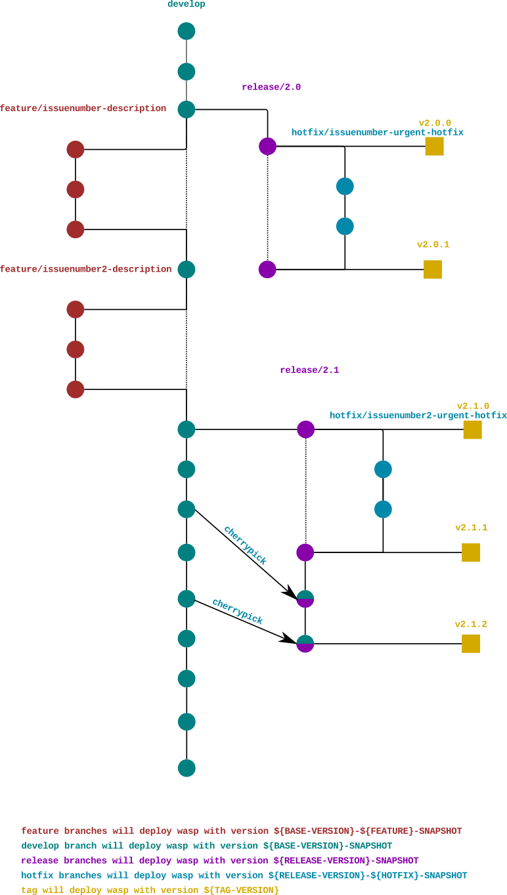

# Contributing to WASP

* [Branching model](#branching-model)
* [Workflow](#workflow)

# Branching model

The branching model is as follows:

## Develop branch
This is the main development branch; it is always sync with the newest release.

When a build is performed on the develop branch, artifacts will be deployed with version `${BASE-VERSION}-SNAPSHOT`.

## Feature branches
These are the branches on which development of new features, and in general any work related to an issue, is performed. Feature branches have a 1-to-1 relationship with issues: one issue, one feature branch and vice versa.

The feature branches follow the naming scheme `feature/${issue-number}-{$description}`.

When a build is performed on a feature branch, artifacts will be deployed with version `${BASE-VERSION}-${issue-number}-SNAPSHOT`.

When a feature branch is ready it will be merged back into master

## Release branches
Release branches track releases.

When all the feature branches needed for a release have merged back to develop and the time comes for a new release, a new release branch branch is started from develop.

To backport a feature to a previous release the relevant commits are merged onto the release branch from the feature branch or cherrypicked form develop.

A release branch can be linked to sprints (linking the minor version to the sprint number) in order to guarantee a deliverable per week.

Release branches follow the naming scheme `release/v${major}.{minor}`.

When a build is performed on a release branch, artifacts will be deployed with version `${RELEASE-VERSION}-SNAPSHOT`.

## Hotfix branches
Hotfix branches are meant for quick, urgent fixes.

Hotfix branches start from release branches and merge back into them directly, without going through develop. If the fix is not already in develop, it is also merged into develop.

Hotfix branches follow the naming scheme `hotfix/${issue-number}-${description}`.

When a build is performed on a hotfix branch, artifacts will be deployed with version `${RELEASE-VERSION}-${issue-number}-hotfix-SNAPSHOT`.

## Tags
Tags help identify the precise commit which defines a version.
 
A tag follows the naming scheme `v${major}.${minor}.${patch}`.

When a build is performed on a tag, artifacts will be deployed with version
`v${major}.${minor}.${patch}`.

# Workflow
To start working on a new feature/bugfix:
- open a new issue on GitLab
- click on the `Create merge request` dropdown
- select `Create merge request and branch` option, in order to also automatically create a merge request with:
    - prefix "WIP:" in the Title, which avoid to accept the merge request
    - "Closes #${issue-number}" in the Description, which will close the related issue when the merge request will be accepted
- change the proposed branch name to one of the legal prefixes described in this document (or you will not be able to push!)

Do your work on the branch as usual; to get new artifact created and deployed from it, simply push to it.
 
When you're done:
- rebase onto `develop` the branch you started on, in order to make the merge process as clean as possible
- "Resolve WIP Status" on merge request: remove from the title of the merge request the prefix "WIP:" in order to allow the merge
- ask somebody with the appropriate permissions to accept your merge request
- the merge process will automatically close the issue