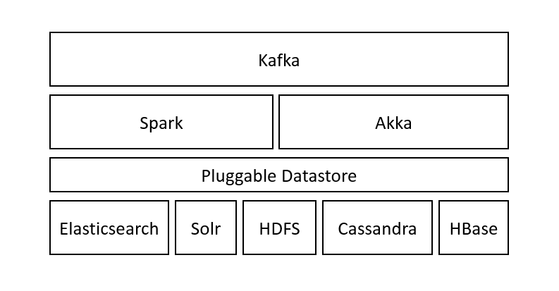

# <a href="https://agilefactory.gitlab.io/Agile.Wasp2/">WASP</a> - Wide Analytics Streaming Platform

**Official documentation website** : [Wasp documentation](https://agilefactory.gitlab.io/Agile.Wasp2/)


[](https://gitter.im/agile-lab-dev/wasp?utm_source=badge&utm_medium=badge&utm_campaign=pr-badge&utm_content=badge)

## Table of contents

- [<a href="https://agilefactory.gitlab.io/Agile.Wasp2/">WASP</a> - Wide Analytics Streaming Platform](#wasp---wide-analytics-streaming-platform)
  - [Table of contents](#table-of-contents)
    - [General](#general)
      - [Overview](#overview)
      - [WASP in the wild](#wasp-in-the-wild)
      - [Background](#background)
      - [Architecture](#architecture)
      - [Glossary](#glossary)
      - [Services](#services)
        - [Kafka](#kafka)
        - [Spark](#spark)
        - [Akka](#akka)
        - [MongoDB](#mongodb)
        - [Pluggable Datastore](#pluggable-datastore)
      - [Using WASP](#using-wasp)
        - [Setting up the development environment](#setting-up-the-development-environment)
        - [Just try wasp without dev dependencies](#just-try-wasp-without-dev-dependencies)
        - [Extension points](#extension-points)
      - [Have a look at what's going on](#have-a-look-at-whats-going-on)


### General

#### Overview
WASP is a framework to build complex real time big data applications.
It relies on a kind of Kappa/Lambda architecture mainly leveraging Kafka and Spark.

If you need to ingest huge amount of heterogeneous data and analyze them through complex pipelines, this is the framework for you.
If you need a point and click product, this is not the tool for you.

WASP is a big data framework that allows you to not waste time with devops architectures and integrating different components. WASP lets you focus on your data, business logic and algorithms, without worrying about tipical big data problems like:

- at least once or exactly once delivery
- periodically training a machine learning model
- publishing your results in real time, to be reactive
- applying schemas to unstructured data
- feeding different datastores from the same data flow in a safe way
- etc.

For more technical documentation, head to the [documentation](documentation/) folder.

#### WASP in the wild
WASP has been added to Cloudera Solution Gallery as an Open Source tool to simplify streaming workflows.

**You can see it [here](https://www.cloudera.com/solutions/gallery/agilelab-wide-streaming-analytics-platform.html)!**


#### Background
Handling huge streams of data in near real time is a hard task. So we want to build a reference architecture to speed up fast data application development and to avoid common mistakes about fault tolerance and reliability.
Kafka is the central pillar of the architecture and helps to handle streams in the correct way. We have been inspired by the Kappa architecture definition.

#### Architecture
You can refer to the diagrams ([Wasp1](documentation/diagrams/Wasp1.png) and [Wasp2](documentation/diagrams/Wasp2.png)) to gain a general overview of the architecture.
The project is divided into sub modules:

- **wasp-core**: provides all basic functionalities, pojo and utilities
- **wasp-master**: it provides the main entry point to control your application, exposing the WASP REST API. In the future, this will also provide a complete web application for monitoring and configuration.
- **wasp-producers**: a thin layer to easily expose endpoints for ingestion purposes. Leveraging Akka-Camel we can provide Http, Tcp, ActiveMQ, JMS, File and many other connectors. This ingestion layer pushes data into Kafka.
- **wasp-consumers-rt**: ...
- **wasp-consumers-spark**: the consumer layer incapsulates Spark Streaming to dequeue data from Kafka, apply business logic to it and then push the output on a target system.

All the components are coordinated, monitored and owned by an Akka Cluster layer, that provides scalability and fault tolerance for each component. For example you can spawn multiple identical producers to balance the load on your http endpoint, and then fairly distribute the data on Kafka.

#### Glossary
- **Pipegraph**: a directed acyclic graph of data transformations. Each step is lazy and loosely coupled from previous and the next one. It is basically an ordered list of ETL blocks, with Inputs and Outputs.
- **ETL**: represents a Spark Streaming job. It can consume data from one or more Inputs, elaborate the incoming data and push it to an Output. You can't have more than an Output for an ETL block, in order to avoid misalignment between outputs. If you want to write the same data on different datastores, you must consume the topic data with two different ETL blocks. Both Streaming and Batch ETLs are supported.
- **Input**: a source of data for an ETL block.
- **Output**: a destination for data produced by an ETL block. Can be any of various datastores or messaging systems.
- **Topic**: the representation of a Kafka topic with an associated Avro schema. Can be either an Input or an Output.
- **Index**: the representation of an index in an indexed datastore (either ElasticSearch or Solr) adn its associated schema. Can be either an Input or an Output.
- **KVStore**: an abstraction for a Key-Value store, like Cassandra and HBase, for when you need high performance access by key. Can only be used as an Output. This is not implemented yet.
- **OLAP**: an abstraction for an Online Analytical Processing system. It will help to provide OLAP capabilities to the application. Druid and Kylin will be the available options. This is not implemented yet.
- **Raw**: any of a number of datastores based on files; for example, HDFS or S3. Can be either an Input or an Output.
- **Producer**: Producers are independent from pipegraphs. They ingest data from different sources and write data to a Kafka topic, after formatting it according to a the schema.

#### Services


##### Kafka
Kafka is the central element of this architecture blue print.
Each topic must have an associated Avro schema. This enforces type consistency and is the first step towards reliable real time data quality, something we will work on in the next future.
Avro has been chosen because more typed and descriptive than JSON and because of its compatibility with Spark and the Hadoop world in general.
Kafka decouples the ingestion layer from the analysis one. This allows updating algorithms and models without impacting the ingestion layer, and vice versa.

##### Spark
Spark is the data engine powering WASP, and is used in two components: Streaming ETL and Batch ETL. It can also be used to provide a JDBC interface using Thrift server.
WASP supports running Spark in three different ways:
- embedded, using Spark's local mode, which is recommended for development only
- on YARN, used when running with an existing Hadoop cluster
- with Spark's standalone clustering (master + workers)

##### Akka
Akka is our middleware: each component of WASP is an actor and relies on a clustered Actor System. In this way each component can be a separate process, and even run on different machines, and we can handle fault tolerance in a trasparent way to the whole application.
This is a general overview of the [ActorSystem](documentation/diagrams/actor_system.png)

##### MongoDB
MongoDB is the central repository for all configurations, ML models, and entities. It is fault tolerant and it simplifies the deployment in a distributed environment because each node just needs the MongoDB address to be ready to go.

##### Pluggable Datastore

WASP system is integrated with Elasticsearch, Solr, Kafka, HBase, Mongo, Jdbc Datasources and HDFS. All data stored inside the datastore is indexed and searchable via the specific query language of the datastore.

#### Using WASP

##### Setting up the development environment
WASP is written in Scala, and the build is managed with SBT.

The recommended development environment is Linux; developing on Windows or MacOS is certainly possible, but is not supported, sorry about that!

Before starting:
- Install JDK 8
- Install SBT
- Install Git


The steps to getting WASP up and running for development are pretty simple:

*Github mirror*

- Clone this repository:

    `git clone https://github.com/agile-lab-dev/wasp.git`

- Build the image locally (it is a cloudera based deployment so we cannot distribute it)

```sh
cd whitelabel/docker/cdh6/cdh-docker
docker build . -t  registry.gitlab.com/agilefactory/agile.wasp2/cdh-docker:6.3.2
```

 - Use the scripts to start WASP:

    `whitelabel/docker/cdh6/start-wasp.sh`

*Gitlab* 

- Clone this repository:

    `git clone https://gitlab.com/AgileFactory/Agile.Wasp2/` 

- Perform a docker login on gitlab registry:
  
    `docker login registry.gitlab.com`

- Use the scripts to start WASP:
    
    `whitelabel/docker/cdh6/start-wasp.sh`
    
##### Just try wasp without dev dependencies

*Github mirror*

Sorry at the moment no public accessible image is available due to distribution concerns, you can build it yourself
but you still need a development environment set up

*Gitlab mirror*

- Login to the registry:

    `docker login registry.gitlab.com`

- Run wasp chosing a version (replace `$TAG`):

    `docker run -it --rm -p 8088:8088 -p 2891:2891 -p 8042:8042 -p 5005:5005 -p 5006:5006 -p 5007:5007 -p 5008:5008 -p8983:8983 -p4040:4040 -p4041:4041 registry.gitlab.com/agilefactory/agile.wasp2/try-wasp:$TAG`

##### Extension points
In order to build you application there are several extension points where to place your algorithms.

- **Producer**: If your data can flow directly into Kafka, for example if you already have a Flume ingestion layer, you don't need to have producers. Otherwise you should extend WaspProducerActor, maybe leveraging Camel, to expose some kind of endpoint (tcp, http, jms, etc).  
At this point you only need to worry about formatting your incoming data according to an Avro schema, as the base class will handle the Kafka connectivity for you.
In order to have each producer acting independently, you should also overwrite WaspProducerNodeGuardian.

An example of an extended WaspProducerNodeGuardian:

```scala
final class YahooFinanceProducer(env: { val producerBL: ProducerBL; val topicBL: TopicBL })
    extends WaspProducerNodeGuardian(env) {

  val name = YahooFinanceProducer.name

  def startChildActors() = {
    logger.info(s"Starting child actors on ${cluster.selfAddress}")

    val stocks = producer.configuration
      .flatMap(bson => bson.getAs[BSONArray]("stocks").map(array => array.values.map(s => s.seeAsOpt[String].get)))
      .getOrElse(YahooFinanceProducer.stocks)

    stocks foreach { s =>
      println("stock: " + s)
      val aRef = context.actorOf(Props(new StockActor(s, kafka_router, associatedTopic)))
      aRef ! StartMainTask
    }
  }
}
```

An example of an extended WaspProducerActor:

```scala
case class Envelope(value: JsValue)
case object Tick

private[wasp] class StockActor(stock: String, kafka_router: ActorRef, topic: Option[TopicModel])
    extends ProducerActor[JsValue](kafka_router, topic) {

  import system.dispatcher
  val client = new HttpClient()
  val url =
    s"""https://query.yahooapis.com/v1/public/yql?q=select%20*%20from%20yahoo.finance.quotes%20where%20symbol%20in%20(%22$stock%22)&format=json&env=store%3A%2F%2Fdatatables.org%2Falltableswithkeys&callback="""

  override def preStart(): Unit = logger.info(s"Starting $stock")

  def mainTask(): Unit = {
    logger.info(s"Starting main task for actor: ${this.getClass.getName}")
    self ! Tick
  }

  override def receive: Receive = super.receive.orElse {
    case toSend: Envelope =>
      // actually send the message to Kafka
      sendMessage(toSend.value)
      // schedule the stock fetch in 10 seconds
      task = Some(context.system.scheduler.scheduleOnce(10.seconds, self, Tick))
    case Tick =>
      val jsonToSend = for {
        res        <- client.url(url).getStream()
        body       = res._2
        jsonString <- body |>>> Iteratee.fold("")((json, bytes) => json + new String(bytes, "UTF-8"))
        jsonValue  = JsonParser(jsonString)
        _          = logger.debug("Forwarding producer message to Kafka: " + jsonString)
      } yield Envelope(jsonValue)
      akka.pattern.pipe(jsonToSend).pipeTo(self)
    case Status.Failure(f) =>
      // if the http request failed, retry immediately
      logger.error(f.getMessage, f)
      self ! Tick
  }

  def generateOutputJsonMessage(inputJson: JsValue): String = {

    /* The following mappings are just an example made to show the producer in action */
    val id_event    = (inputJson \\ "count").map(_.as[Double]).headOption
    val source_name = (inputJson \\ "StockExchange").map(t => t.asOpt[String].getOrElse("")).headOption.getOrElse("")
    val topic_name  = topic.map(_.name).getOrElse(YahooTopicModel.yahooTopic.name)
    val metric_name = stock

    val ts = (inputJson \\ "created")
      .map(time =>
        time.asOpt[String] match {
          case None    => TimeFormatter.format(new Date())
          case Some(t) => TimeFormatter.format(t, YahooFinanceProducer.timeFormat)
        }
      )
      .head
    val latitude   = 0
    val longitude  = 0
    val value      = (inputJson \\ "Bid").map(t => t.asOpt[String].map(_.toDouble).getOrElse(0.0)).headOption.getOrElse(0.0)
    val bid        = value
    val ask        = (inputJson \\ "Ask").map(t => t.asOpt[String].map(_.toDouble).getOrElse(0.0)).headOption.getOrElse(0.0)
    val stock_name = (inputJson \\ "Name").map(t => t.asOpt[String].getOrElse(stock)).headOption.getOrElse(stock)
    val percent_change = (inputJson \\ "PercentChange")
      .map(t => t.asOpt[String].map(s => s.replace("%", "").toDouble).getOrElse(0.0))
      .headOption
      .getOrElse(0.0)
    val volume =
      (inputJson \\ "Volume").map(t => t.asOpt[String].map(_.toDouble).getOrElse(0.0)).headOption.getOrElse(0.0)
    val currency = (inputJson \\ "Currency").map(t => t.asOpt[String].getOrElse("")).headOption.getOrElse("")
    val payload  = inputJson.toString().replaceAll("\"", "") // String bonification

    val myJson = s"""{
		     "id_event":${id_event.getOrElse("0")},
		     "source_name":"$source_name",
		     "topic_name":"$topic_name",
		     "metric_name":"$metric_name",
		     "timestamp":"$ts",
		     "latitude":$latitude,
		     "longitude":$longitude,
		     "value":$value,
		     "payload":"$payload",
		     "stock_name":"$stock_name",
		     "bid":$bid,
		     "ask":$ask,
		     "percent_change":$percent_change,
		     "volume":$volume,
		     "currency":"$currency"
		     }"""

    myJson
  }
}
```

- **Consumer**: to create a consumer you only need to implement the Strategy trait with a concrete class. The full qualifier of the class will then be used in the ETL block inside the Pipegraph definition or in the Batch definition.

- **Models**: these define all the details of your Pipegraph, such as the Inputs, ETL blocks and Outputs, along with some metadata. Topics, Index, Raw etc. are first defined separately using the corresponding model classes, and then are used inside the Pipegraph definition. This has to be added to MongoDB; a convenient place to do this in is the prepareWorkloads() method in the FrameworkLauncher trait. Simply extend the trait in a class, implement the method, then use your Launcher as the main class for your application.

- **Pipegraph**:

    The following diagrams represent a pipegraph overview diagram:

    

    while this is  a more specific model representation of it:

    

    The pipegraph is the core of WASP, because it allows to abstract a pipeline with no coupling between components. It's really easy to change a pipegraph in order to add a datastore or more transformation steps.
    The structure of a Pipegraph forces you to implement in the right direction to avoid architectural mistakes. It forces you to have just one single output for each stream, so if you need to write your data into two datastore you are obliged to redirect the stream to Kafka topic and to consume it with two indipendent consumers.

    An example of a Pipegraph definition:

```scala
object MetroPipegraphModel {

  lazy val metroPipegraphName      = "MetroPipegraph6"
  lazy val metroPipegraph          = MetroPipegraph()
  lazy val conf: Config            = ConfigFactory.load
  lazy val defaultDataStoreIndexed = conf.getString("default.datastore.indexed")

  private[wasp] object MetroPipegraph {

    def apply() =
      PipegraphModel(
        name = MetroPipegraphModel.metroPipegraphName,
        description = "Los Angeles Metro Pipegraph",
        owner = "user",
        system = false,
        creationTime = WaspSystem.now,
        etl = List(
          ETLModel(
            "write on index",
            List(
              ReaderModel(MetroTopicModel.metroTopic._id.get, MetroTopicModel.metroTopic.name, TopicModel.readerType)
            ),
            WriterModel.IndexWriter(
              MetroIndexModel.metroIndex._id.get,
              MetroIndexModel.metroIndex.name,
              defaultDataStoreIndexed
            ),
            List(),
            Some(StrategyModel("it.agilelab.bigdata.wasp.pipegraph.metro.strategies.MetroStrategy", None))
          )
        ),
        rt = List(),
        dashboard = None,
        isActive = false,
        _id = Some(BSONObjectID.generate)
      )
  }
}
```

An other important part of the pipegraph is the strategy. Using strategy, you can apply custom transformation directly to the dataframe, when the DStream is processed with Spark.

An example of a Pipegraph strategy definition:

```scala
case class MetroStrategy() extends Strategy {

  def transform(dataFrames: Map[ReaderKey, DataFrame]) = {

    val input = dataFrames.get(ReaderKey(TopicModel.readerType, "metro.topic")).get

    /** Put your transformation here. */
    input.filter(input("longitude") < -118.451683d)
  }
}
```

In this example the DataFrame is filtered at runtime with a "longitude" condition (i.e. < -118.451683D). Is possible apply more complicated trasformations using all the Spark DataFrame APIs like select, filter, groupBy and count [Spark DataFrame APIs](https://spark.apache.org/docs/1.6.2/api/scala/index.html#org.apache.spark.sql.DataFrame).

#### Have a look at what's going on
- <http://localhost:2891/pipegraphs>, <http://localhost:2891/producers>, <http://localhost:2891/batchjobs> for the current state of your Pipegraphs / Producers / BatchJobs
- <http://localhost:8088> YARN Web UI
