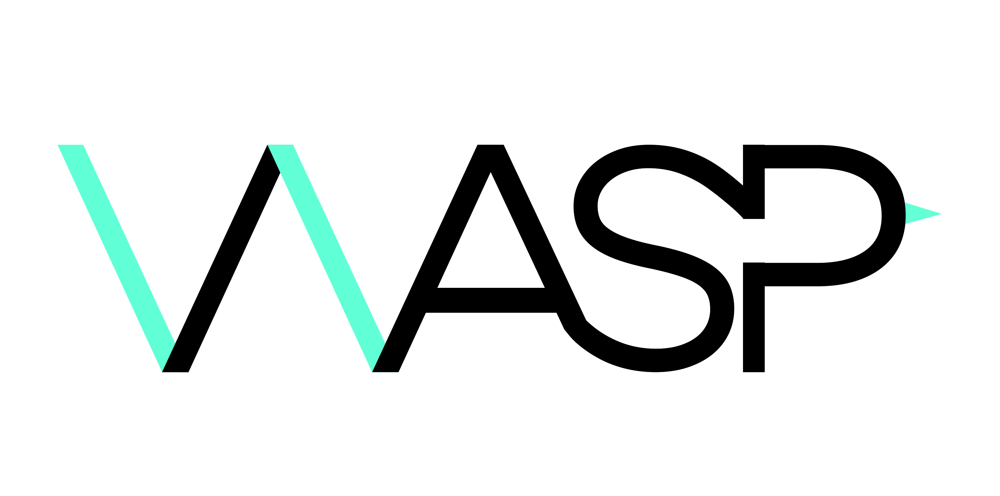
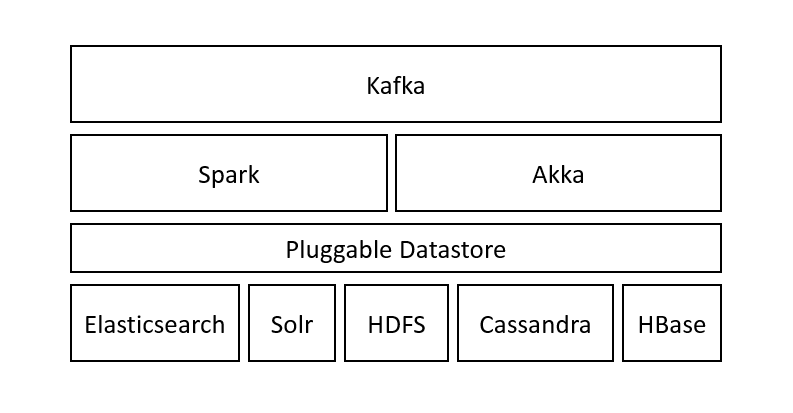
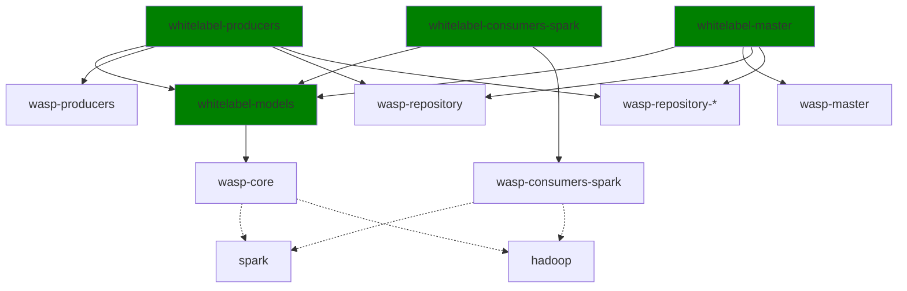

# <a href="https://agilefactory.gitlab.io/Agile.Wasp2/">WASP</a> - Wide Analytics Streaming Platform

**Official documentation website** : [Wasp documentation](https://agilefactory.gitlab.io/Agile.Wasp2/)


[](https://gitter.im/agile-lab-dev/wasp?utm_source=badge&utm_medium=badge&utm_campaign=pr-badge&utm_content=badge)

## Table of contents

- [WASP - Wide Analytics Streaming Platform](#wasp---wide-analytics-streaming-platform)
  - [Table of contents](#table-of-contents)
    - [General](#general)
      - [Overview](#overview)
      - [WASP in the wild](#wasp-in-the-wild)
      - [Background](#background)
      - [Architecture](#architecture)
      - [Glossary](#glossary)
      - [Services](#services)
        - [Kafka](#kafka)
        - [Spark](#spark)
        - [Akka](#akka)
        - [MongoDB or Postgresql](#mongodb-or-postgresql)
        - [Pluggable Datastore](#pluggable-datastore)
      - [Using WASP](#using-wasp)
        - [Setting up the development environment](#setting-up-the-development-environment)
  - [Leverage Wasp in your project](#leverage-wasp-in-your-project)


### General

#### Overview
WASP is a framework to build complex real time big data applications.
It relies on a kind of Kappa/Lambda architecture mainly leveraging Kafka and Spark.

If you need to ingest huge amount of heterogeneous data and analyze them through complex pipelines, this is the framework for you.
If you need a point and click product, this is not the tool for you.

WASP is a big data framework that allows you to not waste time with devops architectures and integrating different components. WASP lets you focus on your data, business logic and algorithms, without worrying about tipical big data problems like:

- at least once or exactly once delivery
- periodically training a machine learning model
- publishing your results in real time, to be reactive
- applying schemas to unstructured data
- feeding different datastores from the same data flow in a safe way
- etc.

For more technical documentation, head to the [documentation](documentation/) folder.

#### WASP in the wild
WASP has been added to Cloudera Solution Gallery as an Open Source tool to simplify streaming workflows.

**You can see it [here](https://www.cloudera.com/solutions/gallery/agilelab-wide-streaming-analytics-platform.html)!**


#### Background
Handling huge streams of data in near real time is a hard task. So we want to build a reference architecture to speed up fast data application development and to avoid common mistakes about fault tolerance and reliability.
Kafka is the central pillar of the architecture and helps to handle streams in the correct way. We have been inspired by the Kappa architecture definition.

#### Architecture
You can refer to the diagrams ([Wasp1](documentation/diagrams/Wasp1.png) and [Wasp2](documentation/diagrams/Wasp2.png)) to gain a general overview of the architecture.
The project is divided into sub modules:

- **wasp-core**: provides all basic functionalities, pojo and utilities
- **wasp-master**: it provides the main entry point to control your application, exposing the WASP REST API. In the future, this will also provide a complete web application for monitoring and configuration.
- **wasp-producers**: a thin layer to easily expose endpoints for ingestion purposes. Leveraging Akka-Camel we can provide Http, Tcp, ActiveMQ, JMS, File and many other connectors. This ingestion layer pushes data into Kafka.
- **wasp-consumers-spark**: the consumer layer incapsulates Spark Streaming to dequeue data from Kafka, apply business logic to it and then push the output on a target system.

All the components are coordinated, monitored and owned by an Akka Cluster layer, that provides scalability and fault tolerance for each component. For example you can spawn multiple identical producers to balance the load on your http endpoint, and then fairly distribute the data on Kafka.

#### Glossary
- **Pipegraph**: a directed acyclic graph of data transformations. Each step is lazy and loosely coupled from previous and the next one. It is basically an ordered list of ETL blocks, with Inputs and Outputs.
- **ETL**: represents a Spark Streaming job. It can consume data from one or more Inputs, elaborate the incoming data and push it to an Output. You can't have more than an Output for an ETL block, in order to avoid misalignment between outputs. If you want to write the same data on different datastores, you must consume the topic data with two different ETL blocks. Both Streaming and Batch ETLs are supported.
- **Input**: a source of data for an ETL block.
- **Output**: a destination for data produced by an ETL block. Can be any of various datastores or messaging systems.
- **Topic**: the representation of a Kafka topic with an associated Avro schema. Can be either an Input or an Output.
- **Index**: the representation of an index in an indexed datastore (either ElasticSearch or Solr) adn its associated schema. Can be either an Input or an Output.
- **KVStore**: an abstraction for a Key-Value store, like Cassandra and HBase, for when you need high performance access by key. Can only be used as an Output. This is not implemented yet.
- **OLAP**: an abstraction for an Online Analytical Processing system. It will help to provide OLAP capabilities to the application. Druid and Kylin will be the available options. This is not implemented yet.
- **Raw**: any of a number of datastores based on files; for example, HDFS or S3. Can be either an Input or an Output.
- **Producer**: Producers are independent from pipegraphs. They ingest data from different sources and write data to a Kafka topic, after formatting it according to a the schema.

#### Services


##### Kafka
Kafka is the central element of this architecture blue print.
Each topic must have an associated Avro schema. This enforces type consistency and is the first step towards reliable real time data quality, something we will work on in the next future.
Avro has been chosen because more typed and descriptive than JSON and because of its compatibility with Spark and the Hadoop world in general.
Kafka decouples the ingestion layer from the analysis one. This allows updating algorithms and models without impacting the ingestion layer, and vice versa.

##### Spark
Spark is the data engine powering WASP, and is used in two components: Streaming ETL and Batch ETL. It can also be used to provide a JDBC interface using Thrift server.
WASP supports running Spark in three different ways:
- embedded, using Spark's local mode, which is recommended for development only
- on YARN, used when running with an existing Hadoop cluster
- with Spark's standalone clustering (master + workers)

##### Akka
Akka is our middleware: each component of WASP is an actor and relies on a clustered Actor System. In this way each component can be a separate process, and even run on different machines, and we can handle fault tolerance in a trasparent way to the whole application.
This is a general overview of the [ActorSystem](documentation/diagrams/actor_system.png)

##### MongoDB or Postgresql
MongoDB and Postgresql are used as the central repository for all configurations, ML models, and entities. It is fault tolerant and it simplifies the deployment in a distributed environment because each node just needs the MongoDB address to be ready to go.

##### Pluggable Datastore

WASP system is integrated with Elasticsearch, Solr, Kafka, HBase, Mongo, Jdbc Datasources and HDFS. All data stored inside the datastore is indexed and searchable via the specific query language of the datastore.

#### Using WASP

##### Setting up the development environment

WASP is written in Scala, and the build is managed with SBT.

The recommended development environment is Linux or MacOs; developing on Windows is certainly possible, but is not supported, sorry about that!

Before starting:

- Install JDK between 8 and 17
- Install SBT
- Install Git

The steps to getting WASP up and running for development are pretty simple:

- Clone this repository:

  `git clone https://github.com/agile-lab-dev/wasp.git`

- Run the unit tests:

  `sbt test`

## Leverage Wasp in your project

If you want to run a WASP based application you will need a multi-module structure similar to the whitelabel one:

```
whitelabel/
├── consumers-spark 
├── master
├── models
└── producers (*)
```

The dependencies between your project module and Wasp artifacts should be the following:


```mermaid
graph TD
  whitelabel-models:::white --> wasp-core
  whitelabel-producers:::white --> whitelabel-models
  whitelabel-producers:::white --> wasp-producers
  whitelabel-producers:::white --> wasp-repository
  whitelabel-producers:::white --> wasp-repository-*
  whitelabel-master:::white --> whitelabel-models
  whitelabel-master:::white --> wasp-master
  whitelabel-master:::white --> wasp-repository
  whitelabel-master:::white --> wasp-repository-*
  whitelabel-consumers-spark:::white --> whitelabel-models
  whitelabel-consumers-spark:::white --> wasp-consumers-spark
  wasp-consumers-spark -.-> spark
  wasp-consumers-spark -.-> hadoop
  wasp-core -.-> spark
  wasp-core -.-> hadoop
  classDef white fill:green
```

In green you see your modules while others are external dependencies.
The dotted lines towards Hadoop and Spark mean that they are provided dependencies by Wasp that
your project should treat as provided too and should install in the target environment, without packing
them with your application.

Each Wasp actor system should be deployed as any Akka actor system, the only caveat is that `consumers-spark`
Actor system needs also a special file named `jars.list`. Such file must contain a list of local dependencies
that will be [submitted](https://spark.apache.org/docs/latest/submitting-applications.html) as `--jars` in the programmatic Spark submit that is invoked by Wasp itself.