# WASP ChangeLog

## WASP 2.0.5
25/01/2018

- Miglioramento complessivo error/exception-handling dai seguenti punti di vista:
	- log in console dei vari componenti
	- propagazione e gestione errori - ora riportati fino alla REST-response
	
	N.B. il timeout passato alla `WaspSystem.??()` (se non esplicitato viene usato general-timeout-millis di *.conf) è ora inteso come "tempo complessivo per gestire la REST" e non più come "tempo per svolgere la specifica operazione interna (es. avvio pipegraph)": a partire da general-timeout, lo slot di tempo assegnato ai livelli inferiori di annidamento è via via ridotto di 5sec

- Gestione down(post-unreachable) / reJoin(post-reachable) dei membri XyzMasterGuardian del cluster Akka - gestito tramite ClusterListenerActor (e `actor-downing-timeout-millis` di *.conf)
	
	N.B. almeno un seed-node deve rimane in vita per poter fare reJoin!!!

- Gestione launcher tramite CommanLine invece che lista argomenti


## WASP 2.1.0
06/02/2018

**Fix**
- A seguito di failure di StartPipegraph, SparkConsumersMasterGuardian e RtConsumersMasterGuardian non rimangono più in stato `starting` ma ritornano in `unitialized`, evitando quindi lo stash() di RestartConsumers durante StartPipegraph successivi

- Corretto uso di log4j direttamente da WASP framework

**Update**
- Miglioramento complessivo error/exception-handling durante StopProducer e StopPipegraph

- Log di stackTrace al posto del solo message da parte dell'attore che gestisce l'eccezione (continua ad esser propagato il solo message)

- Allineata cartella docker (yml e sh) per futuro uso WhiteLabel

- Solr unique key: IndexModel accetta parametro opzionale `idField` per indicare quale campo usare come id al posto di autogenerare UUID random

- Elastic Spark upgrade to 6.1 for Structured Streaming

	yml di riferimento rimane `docker/elastickibana-docker-compose.yml`

- Gestione parametri commandLine e relativo allineamento `docker/start-wasp.sh`
	
	Parametri disponibili: -h (help), -v (versione), -d (MongoDB dropping)
		
		-h, -v	ricevuto da tutti
		-d	ricevuto solo da master

- Aggiornamento di `reference.conf`: WASP usa ora i default presi da `reference.conf`; `docker/docker-environment.conf` funge per ora come `template-whitelabel` dove sono presenti le KEY da sovrascrivere obbligatorie e invece commentate tutte le altre KEY possibili
	
	N.B. per mantenere scalabile la soluzione, i VALUE di default presenti in `reference.conf` non sono anche riportati in `docker/docker-environment.conf`


## WASP 2.1.1
07/02/2018

**Fix**
- GitLab CI to compile and publish on internal (nexus) and public (criticalcase)


## WASP 2.1.2
12/02/2018

**Fix**
- GitLab CI rimossa da master
- Scommentate le KEY `driver-hostname` della `template-whitelabel` `docker/docker-environment.conf` di `spark-streaming` e `spark-batch`

**Update**
- HBASE Writer - gestione celle create dinamicamente in stile Cassandra


## WASP 2.1.3
16/02/2018

**Update**
- MongoDB fullwriteConsistency


## WASP 2.2.0
16/02/2018

**Fix**
- Corretta la KEY `driver-hostname` della `template-whitelabel` `docker/docker-environment.conf` di `spark-batch`
- MongoDB, Elastic, Solr considerano ora il timeout di configuration espresso in millis

**Update**
- WaspRELEASE_NOTES + WhiteLabelREADME

- Trait `Strategy` estende `Serializable`

- Revisione connectionTimeout verso MongoDB, Solr, Elastic

- Impostazione WhiteLabel (per usarla: `whitelabel/docker/start-whitelabel-wasp.sh`)

- Riportata in WaspSystem la creazione della collection MongoDB `configurations` (in modo venga eseguita da tutti i container nello stesso modo)

- Revisione della gestione `dropDB` tramite commandlineOption `-d` di `start_wasp.sh`: Master fa solo drop ed esce (senza reinizializzare)

- Modulo consolePlugin separato da modulo consumers-spark

- Migrazione totale cross-reference da byId a byName delle collection MongoDB


## WASP 2.3.0
26/02/2018

**Fix**
- Corrette dipendenze ElasticSearch

**Update**
- Consistenza/atomicità su waspDB.insertIfNotExist: permette che non avvengano scritture contemporanee/duplicate

- Supporto Solr per nested document

- Whitelabel manual/auto-test per Console, Solr, HDFS, ElasticSearch

- LoggerPipegraph su Solr tramite StructuredStreaming

- Aggiunto service `banana` (Data visualization plugin per Solr) su porta 32770 con template di default per `logger_index_shard1_replica1`: `whitelabel/docker/solrcloud-docker-compose.yml` -> `whitelabel/docker/solrcloudbanana-docker-compose.yml`

- Revisione uso additionalJars

- Batch separato da streaming (container apposito) ma in stesso modulo consumers-spark


## WASP 2.4.0
02/03/2018

**Fix**
- Solr JsonSchema: rollback a gestione "estrapola/invia a Solr solo il contenuto del campo `properties`" (gestione ad-hoc rispetto ElasticSearch)

**Update**
- Aggiornamento di `reference.conf` e `whitelabel/docker/docker-environment.conf`
	- `spark-streaming` e `spark-batch`: riordinate le KEY, aggiunta KEY `driver-conf` che incapsula le configurazioni relative al driver (nuovo `submit-deploy-mode` con default "client"), aggiunta KEY `retained-jobs` (default 100)
	- `solrcloud`: rimossa KEY `cluster_name`
	- `elastic`: rimossa KEY `cluster-name`

- Solr: uso di `zookeeperConnections` al posto di `apiEndPoint`

- Revisione gestione batchJobs: avvio parallelo di istanze di batchJobs diversi (vedi nuova collection MongoDB batchjobinstances)


## WASP 2.5.0
09/03/2018

### Update
- Modificato `chroot_path` di zookeeper per Kafka: da `""` a `"/kafka"` (allineamento con Solr per cui è `"/solr"`)

- Aggiunto JDBCReader plugin

- Aggiunto uso di kryoSerializator tramite `kryo-serializer` in`reference.conf` e `whitelabel/docker/docker-environment.conf` (default: `enabled = true, registrators = "", strict = false`)

- Rimozione `broadcast()` nei seguenti punti:
    - `strategy` in `LegacyStreamingETLActor` / `StructuredStreamingETLActor`
    - `topic.getDataType` in `KafkaReader`

- Aggiunto IndexModelBuilder per gestire Solr/Elastic in modo distinto

### Resolve "Release note generator tool"

[Merge request 22](https://gitlab.com/AgileFactory/Agile.Wasp2/merge_requests/22)

Updated at: 2018-03-09T15:03:26.784Z

Branch: feature/85-release-note-generator-tool

Author: [Andrea Fonti](https://gitlab.com/andrea.fonti)

Closes #85 

```
cd tools/release-note-generator
python setup.py install
wasp-release-note-generator --token 'YOUR GITLAB AUTHENTICATION TOKEN' --sprint 'Sprint 2.5' > file.md

```

### Resolve "[plugin] jdbReader improvement"

[Merge request 20](https://gitlab.com/AgileFactory/Agile.Wasp2/merge_requests/20)

Updated at: 2018-03-09T14:40:28.653Z

Branch: feature/83-plugin-jdbreader-improvement

Author: [Davide Colombatto](https://gitlab.com/davidecolombatto)

Closes #83

### Resolve "[kryo-config] Set new configs for Spark streaming/batch"

[Merge request 17](https://gitlab.com/AgileFactory/Agile.Wasp2/merge_requests/17)

Updated at: 2018-03-09T11:14:44.422Z

Branch: feature/73-kryo-config-set-new-configs-for-spark-streaming-batch

Author: [Davide Colombatto](https://gitlab.com/davidecolombatto)

Closes #73

The config `kryo-serializer.strict` within `wasp.spark-streaming` / `wasp.spark-batch` are mapped to spark `spark.kryo.registrationRequired` in `Agile.Wasp2/consumers-spark/src/main/scala/it/agilelab/bigdata/wasp/consumers/spark/utils/SparkUtils.scala`)

**Note**: This config have to be "false" in order to correctly work without N class registrations (see https://spark.apache.org/docs/2.2.1/configuration.html#compression-and-serialization and https://github.com/EsotericSoftware/kryo#registration)

### Resolve "[gitlab-ci] organize branching model and deployment model"

[Merge request 18](https://gitlab.com/AgileFactory/Agile.Wasp2/merge_requests/18)

Updated at: 2018-03-08T16:23:37.998Z

Branch: feature/66-gitlab-ci-organize-branching-model-and-deployment-model

Author: [Andrea Fonti](https://gitlab.com/andrea.fonti)

Closes #66 

Branching model now follows the rules described in [BranchingModelSupport](project/BranchingModelSupport.scala)

BaseVersion(2.5.0)

* if branch name is develop -> 2.5.0-SNAPSHOT
* if branch name is release/v2.5 -> 2.5.0-SNAPSHOT
* if branch name is feature/issue-issue-text -> 2.5.0-issue-issue-text-SNAPSHOT
* if branch name is hotfix/hotfix -> 2.5.0-hotfix-SNAPSHOT
* if tag name is v2.5.0 -> 2.5.0
* if branch name is not release/v2.5 -> exception
* if tag name is not v2.5.0 -> exception


To use the branching model

```scala
import BranchingModelSupport._

val baseVersion = BaseVersion(2,5,0)

//retrieves branch name from gitlab ci environment or from current repository as fallback
version in ThisBuild := versionForContainingRepositoryOrGitlabCi(baseVersion)

//retrieves branch name from current repository
version in ThisBuild := versionForContainingRepository(baseVersion)

//retrieves branch name from constant
version in ThisBuild := versionForConstant("develop")(baseVersion)

```


## WASP 2.6.0
16/03/2018

### Added Kerberos integration to WASP2 and other stuff

[Merge request 23](https://gitlab.com/AgileFactory/Agile.Wasp2/merge_requests/23)

Created at: 2018-03-12T09:49:27.083Z

Updated at: 2018-03-16T13:20:53.709Z

Branch: feature/20-kerberos

Author: [Mattia](https://gitlab.com/MattiaB)

Assignee: [Davide Colombatto](https://gitlab.com/davidecolombatto)

Closes #20, #63, #71, #54, #89

- Created a new docker image for wasp2; also changed the start-wasp script to integrate with the security
- Fixed the wasp kafka producer to write in the kerberos enviroment
- Some fix to write with Hbase and Solr in the kerberos env
- Added some documentation to run wasp2 in YARN-mode with kerberos
- Added general options for spark
- Added more test for Hbase (keyValue datastore) and KafkaWriter

### Resolve "[rest] improvements"

[Merge request 32](https://gitlab.com/AgileFactory/Agile.Wasp2/merge_requests/32)

Created at: 2018-03-14T17:44:03.445Z

Updated at: 2018-03-15T08:49:13.440Z

Branch: feature/97-rest-improvements

Author: [Davide Colombatto](https://gitlab.com/davidecolombatto)

Closes #97 

- `/help` returns `wasp` as a JSON arrayOfObjects instead of a JSON objectOfObjects
- Added `pretty=true` optional URI param in order to receive JSON beautified

### Resolve "[improvement] master dropDB-mode issue"

[Merge request 33](https://gitlab.com/AgileFactory/Agile.Wasp2/merge_requests/33)

Created at: 2018-03-15T10:38:47.104Z

Updated at: 2018-03-16T13:20:57.566Z

Branch: feature/100-improvement-master-dropdb-mode-issue

Author: [Davide Colombatto](https://gitlab.com/davidecolombatto)

Closes #100

In  WaspLauncher.initializeWasp(): pre-checked if the current node is a `master` and done an ad-hoc mngm


## WASP 2.7.0
26/03/2018

### Resolve "[rest] batchjob-start REST json parameter"

[Merge request 38](https://gitlab.com/AgileFactory/Agile.Wasp2/merge_requests/38)

Created at: 2018-03-16T18:31:17.440Z

Updated at: 2018-03-21T09:34:24.638Z

Branch: feature/104-rest-allow-batchjob-rest-post-parameters

Author: [Davide Colombatto](https://gitlab.com/davidecolombatto)

Closes #104, #86 

**Usage example**

cURL

```bash
curl -X POST \
  http://localhost:2891/batchjobs/TestBatchJobFromHdfsFlatToConsole/start \
  -H 'Content-Type: application/json' \
  -d '{
        "stringKey": "aaa",
        "intKey2": 5
      }'
```

Rest API => POST http://localhost:2891/batchjobs/_batchJobName_/start

Header => Content-Type: application/json

Body => _jsonContent_

**Note**

For the resulting batchJob instance start, the json keys (in the REST json parameter) will be merged with the batchJobETL strategy configuration (Typesafe Config) keys of the related batchJob => the merged configuration is injected in the Strategy `configuration` (Typesafe Config)

*N.B. json keys (in the REST json parameter) override any duplicate keys of the specific batchJob*


### Resolve "[whitelabel] testcases"

[Merge request 39](https://gitlab.com/AgileFactory/Agile.Wasp2/merge_requests/39)

Created at: 2018-03-19T15:21:37.224Z

Updated at: 2018-03-21T13:44:40.817Z

Branch: feature/106-whitelabel-verify-hbase-testcase

Author: [Davide Colombatto](https://gitlab.com/davidecolombatto)

Closes #106 

Fix HBase
* `docker-service-configuration/hdfs` => `docker-service-configuration/hadoop` including also `hbase-site.xml`
* `whitelabel/docker/start-wasp.sh`:

```
DOCKER_OPTS="$DOCKER_OPTS -v $SCRIPT_DIR/docker-service-configuration/hdfs:/etc/hadoop/conf/:ro ..."
```

=>

```
DOCKER_OPTS="$DOCKER_OPTS -v $SCRIPT_DIR/docker-service-configuration/hadoop:/etc/hadoop/conf/:ro ..."
```


### Resolve "[config] revise core-site.xml and hbase.site.xml in containers"

[Merge request 40](https://gitlab.com/AgileFactory/Agile.Wasp2/merge_requests/40)

Created at: 2018-03-21T13:36:28.900Z

Updated at: 2018-03-21T14:01:03.491Z

Branch: feature/108-config-revise-core-site-xml-and-hbase-site-xml-in-container-and

Author: [Davide Colombatto](https://gitlab.com/davidecolombatto)

Closes #108
* `core-site.xml` in solr, hdfs, hbase containers:

```
hdfs://hdfs-namenode:9000
```
=>
```
hdfs://namenode:9000
```

* `whitelabel/docker/start-wasp.sh`:

```
DOCKER_OPTS="$DOCKER_OPTS -v $SCRIPT_DIR/docker-service-configuration/hdfs:/etc/hadoop/conf/:ro  -v $SCRIPT_DIR/docker-service-configuration/hbase:/etc/hbase/conf/:ro"
```

=>

```
DOCKER_OPTS="$DOCKER_OPTS -v $SCRIPT_DIR/docker-service-configuration/hadoop:/etc/hadoop/conf/:ro"
```

*  hbase in `reference.conf`:

```
    core-site-xml-path = "/etc/hbase/conf/core-site.xml"
    hbase-site-xml-path = "/etc/hbase/conf/hbase-site.xml" 
```

 =>

```
    core-site-xml-path = "/etc/hadoop/conf/core-site.xml"
    hbase-site-xml-path = "/etc/hadoop/conf/hbase-site.xml"
```

### GL-111: Producer actor now support extract partition key value

[Merge request 44](https://gitlab.com/AgileFactory/Agile.Wasp2/merge_requests/44)

Created at: 2018-03-23T17:29:37.763Z

Updated at: 2018-03-26T10:29:38.088Z

Branch: feature/GL-111-producerPartitionKey

Author: [Vito](https://gitlab.com/vito.ressa)

Closes #111 


## WASP 2.8.0
30/03/2018

### Resolve "Error/exception handling - Pipegraph start may leave components running while returning a failure"

[Merge request 29](https://gitlab.com/AgileFactory/Agile.Wasp2/merge_requests/29)

Created at: 2018-03-12T16:41:58.997Z

Updated at: 2018-03-30T14:03:08.080Z

Branch: feature/13-error-exception-handling-pipegraph-start-may-leave-components-running-while-returning-a-failure

Author: [Andrea Fonti](https://gitlab.com/andrea.fonti)

#### Start Pipegraph
When a REST start pipegraph request is received a new pipegraphinstance is created and asynchronously runned by the assigned pipegraph guardian

```bash
http -v POST :2891/pipegraphs/TestConsoleWriterWithMetadataStructuredJSONPipegraph/start

POST /pipegraphs/TestConsoleWriterWithMetadataStructuredJSONPipegraph/start HTTP/1.1
Accept: */*
Accept-Encoding: gzip, deflate
Connection: keep-alive
Content-Length: 0
Host: localhost:2891
User-Agent: HTTPie/0.9.9


HTTP/1.1 200 OK
Content-Length: 97
Content-Type: application/json
Date: Fri, 30 Mar 2018 09:32:05 GMT
Server: akka-http/10.0.9

{
    "Result": "OK", 
    "data": "Pipegraph 'TestConsoleWriterWithMetadataStructuredJSONPipegraph' accepted (queued or processing)"
}
```

#### Check pipegraph instance status

* To check if a pipegraph started check the status of the instance via a REST the request /pipegraph/$name/instances

```
http -v GET :2891/pipegraphs/TestConsoleWriterWithMetadataStructuredJSONPipegraph/instances            531ms  ven 30 mar 2018 15:04:29 CEST
GET /pipegraphs/TestConsoleWriterWithMetadataStructuredJSONPipegraph/instances HTTP/1.1
Accept: */*
Accept-Encoding: gzip, deflate
Connection: keep-alive
Host: localhost:2891
User-Agent: HTTPie/0.9.9


HTTP/1.1 200 OK
Content-Length: 285
Content-Type: application/json
Date: Fri, 30 Mar 2018 13:04:37 GMT
Server: akka-http/10.0.9

{
    "Result": "OK", 
    "data": [
        {
            "currentStatusTimestamp": 1522404178417, 
            "instanceOf": "TestConsoleWriterWithMetadataStructuredJSONPipegraph", 
            "name": "TestConsoleWriterWithMetadataStructuredJSONPipegraph-c5db85bb-08d0-4d5a-ab7f-2f52019ddc1d", 
            "startTimestamp": 1522404178360, 
            "status": "PROCESSING"
        }
    ]
}

```

#### Stop Pipegraph

* To Stop a pipegraph use the REST api, the stop will be performed asynchronously, check the status via instances api

```
http -v POST :2891/pipegraphs/TestConsoleWriterWithMetadataStructuredJSONPipegraph/stop                274ms  ven 30 mar 2018 15:04:37 CEST
POST /pipegraphs/TestConsoleWriterWithMetadataStructuredJSONPipegraph/stop HTTP/1.1
Accept: */*
Accept-Encoding: gzip, deflate
Connection: keep-alive
Content-Length: 0
Host: localhost:2891
User-Agent: HTTPie/0.9.9


HTTP/1.1 200 OK
Content-Length: 97
Content-Type: application/json
Date: Fri, 30 Mar 2018 13:05:58 GMT
Server: akka-http/10.0.9

{
    "Result": "OK", 
    "data": "Pipegraph 'TestConsoleWriterWithMetadataStructuredJSONPipegraph' stopped"
}

http -v GET :2891/pipegraphs/TestConsoleWriterWithMetadataStructuredJSONPipegraph/instances            304ms  ven 30 mar 2018 15:05:58 CEST
GET /pipegraphs/TestConsoleWriterWithMetadataStructuredJSONPipegraph/instances HTTP/1.1
Accept: */*
Accept-Encoding: gzip, deflate
Connection: keep-alive
Host: localhost:2891
User-Agent: HTTPie/0.9.9


HTTP/1.1 200 OK
Content-Length: 282
Content-Type: application/json
Date: Fri, 30 Mar 2018 13:06:53 GMT
Server: akka-http/10.0.9

{
    "Result": "OK", 
    "data": [
        {
            "currentStatusTimestamp": 1522415158518, 
            "instanceOf": "TestConsoleWriterWithMetadataStructuredJSONPipegraph", 
            "name": "TestConsoleWriterWithMetadataStructuredJSONPipegraph-c5db85bb-08d0-4d5a-ab7f-2f52019ddc1d", 
            "startTimestamp": 1522404178360, 
            "status": "STOPPED"
        }
    ]
}

```

#### Phases

When a pipegraph is started a new `PipegraphGuardian` is spawned by the `SparkConsumersStreamingMasterGuardian`
the `PipegraphGuardian` instantiate an `StructuredStreamingETLActor` for each Etl component

The `PipegraphGuardian` manages the `StructuredStreamingETLActors` in steps

##### Activation
The strategy is applied, if a failure happens in strategy application it is assumed as transient and thus Activation is retried until successful or a Stop is received (maybe a rest request from within the code executed in wasp jvm before strategy application) 
##### Materialization
The output plugin is applied, if a failure happens in output plugin it is assumed as transient and thus Materialization is retried until successful or a Stop is received (maybe the output data store did not accept the creation of the tables/indices)
##### Monitoring
The streaming query is monitored for failure and progress, if the query signal that a failure and that it has stopped then the activation of that query is retried (the other etls are left running)
##### Stop
The streaming query are stopped gracefully one by one
 

#### Availability guarantees

If spark-consumers jvm is lost (the spark driver is also lost) spark checkpointing and kafka should handle the buffering of incoming data and the consistency of the streaming. 
When the  spark-consumers jvm restarts it should check mongo for pipegraphs in pending or processing status and restart them recovering the queries that were running when the unexpected shutdown occurred

`NOTE: To prevent reactivation of running pipegraphs when intentionally rebooting spark-consumers explicitly stop all pipegraphs`


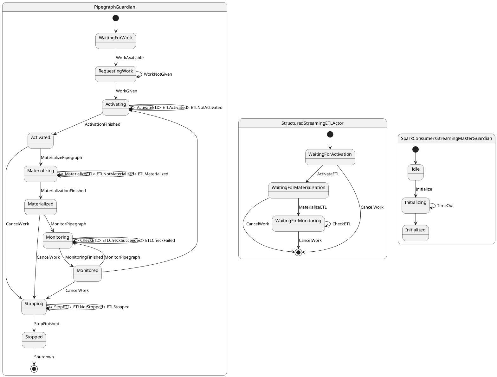

### Resolve "Verify checkpointing with new strategy load"

[Merge request 43](https://gitlab.com/AgileFactory/Agile.Wasp2/merge_requests/43)

Created at: 2018-03-22T11:36:44.193Z

Updated at: 2018-03-29T16:39:14.656Z

Branch: feature/4-verify-checkpointing-with-new-strategy-load

Author: [Davide Colombatto](https://gitlab.com/davidecolombatto)

Closes #4, #118 

*  Default (`reference.conf`) CheckpointDir root is `/checkpoint` on HDFS
*  New testcases to test and show "best-practise" for checkpoint using stateful transformations in Spark StructuredStreaming ETL (e.g. `flatMapGroupsWithState`); in `whitelabel/models/test/TestPipegraphs.scala`
   1.  `TestCheckpointConsoleWriterStructuredJSONPipegraph`
   2.  `TestCheckpointConsoleWriterStructuredAVROPipegraph`
* Documentation
   1. `documentation/spark-structured-streaming-checkpointing.md`: general info about checkpoint internal implementation
   2. `whitelabel/README.md`: added section "Checkpoint and Stateful transformation in Spark StructuredStreaming ETL"

### Resolve "[cherrypick] hotfix kafka-writer-config"

[Merge request 48](https://gitlab.com/AgileFactory/Agile.Wasp2/merge_requests/48)

Created at: 2018-03-30T10:25:42.227Z

Updated at: 2018-03-30T12:29:07.699Z

Branch: feature/119-cherrypick-hotfix-kafka-writer-config

Author: [Davide Colombatto](https://gitlab.com/davidecolombatto)

Closes #119 

*  Fixed some Kafka configurations not being used properly.
*  Fixed reference.conf in wasp core to reflect those changes.


## WASP 2.9.0
06/04/2018

### Resolve "[config] production checks"

[Merge request 49](https://gitlab.com/AgileFactory/Agile.Wasp2/merge_requests/49)

Created at: 2018-04-03T09:45:04.610Z

Updated at: 2018-04-05T10:19:15.583Z

Branch: feature/105-config-production-checks

Author: [Davide Colombatto](https://gitlab.com/davidecolombatto)

Closes #105

Added management of production checks using validation rules:
*  `environment.validationRulesToIgnore`: list of validation rules to ignore (through validation rule's keys)
* For all not ignored validation rules: print VALIDATION-RESULT (validation rule's keys and PASSED/NOT PASSED); if there is at least a validation failure (NOT PASSED):
 * `environment.mode` == "develop": print VALIDATION-WARN and continue
 * `environment.mode` != "develop" (all not "develop" is considered "production" by default): print VALIDATION-ERROR and exit


Documentation
* `whitelabel/README.md`: added section "Configuration validation rules"

### Resolve "Change rest api message for pipegraph stop to better explain that stopping is async"

[Merge request 51](https://gitlab.com/AgileFactory/Agile.Wasp2/merge_requests/51)

Created at: 2018-04-05T10:39:13.190Z

Updated at: 2018-04-05T10:52:10.873Z

Branch: feature/120-change-rest-api-message-for-pipegraph-stop-to-better-explain-that-stopping-is-async

Author: [Davide Colombatto](https://gitlab.com/davidecolombatto)

Closes #120 

Updated feedback messages at start/stop of batch_jobs/pipegraphs (accepted/not accepted due to the new concept of "instance")

### Resolve "WaspKafkaWriter and KafkaWriter issues""

[Merge request 53](https://gitlab.com/AgileFactory/Agile.Wasp2/merge_requests/53)

Created at: 2018-04-05T15:21:51.837Z

Updated at: 2018-04-06T14:21:48.220Z

Branch: feature/74-waspkafkawriter-has-a-hardcoded-value-for-request-required-acks

Author: [Davide Colombatto](https://gitlab.com/davidecolombatto)

Closes #74, #123 

Kafka config "acks":
* taken out from "kafka.others.acks" to "kafka.acks"
* default (`reference.conf`): -1 (i.e. "all")

Kafka config "others":
* Must contain duplicated keys (for WASP-Producers and for PipegraphETLKafka-Producers/Consumers). Example:

    ```
        others = [
          { "security.protocol" = "SASL_PLAINTEXT" }
          { "sasl.kerberos.service.name" = "kafka" }
          { "sasl.jaas.config" = "com.sun.security.auth.module.Krb5LoginModule required storeKey=true useKeyTab=true useTicketCache=false keyTab=\"./wasp2.keytab\" serviceName=\"kafka\" principal=\"wasp2@REALM\";" }
          { "sasl.mechanism" = "GSSAPI" }
          { "kafka.security.protocol" = "SASL_PLAINTEXT" }
          { "kafka.sasl.kerberos.service.name" = "kafka" }
          { "kafka.sasl.jaas.config" = "com.sun.security.auth.module.Krb5LoginModule required storeKey=true useKeyTab=true useTicketCache=false keyTab=\"./wasp2.keytab\" serviceName=\"kafka\" principal=\"wasp2@REALM\";" }
          { "kafka.sasl.mechanism" = "GSSAPI" }
        ]
    ```


## WASP 2.10.0
13/04/2018

### Resolve "Telemetria tramite StructuredStreaming"

[Merge request 50](https://gitlab.com/AgileFactory/Agile.Wasp2/merge_requests/50)

Created at: 2018-04-04T14:09:17.647Z

Updated at: 2018-04-13T13:46:11.977Z

Branch: feature/1-telemetria-tramite-structuredstreaming

Author: [Andrea Fonti](https://gitlab.com/andrea.fonti)

Closes #1 

#### Flow


```
+---------------------------------------------------------------------------------------+
|                                                                                       |
|                                                  wasp-consumer-streaming              |
|                                                                                       |
|  +-----------------------------------+                                                |
|  |                                   |                                                |
|  | StructuredStreamingMasterGuardian |                                                |
|  |                                   |                                                |
|  +-----------------------------------+                                                |
|                                                                                       |
|  +-------------------------------------------------------------------------------+    |
|  |      +-------------------+                                                    |    |
|  |      |                   |                              Pipegraph             |    |
|  |      | PipegraphGuardian |                                                    |    |
|  |      |                   |                                                    |    |          TELEMETRY
|  |      +-------------------+                                                    |    |
|  |                                                                               |    |
|  | +------------------------------------------------------------+                |    |
|  | |                                                            |                |    |
|  | |   +-----------------------------+            ETLBlock      |                |    |
|  | |   |                             |                          |                |    |
|  | |   | StructuredStreamingETLActor |                          |                |    |
|  | |   |                             |                          |                |    |
|  | |   +-----------------------------+                          |                |    |
|  | |                                                            |                |    |
|  | |                                                            |                |    |
|  | |                                                            |                |    |
|  | |         +----------------+                                 |                |    |
|  | |         |                |                                 |                |    |
|  | |         | TelemetryActor |                                 |                |    |
|  | |         |                |                                 |                |    |
|  | |         +------|X|-------+                                 |                |    |
|  | +----------------|X|-----------------------------------------+                |    |
|  +------------------|X|----------------------------------------------------------+    |
+---------------------|X|---------------------------------------------------------------+
                       |
                       |
                       |
                       |
              +--------v--------+    +--------------------+       +-----------------+
              |                 |    |                    |       |                 |
              | telemetry.topic +----> TelemetryPipegraph +-------> OutputDataStore |
              |                 |    |                    |       |                 |
              +--------^--------+    +--------------------+       +-----------------+
                       |
                       |
                       |
                       |
     +-----------------X--------------------------------------------------------+
     |                 +                                                        |
     |                 |                                        SPARK-WORKER    |
     |                 |                                                        |
     |                 |                                                        |
     |                 |                                                        |
     |   +-------------X-----------------------------------------+              |
     |   |             |                                         |              |
     |   |             |                      PARTITION-N        |              |
     |   |   +---------+------+                                  |              |
     |   |   |                |                                  |              |
     |   |   |  Kafka Writer  |                                  |              |
     |   |   |                |                                  |              |           LATENCY
     |   |   +----------------+                                  |              |
     |   |                                                       |              |
     |   |                                                       |              |
     |   +-------------------------------------------------------+              |
     |                                                                          |
     +--------------------------------------------------------------------------+

```

Telemetry is written to `elasticsearch` if `wasp.datastore.indexed="elastic"` or to `solr` if `wasp.datastore.indexed="solr"`


#### Streaming query Telemetry

**To enable telemetry collection Start TelemetryPipegraph or enable system pipegraph startup**

Telemetry about streaming query performance is now collected by `TelemetryActor`, a child of `StructuredStreamingETLActor`


Telemetry is extracted during the Monitoring phase of a pipegraph, extracted telemetry is composed of:

* inputRows
* inputRowsPerSecond
* processedRowsPerSecond
* durationMS of various spark streaming events

```json
{
    "messageId": "22cc1baf-b28e-4385-995d-c7db4e040f5c",
    "timestamp": "2018-04-09T16:54:10.652Z",
    "sourceId": "pipegraph_Telemetry Pipegraph_structuredstreaming_write_on_index_writer_telemetry_elastic_index",
    "metric": "triggerExecution-durationMs",
    "value": 1
  }
```

sourceId is the name of the streaming query, messageId is relative to the collection of the telemetry and is a random identifier.

#### Message Latency sampling

Latency data is extracted per message with a subsampling applied per partition.

The default sampling is one every 100 messages for partition.

**To adjust the sampling factor provide the strategy with a `Configuration` object containing the key**
```wasp.telemetry.latency.sample-one-message-every=<number of messages>```

To enable latency collection the DataFrame should have a `Metadata` column and the ETL block should have a declared strategy.

latency is extracted in the form

```json
{
    "messageId": "3729",
    "timestamp": "2018-04-09T16:49:17.349Z",
    "sourceId": "testDocumentWithMetadataProducer/test-with-metadata-console-etl-enter/test-with-metadata-console-etl-exit",
    "metric": "latencyMs",
    "value": 1
  }
```

messageId is assigned by the source by generating a `metadata` column, see 
`it.agilelab.bigdata.wasp.whitelabel.producers.test.TestDocumentWithMetadataProducerGuardian`

sourceId is the path covered by the message inside wasp

```

testDocumentWithMetadataProducer/test-with-metadata-console-etl-enter
                   ^                              ^
                  source                        enter in streaming query

the timestamp will be the one recorded at the entrance of an etl block, latencyMS will be the difference between the time of
publish on kafka and the entrance of the message in an etl block (we will measure latency to dequeue from kafka)

testDocumentWithMetadataProducer/test-with-metadata-console-etl-enter/test-with-metadata-console-etl-exit
                   ^                               ^                                       ^
                source                        enter in streaming query               exit from streaming query

the timestamp will be the one recorded at the exit of an etl block, latencyMS will be the difference between the time of
enter and the time of exit from the etl block (we will measure latency in processing)

```

```scala
var counter = 0
        
        partition.map { row =>

          if(counter % samplingFactor == 0) {

            val metadata = row.getStruct(row.fieldIndex("metadata"))

            val pathField = metadata.fieldIndex("path")

            val messageId = metadata.getString(metadata.fieldIndex("id"))

            val sourceId = metadata.getString(metadata.fieldIndex("sourceId"))

            val arrivalTimestamp = metadata.getLong(metadata.fieldIndex("arrivalTimestamp"))

            val path = Path(sourceId,arrivalTimestamp) +: metadata.getSeq[Row](pathField).map(Path.apply)

            val lastTwoHops = path.takeRight(2)

            val latency = lastTwoHops(1).ts - lastTwoHops(0).ts

            val collectionTimeAsString = DateTimeFormatter.ISO_INSTANT.format(Instant.ofEpochMilli(lastTwoHops(1).ts))

            val compositeSourceId = path.map(_.name.replace(' ', '-')).mkString("/")


            val json = JSONObject(Map("messageId" -> messageId,
                                      "sourceId" -> compositeSourceId,
                                      "metric" -> "latencyMs",
                                      "value" -> latency,
                                      "timestamp" -> collectionTimeAsString)).toString(JSONFormat.defaultFormatter)


            val topic = SystemPipegraphs.telemetryTopic.name

            val record = new ProducerRecord[Array[Byte], Array[Byte]](topic,
                                                                      messageId.getBytes(StandardCharsets.UTF_8),
                                                                      json.getBytes(StandardCharsets.UTF_8))
            writer.send(record)

          }

          counter = counter + 1
          row
        }
```


### Resolve "[docker] updates in order to use Spark Standalone"

[Merge request 54](https://gitlab.com/AgileFactory/Agile.Wasp2/merge_requests/54)

Created at: 2018-04-06T09:29:09.623Z

Updated at: 2018-04-09T16:41:47.430Z

Branch: feature/122-docker-update-spark-images-to-2-2-1-to-test-spark-standalone

Author: [Davide Colombatto](https://gitlab.com/davidecolombatto)

Closes #122 

**In order to enable usage on Spark Standalone cluster manager:**

1.  Updated Spark docker-images (`spark-docker-compose.yml`):
 *  image: from `gettyimages/spark:2.2.0-hadoop-2.7` to `gettyimages/spark:2.2.1-hadoop-2.7`
 *  Worker SPARK_WORKER_MEMORY: from `2048m` to `4096m`

2.  Added to `reference.conf` / `whitelabel/docker/docker-environment.conf`: `cores.max`

3. Added Validation Rules to check that config `cores.max` >= `executor-cores` when `master.protocol=="spark`" within `spark-streaming`/`spark-batch`

4. Whitelabel uses Spark Standalone cluster manager by default:
 * `whitelabel/docker/docker-environment.conf` -> `master` within `spark-streaming`/`spark-batch`

### Resolve "Instance info on start"

[Merge request 57](https://gitlab.com/AgileFactory/Agile.Wasp2/merge_requests/57)

Created at: 2018-04-09T15:46:36.119Z

Updated at: 2018-04-13T10:26:47.369Z

Branch: feature/instance-info-on-start

Author: [Davide Colombatto](https://gitlab.com/davidecolombatto)

Closes #124, #126 

* Returned `instanceId` of the created instance on start of batchjobs
```javascript
{
    "Result": "OK",
    "data": {
        "startResult": "Batch job 'TestBatchJobFromHdfsFlatToConsole' start accepted'",
        "instance": "TestBatchJobFromHdfsFlatToConsole-96ade2b0-7d20-4c21-b7ca-797a93c1a355"
    }
}
```

* Returned `instanceId` of the created instance on start of pipegraphs
```javascript
{
    "Result": "OK",
    "data": {
        "startResult": "Pipegraph 'TestConsoleWriterStructuredJSONPipegraph' start accepted'",
        "instance": "TestConsoleWriterStructuredJSONPipegraph-1ebc889c-8c71-449b-943d-ca9fd5181598"
    }
}
```

* Updated tests: `SparkConsumersBatchMasterGuardianSpec.scala` and `IntegrationSpec.scala`
* Updated `REST.md`


### Resolve "REST API to retrieve instance status"

[Merge request 58](https://gitlab.com/AgileFactory/Agile.Wasp2/merge_requests/58)

Created at: 2018-04-10T08:36:49.022Z

Updated at: 2018-04-13T10:01:39.111Z

Branch: feature/rest-api-to-retrieve-instance-status

Author: [Davide Colombatto](https://gitlab.com/davidecolombatto)

Closes #125, #127 

- Implemented REST to retrieve batchjob instance status

```bash
curl -X GET \
  http://localhost:2891/batchjobs/TestBatchJobFromHdfsFlatToConsole/instances/TestBatchJobFromHdfsFlatToConsole-8a900d14-3859-4a5a-b2c2-5b8fcb8250c4
```
```javascript
{
    "Result": "OK",
    "data": {
        "name": "TestBatchJobFromHdfsFlatToConsole-8a900d14-3859-4a5a-b2c2-5b8fcb8250c4",
        "instanceOf": "TestBatchJobFromHdfsFlatToConsole",
        "restConfig": {
            "intKey2": 5,
            "stringKey": "aaa"
        },
        "currentStatusTimestamp": 1523437338661,
        "error": "java.lang.Exception: Failed to create data frames for job TestBatchJobFromHdfsFlatToConsole...",
        "status": "FAILED",
        "startTimestamp": 1523437333307
    }
}
```

- Implemented REST to retrieve pipegraph instance status

```bash
curl -X GET \
  http://localhost:2891/pipegraphs/TestConsoleWriterStructuredJSONPipegraph/instances/TestConsoleWriterStructuredJSONPipegraph-6e139f53-254c-44b9-8b6a-3dbbaaa84760
```
```javascript
{
    "Result": "OK",
    "data": {
            "name": "TestConsoleWriterStructuredJSONPipegraph-6e139f53-254c-44b9-8b6a-3dbbaaa84760",
            "instanceOf": "TestConsoleWriterStructuredJSONPipegraph",
            "currentStatusTimestamp": 1523435670321,
            "status": "PROCESSING",
            "startTimestamp": 1523435670306
    }
}
```

- Updated `REST.md`

### Resolve "[kafka writer] possibility to define kafka partition key from nested dataframe field"

[Merge request 59](https://gitlab.com/AgileFactory/Agile.Wasp2/merge_requests/59)

Created at: 2018-04-11T17:24:37.695Z

Updated at: 2018-04-13T13:47:18.852Z

Branch: feature/112-kafka-writer-possibility-to-define-kafka-partition-key-from-nested-dataframe-field

Author: [Davide Colombatto](https://gitlab.com/davidecolombatto)

Closes #112

Supported kafka partition key from nested dataframe field for AVRO and JSON

See `whitelabel`:
*  `TestPipegraphs.JSON.Structured.kafka`, `TestTopicModel.json2`
*  `TestPipegraphs.AVRO.Structured.kafka`, `TestTopicModel.avro2`


## WASP 2.11.0
20/04/2018

### Resolve "[Documentation] Draft Procedure Operations"

[Merge request 60](https://gitlab.com/AgileFactory/Agile.Wasp2/merge_requests/60)

Created at: 2018-04-16T13:44:38.295Z

Updated at: 2018-04-20T09:24:21.904Z

Branch: feature/22-documentation-procedure-operations

Author: [Davide Colombatto](https://gitlab.com/davidecolombatto)

Closes #22

All the sub-documentation, diagrams and icons are moved under `documentation`

Revised documentation:
* WASP RESTful APIs -> `api.md`
* Development -> `dev.md`, includes old `whitelabel.md`, `yarn.md` and `kerberos.md`

Draft documentation:
* Operations -> `ops.md`

Revised code:
*  API `http://localhost:2891/help` to retrieve the list of available APIs
*  `SolrAdminActor` checks `System.getProperty("java.security.auth.login.config")` instead of 
   `System.getenv("java.security.auth.login.config")`

## WASP 2.12.0
10/05/2018

### Batch jobs can now be multi-instantiated

[Merge request 61](https://gitlab.com/AgileFactory/Agile.Wasp2/merge_requests/61)

Created at: 2018-05-10T15:58:51.154Z

Updated at: 2018-05-10T16:13:44.280Z

Branch: feature/GL-130-parallelBatchJobs

Author: [Vito](https://gitlab.com/vito.ressa)

GL-130: Batch jobs can now be multi-instantiated. Exclusivity can be limited to a subset of rest parameters.
BatchJobModel now has a "exclusivityConfig" of type BatchJobExclusionConfig.
BatchJobExclusionConfig has 2 fields:
- isFullyExclusive: Boolean
- restConfigExclusiveParams: Seq[String]
If a batch job is fully exclusive it can never be multi-instantiated as pending or processing. Eventual start request fails if there is another job of the same model pending or processing.

If a batch job is NOT fully exclusive but restConfigExclusiveParams is NOT empty can be multi-instantiated if the instances differs in input rest config in at least one fields indicated in restConfigExclusiveParams.

If a batch job is NOT fully exclusive and restConfigExclusiveParams is empty it can always be multi-instantiated.

## WASP 2.12.3
20/06/2018

[Merge request 62](https://gitlab.com/AgileFactory/Agile.Wasp2/merge_requests/62)

Branch: hotfix/mongoAuthentication

Author: [Vito](https://gitlab.com/vito.ressa)

HOTFIX: Mongo authentication fixed when mongo.username is defined.

Connection to authorized mongo fixed.
New fields in config:
wasp.mongo.username -> Username to be used to connect
wasp.mongo.password -> Password to be used to connect

If wasp.mongo.username = "" authentication doesn't happen


## WASP 2.12.4
02/07/2018

[Merge request 63](https://gitlab.com/AgileFactory/Agile.Wasp2/merge_requests/63)

Branch: hotfix/hbaseOptConfigs

Author: [Vito](https://gitlab.com/vito.ressa)

Now it is possible to add options to hbase config


## WASP 2.13.0

[Merge request 64](https://gitlab.com/AgileFactory/Agile.Wasp2/merge_requests/64)

Branch: feature/GL-131-restHttps

Author: [Vito](https://gitlab.com/vito.ressa)

Is now possible to expose REST API via https. 
In config put ssl config under wasp.rest.server.https 

```
[ ... ] 
https = { 
          active = true 
          keystore-location = "/path/to/test-file.p12" 
          password-location = "/path/to/keystore-pwd.key" 
          keystore-type = "PKCS12" 
} 
[ ... ]
```

## WASP 2.14.0

### kafka plaintext support

[Merge request 65](https://gitlab.com/AgileFactory/Agile.Wasp2/merge_requests/65)

Created at: 2018-08-07T12:39:34.186Z

Updated at: 2018-08-07T12:52:29.932Z

Branch: feature/kafka-plaintext-support

Author: [Stefano Castoldi](https://gitlab.com/theShadow89)

Add `plaintext` for Kafka Topic Data Type
*  In the `Producer Actor` implementations, the method `generateOutputJsonMessage` should return a simple string instead of a JSON when topic data type is `plaintext`

# WASP 2.15.0

### Resolve "Spark consumers streaming module is unable to proceed if spark context goes down due to executor failures"

[Merge request 66](https://gitlab.com/AgileFactory/Agile.Wasp2/merge_requests/66)

Created at: 2018-08-08T10:15:54.270Z

Updated at: 2018-08-14T09:19:11.063Z

Branch: hotfix/132-spark-consumers-streaming-module-is-unable-to-proceed-if-spark-context-goes-down-due-to-executor-failures

Author: [Andrea Fonti](https://gitlab.com/andrea.fonti)

Closes #132

### allow to discard column metadata before writer write data

[Merge request 67](https://gitlab.com/AgileFactory/Agile.Wasp2/merge_requests/67)

Created at: 2018-08-13T15:44:16.767Z

Updated at: 2018-08-14T09:19:47.367Z

Branch: hotfix/dropColumnMetadata

Author: [Andrea L.](https://gitlab.com/andreaL)

Allow to discard column metadata before writing phase begins. For use this feature you need to set the property 'dropMetadata' in strategy config. 

Added the possibility to select a datastore for the telemetry index.

# WASP 2.15.2

### Resolve "Actor names are not unique when restarting (actor restart are async, append unique identifier)"

[Merge request 69](https://gitlab.com/AgileFactory/Agile.Wasp2/merge_requests/69)

Created at: 2018-08-22T12:44:42.151Z

Updated at: 2018-08-22T13:10:03.147Z

Branch: hotfix/133-actor-names-are-not-unique-when-restarting-actor-restart-are-async-append-unique-identifier

Author: [Andrea Fonti](https://gitlab.com/andrea.fonti)

Closes #133

An unique uuid will be appended to every actor name in order to prevent name clashes if akka has not yet deregistered the old actor name

# WASP 2.16.0

### Change Spark version to CDS

[Merge request 70](https://gitlab.com/AgileFactory/Agile.Wasp2/merge_requests/70)

Created at: 2018-08-28T15:32:59.897Z

Updated at: 2018-09-18T10:22:45.866Z

Branch: feature/136-spark-cdh

Author: [Nicolò Bidotti](https://gitlab.com/m1lt0n)

Closes #136 

WASP now uses the CLoudera Distribution of Spark, which means that we get CDH as a transitive dependency. This should fix various problems with KMS and also bring many other fixes and improvementsfrom CDS & CDH.

### Resolve "Add ability to specify query/writer options for each ETL/Writer"

[Merge request 71](https://gitlab.com/AgileFactory/Agile.Wasp2/merge_requests/71)

Created at: 2018-08-28T16:00:11.317Z

Updated at: 2018-09-18T14:37:54.988Z

Branch: feature/138-query-writer-options-for-each-etl-writer

Author: [Nicolò Bidotti](https://gitlab.com/m1lt0n)

Closes #138

New features and improvements:
- the streaming readers of a SparkStructuredStreamingETLModel have been moved to a separate field in preparation of the support of stream-to-stream joins and multi-stream support
- StreamingReaderModel has been introduced to add support for rate limiting each streaming source independently
- trigger interval is now independently configurable for each SparkStructuredStreamingETLModel
- datastores are now organized using a class hierarchy (see DatastoreCategory, DatastoreProduct and related)
- WriterModels now don't have an optional endpoint anymore
- docker containers for services are now based on CDH 5.12
- docker containers for WASP now use the JDK 1.8u181
- query final configuration and starting has been moved from the writers to MaterializationSteps 
- general rework of the Spark consumers plugins and writers to accomodate the new features
- the telemetry writer can now be specified as "default", letting the framework choose the indexed datastore from its configuration

Fixes:
- remove kafkaAccessType in SparkStructuredStreamingETLModel as it is not applicable
- some Spark Structured Streaming writers did not apply the trigger interval setting
- improvements in some logging messages
- the whitelabel now has a functional configuration for the telemetry
- fix kafka docker container broker znode check


### Resolve "Add informations on how to contribute"

[Merge request 74](https://gitlab.com/AgileFactory/Agile.Wasp2/merge_requests/74)

Created at: 2018-08-29T16:53:22.034Z

Updated at: 2018-09-18T10:23:06.997Z

Branch: feature/137-contributing

Author: [Nicolò Bidotti](https://gitlab.com/m1lt0n)

Closes #137

### Resolve "Solr Writer Atomic Update Support"

[Merge request 75](https://gitlab.com/AgileFactory/Agile.Wasp2/merge_requests/75)

Created at: 2018-09-03T09:03:41.415Z

Updated at: 2018-09-18T10:34:51.176Z

Branch: feature/144-solr-writer-atomic-update-support

Author: [Gloria Lovera](https://gitlab.com/glovera)

Assignee: [Nicolò Bidotti](https://gitlab.com/m1lt0n)

Closes #144

New features and improvements:
- the Solr writers now support atomic updates

When processing Rows, any fields of type MapType are converted to a Java Map that is then interpreted by Solr as an atomic update with the modifier specified as the key. To perform an atomic add (as in, append to a multivalue) on a multivalue field named `ts` with values of type `Timestamp`, you would declare a column of a DataFrame called `ts` with contents:
```
Map[String,Timestamp]("add"-> new Timestamp(System.currentTimeMillis)))
```

### Resolve "Change Spark version to CDS 2.2.0.cloudera2"

[Merge request 76](https://gitlab.com/AgileFactory/Agile.Wasp2/merge_requests/76)

Created at: 2018-09-03T10:31:53.030Z

Updated at: 2018-09-18T10:24:37.179Z

Branch: feature/145-change-spark-version-to-cds-2-2-0-cloudera2

Author: [Nicolò Bidotti](https://gitlab.com/m1lt0n)

Closes #145

### Resolve "Fix setup.py for wasprng"

[Merge request 77](https://gitlab.com/AgileFactory/Agile.Wasp2/merge_requests/77)

Created at: 2018-09-18T15:27:03.893Z

Updated at: 2018-09-18T15:44:16.360Z

Branch: feature/147-fix-setup-py-for-wasprng

Author: [Nicolò Bidotti](https://gitlab.com/m1lt0n)

Closes #147

# WASP 2.17.0

### Resolve "Add ability to specify a different destination topic per each row in the strategies"

[Merge request 78](https://gitlab.com/AgileFactory/Agile.Wasp2/merge_requests/78)

Created at: 2018-09-18T17:06:40.014Z

Updated at: 2018-10-01T10:20:07.001Z

Branch: feature/142-add-ability-to-specify-a-different-destination-topic-per-each-row-in-the-strategies

Author: [Nicolò Bidotti](https://gitlab.com/m1lt0n)

Closes #142

#### New features and improvements

- the Spark Structured Streaming Kafka writer now supports wrtiting to a different topic on a per-row basis using a MultiTopicModel instead of a TopicModel as the DatastoreModel for the WriterModel

### Resolve "Support raw bytes as Kafka output format"

[Merge request 81](https://gitlab.com/AgileFactory/Agile.Wasp2/merge_requests/81)

Created at: 2018-09-18T17:16:59.400Z

Updated at: 2018-10-01T17:25:04.565Z

Branch: feature/149-support-raw-bytes-as-kafka-output-format

Author: [Nicolò Bidotti](https://gitlab.com/m1lt0n)

Closes #149

Closes #157

#### New features and improvements

- WASP now supports a new topic data type, "binary", for directly reading and writing binary data to/from Kafka when using the Producers and Spark Structured Streaming

#### Bug fixes

- fixed reading and writing with "plaintext" topic data type support in Producers and Spark Structured Streaming


### Resolve "Support subscribing to multiple topics form a single streaming input"

[Merge request 82](https://gitlab.com/AgileFactory/Agile.Wasp2/merge_requests/82)

Created at: 2018-09-20T08:55:12.108Z

Updated at: 2018-09-30T18:28:16.180Z

Branch: feature/150-suport-subscribing-to-multiple-topics-form-a-single-streaming-input

Author: [Nicolò Bidotti](https://gitlab.com/m1lt0n)

Closes #150

#### New features and improvements

- the Spark Structured Streaming Kafka reader now supports reading from multiple topics at once using a MultiTopicModel instead of a TopicModel as the DatastoreModel for the StreamingReaderModel

### Resolve "Support for Kafka message headers"

[Merge request 83](https://gitlab.com/AgileFactory/Agile.Wasp2/merge_requests/83)

Created at: 2018-09-20T09:17:50.323Z

Updated at: 2018-10-01T17:34:17.559Z

Branch: feature/151-support-for-kafka-message-headers

Author: [Nicolò Bidotti](https://gitlab.com/m1lt0n)

Closes #151

#### Breaking changes:

- the Kafka Spark reader/writer code has been moved to the plugin-kafka-spark module. TO use Kafka you will have to add the wasp-plugin-kafka-spark artifact to the dependencies of your consumer-spark module
- the Kafka version has changed from 0.10.2.1 to 0.11.0-kafka-3.0.0. WASP is now based on the Cloudera Distribution of Kafka.
- in order to supports Kafka message headers (added in 0.11 with KIP-82), the Kafka Spark Structured Streaming reader now also returns all message metadata into a "kafkaMetadata" column: you may have to explicitly drop it, which for no-strategy kafka-to-kafka ETLs means adding a strategy
- the type of the value column returned by the plaintext format changed from bytes to actual text: you may have to remove any explicit conversion/casting that you did in the strategies


#### New features and improvements:

- the Kafka Spark Structured Streaming writer now supports Kafka message headers (added in 0.11 with KIP-82)
- the Kafka Spark Structured Streaming reader now supports Kafka message headers (added in 0.11 with KIP-82)

### Resolve "Update Docker image for Kafka service to >= 0.11"

[Merge request 86](https://gitlab.com/AgileFactory/Agile.Wasp2/merge_requests/86)

Created at: 2018-09-30T08:01:44.270Z

Updated at: 2018-09-30T08:11:13.874Z

Branch: feature/155-update-docker-image-for-kafka-service-to-0-11

Author: [Nicolò Bidotti](https://gitlab.com/m1lt0n)

Closes #155

#### New features and improvements

- the Kafka service container now runs Kafka 0.11.0.3

### Resolve "Get informations about Streaming Query in Spark Structured Streaming"

[Merge request 90](https://gitlab.com/AgileFactory/Agile.Wasp2/merge_requests/90)

Created at: 2018-10-15T08:20:50.323Z

Updated at: 2018-10-15T10:28:17.559Z

Branch: feature/166-add-informations-about-sources-in-streaming

Author: [Eugenio Liso](https://gitlab.com/Warrior92)

Now the Telemetry actor can send the TelemetryMessageSource message (that contains informations about the Streaming Query) to another actor, in order to allow the analysis of the Streaming Query. The Telemetry actor sends a message on a publishSubscribe topic regularly and, when it receives a connection from another actor, it will begin to send the TelemetryMessageSource message also to the other actor.


# WASP 2.19.0

### Feature/168 schema registry

[Merge request 99](https://gitlab.com/AgileFactory/Agile.Wasp2/merge_requests/99)

Created at: 2018-11-06T21:41:14.743Z

Updated at: 2018-11-08T18:31:12.615Z

Branch: feature/168-schema-registry

Author: [Andrea L.](https://gitlab.com/andreaL)

Integration of Darwin in WASP.

To use darwin in our project  it is necessary to add a connector implementation.
In this release two connectors are supported, you have to choose one of them:

 1) `"it.agilelab" %% "darwin-hbase-connector" % "1.0.3"`
 2) `"it.agilelab" %% "darwin-postgres-connector" % "1.0.3"`


The chosen connector should be added to the following modules of your project xxx:
- `xxx-master`
- `xxx-producers`
- `xxx-consumers-spark`

Here an example:

```scala
lazy val whiteLabelMaster = Project("wasp-whitelabel-master", file("whitelabel/master"))
	.settings(Settings.commonSettings: _*)
	.dependsOn(whiteLabelModels)
	.dependsOn(master)
	.dependsOn(plugin_hbase_spark)
	.settings(libraryDependencies ++= Dependencies.log4j :+ Dependencies.darwinHBaseConnector)
	.enablePlugins(JavaAppPackaging)
```

If you use `darwin-hbase-connector`, it is necessary to add `dependsOn(plugin_hbase_spark)` in each module.

In your configuration file add the following option under the path `wasp` (insert only configuration for connector chosen)
```
  #possible value is hbase or postgres
  darwinConnector = "" 
  avroSchemaManager {
    wasp-manages-darwin-connectors-conf = #true/false

    #darwin {                                       #hbase-conf
      #namespace  = "AVRO"                          #optional
      #table      = "SCHEMA_REPOSITORY"             #optional
      #hbaseSite  = "path/to/hbase-site-xml"        #required if wasp-manages-darwin-connectors-conf= false
      #coreSite   = "path/to/core-site-xml" 	    #required if wasp-manages-darwin-connectors-conf= false
      #isSecure   = true/false                      #required if wasp-manages-darwin-connectors-conf= false
      #principal  = "user@REALM"                    #required if wasp-manages-darwin-connectors-conf= false
      #keytabPath = "path/to/keytab"                #required if wasp-manages-darwin-connectors-conf= false
    #}

    #darwin {                                       #postgres-conf
      #table =                                      #optional
      #host =                                       #required
      #db =                                         #required
      #user =                                       #required
      #password =                                   #required
    #}
  }
```

IF `wasp-manages-darwin-connectors-conf` is set to `true`, it allows WASP to set some configurations in the automatic mode (only for hbase-connector), retrieving from other configurations or from enviornment variables.
E.g for hbase-connector the values `hbaseSite` and `coreSite` will be filled from path `wasp.hbase`, while the `security` option will be filled from these environment variables: `WASP_SECURITY`, `PRINCIPAL_NAME`, `KEYTAB_FILE_NAME`.
Instead if you set `false` this settings will be mandatory in configuration.

The schema can be added to the registry in the `it.agilelab.bigdata.wasp.xxx.master.launcherMasterNodeLauncher` class in the following way:

```scala
  import org.apache.avro.Schema
  object MasterNodeLauncher extends MasterNodeLauncherTrait {

    [...]


    override def launch(commandLine: CommandLine): Unit = {
      super.launch(commandLine)
      addExamplePipegraphs()
      addExampleRegisterAvroSchema()
    }

    private def addExampleRegisterAvroSchema(): Unit = {
        val schemas: Seq[Schema] = Seq(AvroSchema[TopicAvro_v1], AvroSchema[TopicAvro_v2])
        val configAvroSchemaManager = ConfigFactory.parseMap(ConfigManager.getAvroSchemaManagerConfig)
        AvroSchemaManager(configAvroSchemaManager).registerAll(schemas)
    }

    [...]
  }
```

TopicModel and KeyValueModel classes have a new `useAvroSchemaManager` `boolean` field. If this field is set to `true`, the avro will be serialized and deserialized using darwin.

# WASP 2.19.4

### Develop custom Credentials provider for wasp

[Merge request 120](https://gitlab.com/AgileFactory/Agile.Wasp2/merge_requests/120)

Created at: 2019-02-22T16:56:47.465Z

Updated at: 2019-03-01T18:51:01.019Z

Branch: feature/198-authentication-develop-custom-credentials-provider-for-wasp

Author: [Andrea Fonti](https://gitlab.com/andrea.fonti)

# Delegation Tokens Renewal in spark 2.2


```
                    ┌───────────────────────────┐                ┌────────────────┐                                                                                                                        
     ┌───┐          │Driver                     │                │YARN            │                                                                                                                        
     │KDC│          │(consumers-spark-streaming)│                │Resource manager│                                                                                                                        
     └─┬─┘          └─────────────┬─────────────┘                └───────┬────────┘                                                                                                                        
       │      keytab login        │                                      │                                                                                                                                 
       │<─────────────────────────│                                      │                                                                                                                                 
       │                          │                                      │                                                                                                                                 
       │     kerberos ticket      │                                      │                                                                                                                                 
       │─────────────────────────>│                                      │                                                                                                                                 
       │                          │                                      │                                                                                                                                 
       │                          │        Authenticate with yarn        │                                                                                                                                 
       │                          │──────────────────────────────────────>                                                                                                                                 
       │                          │                                      │                                                                                                                                 
       │                          │           DelegationToken            │                                                                                                                                 
       │                          │<──────────────────────────────────────                                                                                                                                 
       │                          │                                      │                                                                                                                                 
       │                          │Negotiate Application master container│                                                                                                                                 
       │                          │──────────────────────────────────────>                                             │                                                                                   
       │                          │                                      │                                             │                                                                                   
       │                          │                                      │ create and pass delegation token ┌──────────────────────┐                                                                       
       │                          │                                      │ ────────────────────────────────>│SparkApplicationMaster│                                                                       
       │                          │                                      │                                  └──────────┬───────────┘                                                                       
       │                          │          distribute keytab           │                                             │                                                                                   
       │                          │──────────────────────────────────────>                                             │                                                                                   
       │                          │                                      │                                             │                                                                                   
       │                          │                                      │              distribute keytab              │                                                                                   
       │                          │                                      │ ────────────────────────────────────────────>                                                                                   
       │                          │                                      │                                             │                                                                                   
       │                          │                                      │                                             │────┐                                                                              
       │                          │                                      │                                             │    │ Login from keytab                                                            
       │                          │                                      │                                             │<───┘                                                                              
       │                          │                                      │                                             │                                                                                   
       │                          │                                      │                                             │────┐                                                                              
       │                          │                                      │                                             │    │ Renew all delegation token given by yarn                                     
       │                          │                                      │                                             │<───┘                                                                              
       │                          │                                      │                                             │                                                                                   
       │                          │                                      │        negotiate executors container        │                                                                                   
       │                          │                                      │ <────────────────────────────────────────────                                             │                                     
       │                          │                                      │                                             │                                             │                                     
       │                          │                                      │                                        create                                         ┌────────┐                                
       │                          │                                      │ ─────────────────────────────────────────────────────────────────────────────────────>│Executor│                                
       │                          │                                      │                                             │                                         └───┬────┘                                
       │                          │                                    connect back                                    │                                             │                                     
       │                          │<────────────────────────────────────────────────────────────────────────────────────                                             │                                     
       │                          │                                      │                                             │                                             │                                     
       │                          │                                      │                    connect back             │                                             │                                     
       │                          │<──────────────────────────────────────────────────────────────────────────────────────────────────────────────────────────────────                                     
       │                          │                                      │                                             │                                             │                                     
       │                          ────┐                                  │                                             │                                             │                                     
       │                              │ Start credential updater thread  │                                             │                                             │                                     
       │                          <───┘                                  │                                             │                                             │                                     
       │                          │                                      │                                             │                                             │                                     
       │                          │                                      │                                             │                                             │────┐                                
       │                          │                                      │                                             │                                             │    │ Start credential updater thread
       │                          │                                      │                                             │                                             │<───┘                                
       │                          │                                      │                                             │                                             │                                     
       │                          │                                      │                                             │────┐                                        │                                     
       │                          │                                      │                                             │    │ Start credential renewer thread        │                                     
       │                          │                                      │                                             │<───┘                                        │                                     
     ┌─┴─┐          ┌─────────────┴─────────────┐                ┌───────┴────────┐                         ┌──────────┴───────────┐                             ┌───┴────┐                                
     │KDC│          │Driver                     │                │YARN            │                         │SparkApplicationMaster│                             │Executor│                                
     └───┘          │(consumers-spark-streaming)│                │Resource manager│                         └──────────────────────┘                             └────────┘  
```


```
@startuml

participant "KDC" as KDC
participant "Driver\n(consumers-spark-streaming)" as Driver
participant "YARN\nResource manager" as YarnRM
participant "SparkApplicationMaster" as AM
participant "Executor" as Executor

Driver -> KDC: keytab login
KDC -> Driver: kerberos ticket

Driver -> YarnRM: Authenticate with yarn
Driver <- YarnRM : DelegationToken
Driver -> YarnRM: Negotiate Application master container

YarnRM -> AM **: create and pass delegation token

Driver -> YarnRM: distribute keytab
YarnRM -> AM: distribute keytab

AM -> AM: Login from keytab
AM -> AM: Renew all delegation token given by yarn

AM -> YarnRM: negotiate executors container

YarnRM -> Executor **: create

AM -> Driver : connect back
Executor -> Driver: connect back


Driver -> Driver: Start credential updater thread
Executor -> Executor: Start credential updater thread
AM -> AM: Start credential renewer thread


@enduml
```


```
                    ,.-^^-._        ,.-^^-._                                                                                                                                                                            
                   |-.____.-|      |-.____.-|                                                                                                                                                                           
                   |        |      |        |                                                                                                                                                                           
                   |        |      |        |                                                                               ┌────────────────────┐          ┌─────────────────┐          ┌─────────────────┐            
                   |        |      |        |        ┌────────────────────────┐          ┌───────────────────────┐          │[ApplicationMaster] │          │[Driver]         │          │[Executor]       │            
                   '-.____.-'      '-.____.-'        │HBaseCredentialsProvider│          │HdfsCredentialsProvider│          │AMCredentialsRenewer│          │CredentialUpdater│          │CredentialUpdater│            
                     HDFS            HBASE           └───────────┬────────────┘          └───────────┬───────────┘          └─────────┬──────────┘          └────────┬────────┘          └────────┬────────┘            
                      │                │                         │                                   │                                │                              │                            │                     
          ╔═══════╤═══╪════════════════╪═════════════════════════╪═══════════════════════════════════╪════════════════════════════════╪══════════════════════════════╪════════════════════════════╪════════════════════╗
          ║ LOOP  │   │                │                         │                                   │                                │                              │                            │                    ║
          ╟───────┘   │                │                         │                                   │                                │                              │                            │                    ║
          ║           │                │                         │                                   │                                │────┐                         │                            │                    ║
          ║           │                │                         │                                   │                                │    │ login from keytab       │                            │                    ║
          ║           │                │                         │                                   │                                │<───┘                         │                            │                    ║
          ║           │                │                         │                                   │                                │                              │                            │                    ║
          ║           │                │                         │                            request token                           │                              │                            │                    ║
          ║           │                │                         │ <───────────────────────────────────────────────────────────────────                              │                            │                    ║
          ║           │                │                         │                                   │                                │                              │                            │                    ║
          ║           │                │     request token       │                                   │                                │                              │                            │                    ║
          ║           │                │<────────────────────────│                                   │                                │                              │                            │                    ║
          ║           │                │                         │                                   │                                │                              │                            │                    ║
          ║           │                │         token           │                                   │                                │                              │                            │                    ║
          ║           │                │────────────────────────>│                                   │                                │                              │                            │                    ║
          ║           │                │                         │                                   │                                │                              │                            │                    ║
          ║           │                │                         │                                token                               │                              │                            │                    ║
          ║           │                │                         │ ───────────────────────────────────────────────────────────────────>                              │                            │                    ║
          ║           │                │                         │                                   │                                │                              │                            │                    ║
          ║           │                │                         │                                   │         request token          │                              │                            │                    ║
          ║           │                │                         │                                   │<───────────────────────────────│                              │                            │                    ║
          ║           │                │                         │                                   │                                │                              │                            │                    ║
          ║           │                │               request token                                 │                                │                              │                            │                    ║
          ║           │ <────────────────────────────────────────────────────────────────────────────│                                │                              │                            │                    ║
          ║           │                │                         │                                   │                                │                              │                            │                    ║
          ║           │                │                   token │                                   │                                │                              │                            │                    ║
          ║           │ ────────────────────────────────────────────────────────────────────────────>│                                │                              │                            │                    ║
          ║           │                │                         │                                   │                                │                              │                            │                    ║
          ║           │                │                         │                                token                               │                              │                            │                    ║
          ║           │                │                         │ ───────────────────────────────────────────────────────────────────>                              │                            │                    ║
          ║           │                │                         │                                   │                                │                              │                            │                    ║
          ║           │                │                         │ write token storage file          │                                │                              │                            │                    ║
          ║           │ <──────────────────────────────────────────────────────────────────────────────────────────────────────────────                              │                            │                    ║
          ║           │                │                         │                                   │                                │                              │                            │                    ║
          ║           │                │                         │                read token storage file                             │                              │                            │                    ║
          ║           │ <────────────────────────────────────────────────────────────────────────────────────────────────────────────────────────────────────────────│                            │                    ║
          ║           │                │                         │                                   │                                │                              │                            │                    ║
          ║           │                │                         │               token storage file content                           │                              │                            │                    ║
          ║           │ ────────────────────────────────────────────────────────────────────────────────────────────────────────────────────────────────────────────>│                            │                    ║
          ║           │                │                         │                                   │                                │                              │                            │                    ║
          ║           │                │                         │                                   │                                │                              ────┐                        │                    ║
          ║           │                │                         │                                   │                                │                                  │ load tokens            │                    ║
          ║           │                │                         │                                   │                                │                              <───┘                        │                    ║
          ║           │                │                         │                                   │                                │                              │                            │                    ║
          ║           │                │                         │                               read token storage file              │                              │                            │                    ║
          ║           │ <─────────────────────────────────────────────────────────────────────────────────────────────────────────────────────────────────────────────────────────────────────────│                    ║
          ║           │                │                         │                                   │                                │                              │                            │                    ║
          ║           │                │                         │                             token storage file content             │                              │                            │                    ║
          ║           │ ─────────────────────────────────────────────────────────────────────────────────────────────────────────────────────────────────────────────────────────────────────────>│                    ║
          ║           │                │                         │                                   │                                │                              │                            │                    ║
          ║           │                │                         │                                   │                                │                              │                            ────┐                ║
          ║           │                │                         │                                   │                                │                              │                                │ load tokens    ║
          ║           │                │                         │                                   │                                │                              │                            <───┘                ║
          ╚═══════════╪════════════════╪═════════════════════════╪═══════════════════════════════════╪════════════════════════════════╪══════════════════════════════╪════════════════════════════╪════════════════════╝
                     HDFS            HBASE           ┌───────────┴────────────┐          ┌───────────┴───────────┐          ┌─────────┴──────────┐          ┌────────┴────────┐          ┌────────┴────────┐            
                    ,.-^^-._        ,.-^^-._         │HBaseCredentialsProvider│          │HdfsCredentialsProvider│          │[ApplicationMaster] │          │[Driver]         │          │[Executor]       │            
                   |-.____.-|      |-.____.-|        └────────────────────────┘          └───────────────────────┘          │AMCredentialsRenewer│          │CredentialUpdater│          │CredentialUpdater│            
                   |        |      |        |                                                                               └────────────────────┘          └─────────────────┘          └─────────────────┘            
                   |        |      |        |                                                                                                                                                                           
                   |        |      |        |                                                                                                                                                                           
                   '-.____.-'      '-.____.-'                                                                                                                                                                           

```


## Deploy wasp credential providers:

place `wasp-yarn-auth-hdfs.jar` into the directory pointed by `wasp.spark-streaming.yarn-jar`

place `wasp-yarn-auth-hbase.jar` into the directory pointed by `wasp.spark-streaming.yarn-jar`

place `wasp-yarn-auth-hdfs.jar` into the directory pointed by `wasp.spark-batch.yarn-jar`

place `wasp-yarn-auth-hbase.jar` into the directory pointed by `wasp.spark-batch.yarn-jar`


place under freeform configurations (`wasp.spark-batch.others` and `wasp.spark-streaming.others`)


```
 others = [
        #disable builtin hbase provider
	{"spark.yarn.security.credentials.hbase.enabled" = false} 
        #disable builtin hdfs provider
        {"spark.yarn.security.credentials.hadoopfs.enabled" = false} 
        #disable caching of FileSystem instances by hadoop code (it would cache expired tokens)
	{ "spark.hadoop.fs.hdfs.impl.disable.cache" = true} 
        #am needs to know the principal
	{ "spark.yarn.principal" = "andrea.fonti@CLUSTER01.ATSCOM.IT"}
        #am needs a keytab
        { "spark.yarn.keytab" = "andrea.fonti.2.keytab"}
        #how often am should check for renewal
	{ "spark.yarn.credentials.renewalTime" = "10000"}
        #how often executors and driver should check for renewal
        { "spark.yarn.credentials.updateTime" = "10000"}
        #distribute keytab
        { "spark.yarn.dist.files" = "file:///root/configurations/andrea.fonti.keytab" }
        #force spark to authenticate
        { "spark.authenticate" = "true" }
        #hadoop file system to access (pipe separated uris)
        { "spark.wasp.yarn.security.tokens.hdfs.fs.uris"="hdfs://nameservice1/user/andrea.fonti" }
        #place this if you want to debug the application master
#	{ "spark.yarn.am.extraJavaOptions" = "-agentlib:jdwp=transport=dt_socket,server=y,suspend=y,address=5008"}
```


## Credentials provider specific configurations

should be placed in the same free form block `others`

code is better than documentation here, sorry

```scala
object HbaseCredentialsProviderConfiguration {

  private val HADOOP_CONF_TO_LOAD_KEY = "spark.wasp.yarn.security.tokens.hbase.config.files"
  private val HADOOP_CONF_TO_LOAD_DEFAULT = ""
  private val HADOOP_CONF_TO_LOAD_SEPARATOR_KEY = "spark.wasp.yarn.security.tokens.hbase.config.separator"
  private val HADOOP_CONF_TO_LOAD_SEPARATOR_DEFAULT = "|"
  private val HADOOP_CONF_TO_LOAD_INLINE_PREFIX = "spark.wasp.yarn.security.tokens.hbase.config.inline"
  private val HADOOP_CONF_FAILFAST_KEY = "spark.wasp.yarn.security.tokens.hbase.failfast"
  private val HADOOP_CONF_FAILFAST_DEFAULT = true

  def fromSpark(conf: SparkConf): HbaseCredentialsProviderConfiguration = {

    val actualSeparator = conf.get(HADOOP_CONF_TO_LOAD_SEPARATOR_KEY, HADOOP_CONF_TO_LOAD_SEPARATOR_DEFAULT)

    val filesToLoad = conf.get(HADOOP_CONF_TO_LOAD_KEY, HADOOP_CONF_TO_LOAD_DEFAULT)
      .split(Pattern.quote(actualSeparator))
      .filterNot(_.isEmpty)
      .map(new Path(_))

    val other = conf.getAllWithPrefix(HADOOP_CONF_TO_LOAD_INLINE_PREFIX)

    val failFast = conf.getBoolean(HADOOP_CONF_FAILFAST_KEY, HADOOP_CONF_FAILFAST_DEFAULT)

    HbaseCredentialsProviderConfiguration(filesToLoad, failFast, other)
  }


  def toHbaseConf(conf: HbaseCredentialsProviderConfiguration): Configuration = {
    val hbaseConfig = HBaseConfiguration.create()

    conf.configurationFiles.foreach(hbaseConfig.addResource)
    conf.other.foreach {
      case (k, v) => hbaseConfig.set(k, v)
    }

    if (conf.failFast) {
      hbaseConfig.set("hbase.client.retries.number ", "1")
    }

    hbaseConfig
  }
}
```


```scala

object HdfsCredentialProviderConfiguration {

  private val KMS_SEPARATOR_KEY = "spark.wasp.yarn.security.tokens.hdfs.kms.separator"
  private val KMS_SEPARATOR_DEFAULT = "|"
  private val KMS_URIS_KEY = "spark.wasp.yarn.security.tokens.hdfs.kms.uris"
  private val KMS_URIS_VALUE = ""


  private val FS_SEPARATOR_KEY = "wasp.yarn.security.tokens.hdfs.fs.separator"
  private val FS_SEPARATOR_DEFAULT = "|"
  private val FS_URIS_KEY = "spark.wasp.yarn.security.tokens.hdfs.fs.uris"
  private val FS_URIS_VALUE = ""

  private val RENEW_KEY = "spark.wasp.yarn.security.tokens.hdfs.renew"
  private val RENEW_DEFAULT = 600000

  def fromSpark(conf: SparkConf): HdfsCredentialProviderConfiguration = {

    val kmsSeparator = conf.get(KMS_SEPARATOR_KEY, KMS_SEPARATOR_DEFAULT)

    val kmsUris = conf.get(KMS_URIS_KEY, KMS_URIS_VALUE)
      .split(Pattern.quote(kmsSeparator))
      .filterNot(_.isEmpty)
      .map(new URI(_))
      .toVector

    val fsSeparator = conf.get(FS_SEPARATOR_KEY, FS_SEPARATOR_DEFAULT)

    val fsUris = conf.get(FS_URIS_KEY, FS_URIS_VALUE)
      .split(Pattern.quote(fsSeparator))
      .filterNot(_.isEmpty)
      .map(new Path(_))
      .toVector

    val renew = conf.getLong(RENEW_KEY, RENEW_DEFAULT)

    HdfsCredentialProviderConfiguration(kmsUris, fsUris, renew)
  }

  def toSpark(conf: HdfsCredentialProviderConfiguration): SparkConf = {
    val c = new SparkConf()

    c.set(RENEW_KEY, conf.renew.toString)
    c.set(KMS_URIS_KEY, conf.kms.map(_.toString).mkString(KMS_SEPARATOR_DEFAULT))
    c.set(FS_URIS_KEY, conf.fs.map(_.toString).mkString(FS_URIS_VALUE))

  }
}
```


## Check if everything is working


Go to the application master log page and search for these logs

```

INFO  2019-03-01 18:35:37,375 o.a.s.d.y.s.AMCredentialRenewer: Credentials have expired, creating new ones now.
INFO  2019-03-01 18:35:37,376 o.a.s.d.y.s.AMCredentialRenewer: Attempting to login to KDC using principal: andrea.fonti@CLUSTER01.ATSCOM.IT
INFO  2019-03-01 18:35:37,378 o.a.s.d.y.s.AMCredentialRenewer: Successfully logged into KDC.
INFO  2019-03-01 18:35:38,165 i.a.b.w.y.a.h.HBaseCredentialsProvider: Provider config is: HbaseCredentialsProviderConfiguration(WrappedArray(),true,WrappedArray())
INFO  2019-03-01 18:35:38,594 i.a.b.w.y.a.h.HBaseCredentialsProvider: Token renewed Username=andrea.fonti@CLUSTER01.ATSCOM.IT, SequenceNumber=433, KeyId=15343, IssueDate=Fri Mar 01 18:35:38 CET 2019, ExpirationDate=Fri Mar 01 18:37:38 CET 2019
INFO  2019-03-01 18:35:38,594 i.a.b.w.y.a.h.HBaseCredentialsProvider: renewal of hbase token calculated from token info will happen before Fri Mar 01 18:37:38 CET 2019
INFO  2019-03-01 18:35:38,606 i.a.b.w.y.a.h.HdfsCredentialProvider: Provider config is: HdfsCredentialProviderConfiguration(Vector(),Vector(hdfs://nameservice1/user/andrea.fonti),130000)
INFO  2019-03-01 18:35:38,657 o.a.h.h.DFSClient: Created token for andrea.fonti: HDFS_DELEGATION_TOKEN owner=andrea.fonti@CLUSTER01.ATSCOM.IT, renewer=yarn, realUser=, issueDate=1551461738626, maxDate=1551461978626, sequenceNumber=11863, masterKeyId=15324 on ha-hdfs:nameservice1
INFO  2019-03-01 18:35:38,665 i.a.b.w.y.a.h.HdfsCredentialProvider: obtained HDFS delegation token Kind: HDFS_DELEGATION_TOKEN, Service: ha-hdfs:nameservice1, Ident: (token for andrea.fonti: HDFS_DELEGATION_TOKEN owner=andrea.fonti@CLUSTER01.ATSCOM.IT, renewer=yarn, realUser=, issueDate=1551461738626, maxDate=1551461978626, sequenceNumber=11863, masterKeyId=15324)
INFO  2019-03-01 18:35:38,668 i.a.b.w.y.a.h.HdfsCredentialProvider: Final renewal deadline will be Fri Mar 01 18:39:38 CET 2019
INFO  2019-03-01 18:35:38,678 o.a.s.d.y.s.AMCredentialRenewer: Writing out delegation tokens to hdfs://nameservice1/user/andrea.fonti/.sparkStaging/application_1551348340529_0023/credentials-e5ad77a1-b400-443c-91ca-2826a7c2d031-1551461834572-1.tmp
INFO  2019-03-01 18:35:38,849 o.a.s.d.y.s.AMCredentialRenewer: Delegation Tokens written out successfully. Renaming file to hdfs://nameservice1/user/andrea.fonti/.sparkStaging/application_1551348340529_0023/credentials-e5ad77a1-b400-443c-91ca-2826a7c2d031-1551461834572-1
INFO  2019-03-01 18:35:38,866 o.a.s.d.y.s.AMCredentialRenewer: Delegation token file rename complete.
INFO  2019-03-01 18:35:38,881 o.a.s.d.y.s.AMCredentialRenewer: Scheduling login from keytab in 89697 millis.
```

Check logs of spark-consumers-streaming:

verify thet scheduled refresh is plausible

```
INFO  2019-03-01 17:36:40,195 o.a.s.d.y.s.CredentialUpdater: Reading new credentials from hdfs://nameservice1/user/andrea.fonti/.sparkStaging/application_1551348340529_0023/credentials-e5ad77a1-b400-443c-91ca-2826a7c2d031-1551461834572-1
INFO  2019-03-01 17:36:40,239 o.a.s.d.y.s.CredentialUpdater: Credentials updated from credentials file.
INFO  2019-03-01 17:36:40,239 o.a.s.d.y.s.CredentialUpdater: Scheduling credentials refresh from HDFS in 34333 ms.
INFO  2019-03-01 17:37:14,613 o.a.s.d.y.s.CredentialUpdater: Reading new credentials from hdfs://nameservice1/user/andrea.fonti/.sparkStaging/application_1551348340529_0023/credentials-e5ad77a1-b400-443c-91ca-2826a7c2d031-1551461924682-2
```

verify that the watchdog does not report anomalies

```
INFO  2019-03-01 18:33:05,927 i.a.b.w.c.s.s.a.w.SparkContextWatchDog: Everything is fine, delegation tokens are ok
INFO  2019-03-01 18:33:06,927 i.a.b.w.c.s.s.a.w.SparkContextWatchDog: all token identifiers : List(org.apache.hadoop.yarn.security.AMRMTokenIdentifier@6a32009d, org.apache.hadoop.hbase.security.token.AuthenticationTokenIdentifier@1d8, token for andrea.fonti: HDFS_DELEGATION_TOKEN owner=andrea.fonti@CLUSTER01.ATSCOM.IT, renewer=yarn, realUser=, issueDate=1551465162963, maxDate=1551465402963, sequenceNumber=11974, masterKeyId=15352)
INFO  2019-03-01 18:33:06,927 i.a.b.w.c.s.s.a.w.SparkContextWatchDog: filtered token identifiers : List(token for andrea.fonti: HDFS_DELEGATION_TOKEN owner=andrea.fonti@CLUSTER01.ATSCOM.IT, renewer=yarn, realUser=, issueDate=1551465162963, maxDate=1551465402963, sequenceNumber=11974, masterKeyId=15352)
INFO  2019-03-01 18:33:06,927 i.a.b.w.c.s.s.a.w.SparkContextWatchDog: Expired tokens? : None
```

check logs of executors
```
INFO  2019-03-01 17:36:40,195 o.a.s.d.y.s.CredentialUpdater: Reading new credentials from hdfs://nameservice1/user/andrea.fonti/.sparkStaging/application_1551348340529_0023/credentials-e5ad77a1-b400-443c-91ca-2826a7c2d031-1551461834572-1
INFO  2019-03-01 17:36:40,239 o.a.s.d.y.s.CredentialUpdater: Credentials updated from credentials file.
INFO  2019-03-01 17:36:40,239 o.a.s.d.y.s.CredentialUpdater: Scheduling credentials refresh from HDFS in 34333 ms.
INFO  2019-03-01 17:37:14,613 o.a.s.d.y.s.CredentialUpdater: Reading new credentials from hdfs://nameservice1/user/andrea.fonti/.sparkStaging/application_1551348340529_0023/credentials-e5ad77a1-b400-443c-91ca-2826a7c2d031-1551461924682-2
```

# WASP 2.19.5

Minor fixes

# WASP 2.19.6

### Perform avro encoding inside spark expression via code generation 3

[Merge request 130](https://gitlab.com/AgileFactory/Agile.Wasp2/merge_requests/130)

Created at: 2019-03-28T18:10:44.426Z

Updated at: 2019-04-01T17:00:49.467Z

Branch: feature/206-perform-avro-encoding-inside-spark-expression-via-code-generation-3

Author: [Andrea Fonti](https://gitlab.com/andrea.fonti)

Avro serialization is now performed in a spark sql expression,
the sql expression will use the spark codegen creating less serialization boundaries,
the spark plan will be easier to optimize for the planner.

Various optimization were performed in avro schema handling and serialization exploiting the schema registry caching mechanism to perform less round trips of json schemas (that should be parsed from json, an expensive operation)

Thnx to @mark91  and @antonio.murgia

### Resolve "Pipegraph high availability will sometimes get confused"

[Merge request 131](https://gitlab.com/AgileFactory/Agile.Wasp2/merge_requests/131)

Created at: 2019-04-01T15:11:19.548Z

Updated at: 2019-04-01T17:06:15.371Z

Branch: feature/209-pipegraph-high-availability-will-sometimes-get-confused

Author: [Andrea Fonti](https://gitlab.com/andrea.fonti)

Closes #209

## WASP 2.19.7

### Spark session should be cloned for each etl to prevent global options to affect different strategies in non deterministic order

[Merge request 134](https://gitlab.com/AgileFactory/Agile.Wasp2/merge_requests/134)

Created at: 2019-04-02T13:29:50.281Z

Updated at: 2019-04-02T16:10:45.347Z

Branch: feature/210-spark-session-should-be-cloned-for-each-etl-to-prevent-global-options-to-affect-different-strategies-in-non-deterministic-order

Author: [Andrea Fonti](https://gitlab.com/andrea.fonti)

Structured streaming etls now do not share Spark Sessions.

Closes #210

### Let user configure the name of the telemetry topic

[Merge request 135](https://gitlab.com/AgileFactory/Agile.Wasp2/merge_requests/135)

Created at: 2019-04-02T16:12:20.943Z

Updated at: 2019-04-10T14:27:49.883Z

Branch: feature/205-let-user-configure-the-name-of-the-telemetry-topic

Author: [Andrea Fonti](https://gitlab.com/andrea.fonti)

Closes #205 

Telemetry topic name is now configurable, one producer per process instead of one producer per ETL is instantiated

Telemetry is now configurable via the following HOCON configuration


```
wasp {
    telemetry{
        writer = "default"
        latency.sample-one-message-every = 100
        topic = {
        name = "telemetry"
        partitions = 3
        replica = 1
        others = [
            {"batch.size" = "1048576"}
            {"acks" = "0" }
        ]
        }
    }
}

```


`wasp.telemetry.writer`: can be "solr", "elastic" or "default"

`wasp.telemetry.latency.sample-one-message-every`: affect sampling of messages in end to end message latency telemetry

`wasp.telemetry.topic.name`: name of the telemetry topic to write to `.topic` will be appended to it by wasp

`wasp.telemetry.topic.partitions`: number of partitions of topic to create if topic is created by wasp

`wasp.telemetry.topic.replica`: number of replica of topic if topic is created by wasp

`wasp.telemetry.topic.others`: list of free form tuples (string, string) that will be appended to the kafka telemetry producer configuration after the global options set by `wasp.kafka.others`

relevant code describing how configurations of KafkaProducer for telemetry are set

```scala
    val kafkaConfig = ConfigManager.getKafkaConfig

    val telemetryConfig = ConfigManager.getTelemetryConfig

    val connectionString = kafkaConfig.connections.map {
      conn => s"${conn.host}:${conn.port}"
    }.mkString(",")


    val props = new Properties()
    props.put("bootstrap.servers", connectionString)
    props.put("value.serializer", "org.apache.kafka.common.serialization.ByteArraySerializer")
    props.put("key.serializer", "org.apache.kafka.common.serialization.ByteArraySerializer")

    val notOverridableKeys = props.keySet.asScala

    val merged: Seq[KafkaEntryConfig] = kafkaConfig.others ++ telemetryConfig.telemetryTopicConfigModel.kafkaSettings

    val resultingConf = merged.filterNot(x => notOverridableKeys.contains(x.key))

    logger.info(s"Telemetry configuration\n${resultingConf.mkString("\n")}" )

    resultingConf.foreach {
      case KafkaEntryConfig(key, value) => props.put(key, value)
    }

```

### Let users configure compression on a topic-by-topic basis

[Merge request 141](https://gitlab.com/AgileFactory/Agile.Wasp2/merge_requests/141)

Created at: 2019-04-10T14:25:56.970Z

Updated at: 2019-04-11T13:46:06.005Z

Branch: feature/217-let-users-configure-compression-on-a-topic-by-topic-basis

Author: [Andrea Fonti](https://gitlab.com/andrea.fonti)

Closes #217 


TopicModel now has a new field called topicCompression, it's default value is `TopicCompression.Disabled`


To use compression the relevant TopicModels should be updated.


Available compression methods are

```scala
TopicCompression.Disabled // No compression will be used by the producer,
TopicCompression.Gzip // Gzip compression will be applied by the producer for each sent batch (High CPU usage best compression),
TopicCompression.Snappy // "snappy" (Medium CPU usage lowest compression),
TopicCompression.Lz4 // "lz4" (Lower CPU usage than snappy, slightly better compression than snappy)
```

For convenience an overview of different compression algorithms is available in the following image


## WASP 2.19.8

### Optimize avro conversions writing to hbase

[Merge request 137](https://gitlab.com/AgileFactory/Agile.Wasp2/merge_requests/137)

Created at: 2019-04-08T08:27:47.268Z

Updated at: 2019-04-11T16:21:49.287Z

Branch: feature/208-optimize-avro-conversions-writing-to-hbase

Author: [Marco](https://gitlab.com/mark91)

The PR leverages the `AvroConverterExpression` when writing to HBase and removes `AvroToRow`: this provides great perf improvements when writing to HBase.

Thanks to @antonio.murgia for the great help on this.

cc @andrea.fonti

### Use native expression in order to convert avro from kafka

[Merge request 139](https://gitlab.com/AgileFactory/Agile.Wasp2/merge_requests/139)

Created at: 2019-04-09T08:46:44.745Z

Updated at: 2019-04-12T08:22:21.543Z

Branch: feature/215-use-native-expression-in-order-to-convert-avro-from-kafka-2

Author: [Marco](https://gitlab.com/mark91)

Closes #215

Improves performance reading avro serialized data from kafka


## WASP 2.20.0

### [#234] Add a way to start singletons services inside executors, develop a jmx scraper as a poc

    commit c4e92fb2ec5cb03b380dba15de626593decb4e6a
    Author: Andrea Fonti <andrea.fonti@agilelab.it>
    Date:   Thu Jul 25 16:44:41 2019 +0000
    
#### New features and improvements

##### New Whitelabel based on a standalone docker container

Hadoop services and wasp now run in a single container, the wasp deployment is based on supervisord.

##### New spark executor plugin

`it.agilelab.bigdata.wasp.spark.plugins.telemetry.TelemetryPlugin`

To enable the telemetry plugin you need to put the relevant jars on hdfs in `spark-yarn-jar` dir

```
hdfs dfs -copyFromLocal $WASP_LIB/it.agilelab.wasp-spark-telemetry-plugin-*.jar $SPARK_YARN_JAR_DIR
hdfs dfs -copyFromLocal $WASP_LIB/org.apache.kafka.kafka-clients-0.11.0-kafka-3.0.0.jar $SPARK_YARN_JAR_DIR
```

and add an extra spark option to the streaming or batch configuration

```json
wasp.spark-streaming.others : [
        {"spark.executor.plugins": "it.agilelab.bigdata.wasp.spark.plugins.telemetry.TelemetryPlugin"}
        { "spark.executor.extraJavaOptions" : "-Dwasp.plugin.telemetry.collection-interval=\"1 second\"" }
    ]
```

or

```json
wasp.spark-batch.others : [
        {"spark.executor.plugins": "it.agilelab.bigdata.wasp.spark.plugins.telemetry.TelemetryPlugin"}
        { "spark.executor.extraJavaOptions" : "-Dwasp.plugin.telemetry.collection-interval=\"1 second\"" }
    ]
```

To configure which java mbeans are scraped for telemetry you need to set configuration like this:

```json
wasp.telemetry.topic.jmx = [
        {
            query = "java.lang:*"
            metricGroupAttribute = "name"
            sourceIdAttribute = "unknown"
            metricGroupFallback = "jvm"
            sourceIdFallback = "jvm"
        },
        {
            query = "kafka.producer:*"
            metricGroupAttribute = "type"
            sourceIdAttribute = "client-id"
        },
        {
            query = "kafka.consumer:*"
            metricGroupAttribute = "type"
            sourceIdAttribute="client-id"
        },
        {
            query = "\"org.apache.hadoop.hbase.client\":*"
            metricGroupAttribute ="name"
            sourceIdAttribute="scope"
        }
        ]
```

telemetry will be scraped from jmx and sent to the telemetry topic in this format

```json
{
    "timestamp":"2019-07-25T09:40:57.903Z",
    "tag":"1",
    "metric":"org.apache.hadoop.hbase.client.rpc-call-duration-ms-client-service-mutate-increment.50th-percentile",
    "messageId":"b141091e-5b93-458b-b7ee-905c693c5f7e",
    "value":0.0,
    "sourceId":"hconnection-0x6d1e30f7"
}
```

for example, the configuration specifies `sourceIdAttribute=scope`

`sourceId` of the telemetry message was derived by the jmx key `scope` of the bean identified by the query  `\"org.apache.hadoop.hbase.client\":*` (yes the quotes are included in the query, hbase registers the bean like that)

the prefix of the `metric` field was derived from the query `org.apache.hadoop.hbase.client` the suffix was derived by concatenating the result of the key `name` specified via `metricGroupAttribute="scope"` and the bean attribute name

#### Breaking changes

No breaking changes

#### Migration

To use the feature please perform all the steps to enable the executor plugin

#### Bug fixes

No bugs fixed

#### Related issue

Closes #234


### [#202] Don't instantiate one producer per partition in end to end message latency telemetry

    commit 12a3633491ec5b86fe9bd2a9c5f3d852bfdff962
    Author: Andrea Latella <andrea.latella87@gmail.com>
    Date:   Thu Jul 18 15:08:42 2019 +0000

#### New features and improvements

Now one kafka producer will be spawned per executor

if you need to send additional telemetry:

1. on the driver side get hold of the configuration needed

    ```
    val config = TelemetryMetadataProducerConfig(ConfigManager.getKafkaConfig.toTinyConfig(),
                    ConfigManager.getTelemetryConfig)
    ```

2. invoke the method `it.agilelab.bigdata.wasp.consumers.spark.streaming.actor.etl.TelemetryMetadataProducer#send`

    In order to provide a JsValue taske a look at `it.agilelab.bigdata.wasp.consumers.spark.streaming.actor.etl.MetricsTelemetryMessageFormat$#metricsTelemetryMessageFormat`

#### Breaking changes

No breaking changes

#### Migration

No migration required

#### Bug fixes

Now telemetry producers are shared executor side

#### Related issue

Closes #202


## WASP 2.21.0

### feature: Wasp could expose before and after materialize hooks

[Merge request 152](https://gitlab.com/AgileFactory/Agile.Wasp2/-/merge_requests/152)

Created at: 2019-10-31T16:20:17.020Z

Updated at: 2020-02-28T16:02:43.448Z

Branch: feature/237-wasp-could-expose-before-and-after-materialize-hooks

Author: [Andrea Fonti](https://gitlab.com/andrea.fonti)

#### New features and improvements

Strategies can now mix also this trait

```scala
/**
  * Mixin this trait to a strategy that needs an hook after the write phase,
  * the framework will detect this trait and call postMaterialization after the relevant phase
  */
trait HasPostMaterializationHook {
  self: Strategy =>

  /**
    *
    * @param maybeDataframe (optional) output dataframe of the strategy (it is None only if the strategy has no writer)
    * @param maybeError     Some(error) if an error happened during materialization; None otherwise
    * @return the wanted outcome of the strategy. This means that if the maybeError is not None and the hook does not
    *         have a "recovery" logic, it should always return a Failure wrapping the input error.
    */
  def postMaterialization(maybeDataframe: Option[DataFrame], maybeError: Option[Throwable]): Try[Unit]


}
```

To declare that they need a hook after materialization of batch a job to do cleanup operations, strategies that do not mix this trait will work as usual

#### Breaking changes

No breaking changes

#### Migration

No migration required

#### Bug fixes

No bugs fixed

#### Related issue

Closes #237

### feature: Create spark plugin that writes to mongodb

[Merge request 153](https://gitlab.com/AgileFactory/Agile.Wasp2/-/merge_requests/153)

Created at: 2020-01-16T17:46:29.678Z

Updated at: 2020-02-28T16:02:44.036Z

Branch: feature/239-create-spark-plugin-that-writes-to-mongodb

Author: [Andrea Fonti](https://gitlab.com/andrea.fonti)

#### New features and improvements

New Mongo db plugin

Supports:

* Streaming writes to collection
* Batch reads from collection
* Batch writes from collection


See documentation of spark-mongo for configuration keys

https://docs.mongodb.com/spark-connector/v2.2/

those configuration keys should be added in the ReaderModel and in the WriterModel


to demo the functionality via white-label project do the following:

```bash
cd whitelabel/docker-new/
./start-wasp.sh -d
http POST http://andreaf-laptop:2891/producers/TestJSONProducer/start
http POST http://andreaf-laptop:2891/pipegraphs/TestMongoWriterStructuredJSONPipegraph/start
http POST http://andreaf-laptop:2891/pipegraphs/TestMongoWriterStructuredJSONPipegraph/stop
http POST http://andreaf-laptop:2891/batchjobs/TestBatchJobFromMongoNestedToConsole/start
http POST http://andreaf-laptop:2891/pipegraphs/TestHdfsWriterStructuredJSONPipegraph/start
http POST http://andreaf-laptop:2891/pipegraphs/TestHdfsWriterStructuredJSONPipegraph/stop
http POST http://andreaf-laptop:2891/batchjobs/TestBatchJobFromHdfsNestedToMongo/start
http POST http://andreaf-laptop:2891/producers/TestJSONProducer/stop
```

example models

```scala
writeToMongo = DocumentModel(
    name = "test-write-to-mongo",
    connectionString = ConfigManager.getMongoDBConfig.address + "/" +  ConfigManager.getMongoDBConfig.databaseName + "." + "TestCollectionStructuredWriteMongo",
    schema = StructType(Seq(
      StructField("id", StringType),
      StructField("number", IntegerType),
      StructField("nested", StructType(Seq(
        StructField("field1", StringType),
        StructField("field2", LongType),
        StructField("field3", StringType)
      )))
    )).json
  )
```

```scala
lazy val mongo = PipegraphModel(
        name = "TestMongoWriterStructuredJSONPipegraph",
        description = "Description of TestMongoWriterStructuredJSONPipegraph",
        owner = "user",
        isSystem = false,
        creationTime = System.currentTimeMillis,

        legacyStreamingComponents = List(),
        structuredStreamingComponents = List(
          StructuredStreamingETLModel(
            name = "ETL TestConsoleWriterStructuredJSONPipegraph",
            streamingInput = StreamingReaderModel.kafkaReader("Kafka Reader", TestTopicModel.json, None),
            staticInputs = List.empty,
            streamingOutput = WriterModel.mongoDbWriter("Mongo Writer", TestMongoModel.writeToMongo, Map.empty),
            mlModels = List(),
            strategy = None,
            triggerIntervalMs = None,
            options = Map()
          )
        ),
        rtComponents = List(),

        dashboard = None
      )
```

```scala
 lazy val nestedToMongo = BatchJobModel(
      name = "TestBatchJobFromHdfsNestedToMongo",
      description = "Description of TestBatchJobFromHdfsNestedToConsole",
      owner = "user",
      system = false,
      creationTime = System.currentTimeMillis(),
      etl = BatchETLModel(
        name = "EtlModel for TestBatchJobFromHdfsNestedToConsole",
        inputs = List(
          ReaderModel.rawReader("TestRawNestedSchemaModel", TestRawModel.nested)
        ),
        output = WriterModel.mongoDbWriter("Console Writer", TestMongoModel.writeToMongo, Map.empty),
        mlModels = List(),
        strategy = Some(StrategyModel.create("it.agilelab.bigdata.wasp.whitelabel.consumers.spark.strategies.test.TestIdentityStrategy",
          ConfigFactory.parseString("""stringKey = "stringValue", intKey = 1"""))),
        kafkaAccessType = LegacyStreamingETLModel.KAFKA_ACCESS_TYPE_DIRECT
      )
    )
```

```scala
/**
      *  Fail if the HDFS directory does not exist
      */
    lazy val nestedToConsole = BatchJobModel(
      name = "TestBatchJobFromMongoNestedToConsole",
      description = "Description of TestBatchJobFromHdfsNestedToConsole",
      owner = "user",
      system = false,
      creationTime = System.currentTimeMillis(),
      etl = BatchETLModel(
        name = "EtlModel for TestBatchJobFromHdfsNestedToConsole",
        inputs = List(
          ReaderModel.mongoDbReader("TestRawNestedSchemaModel", TestMongoModel.writeToMongo, Map.empty)
        ),
        output = WriterModel.consoleWriter("Console Writer"),
        mlModels = List(),
        strategy = Some(StrategyModel.create("it.agilelab.bigdata.wasp.whitelabel.consumers.spark.strategies.test.TestIdentityStrategy",
          ConfigFactory.parseString("""stringKey = "stringValue", intKey = 1"""))),
        kafkaAccessType = LegacyStreamingETLModel.KAFKA_ACCESS_TYPE_DIRECT
      )
    )
```

#### Breaking changes

None

#### Migration

None

#### Bug fixes

None

#### Related issue

Closes #239

### feature: Implement AvroExpressionEncoder

[Merge request 156](https://gitlab.com/AgileFactory/Agile.Wasp2/-/merge_requests/156)

Created at: 2020-02-01T15:16:48.600Z

Updated at: 2020-02-28T16:02:44.412Z

Branch: feature/248-implement-avroexpressionencoder

Author: [Antonio Murgia](https://gitlab.com/antonio.murgia)

#### New features and improvements


As of now when anyone develops a Spark Structured Streaming stateful query (this is not limited to Wasp, even if, Wasp puts structured streaming at its core), has to choose encoders for both it's ouput dataframe and the state he wants to keep. Looking at flatMapGroupsWithState signature:

```scala
  def flatMapGroupsWithState[S: Encoder, U: Encoder](
      outputMode: OutputMode,
      timeoutConf: GroupStateTimeout)(
      func: (K, Iterator[V], GroupState[S]) => Iterator[U]): Dataset[U]
```

`Encoder[U]` is important for downstream computations but it's never persisted anywhere (except for shuffles and dataframe persistence (i.e. caching)), unless obviously it's directed to the "sink" of the streaming query and explicitly written somewhere explicitly.

`Encoder[S]` is instead persisted by the `StateStore` implementation of choice, which is almost every time, `HDFSBackedStateStore`. This means that if an application evolves and its state evolves with it, there is need for the Encoder to support some kind of schema evolution.

 The current only available choices are for `Encoder[_]`:
- `Encoders.product`: which encodes the case class as a "well-typed" spark Row (i.e. each field of the case class is a "column" with its spark sql type and metadata attached). The row serialization is very naive and straightforward: every column is transformed into raw bytes and appended, it's mandatory to know the schema to read it back, there is no support to schema evolution whatsoever. If it happens that you append fields, it might work and you will have null values, bettere than nothing, but certainly not an intended feature I would like to rely on.
- `Encoders.kryo`: which relies upon [Kryo serialization framework](https://github.com/EsotericSoftware/kryo/blob/master/README.md) to create a Spark row with only one column name "value" and of type `Array[Byte]`. This approach has downsides and upsides: having a single column makes the Spark optimizer work worthless but much much faster, the downside is that you cannot apply any sql function to the byte array. This downside is not much of a problem, because the only stateful aggregations that are possible to perform are "typed" i.e. rely on the user to provide an arbitrary scala function that works on JVM objects (i.e. there cannot be use of sql statements and codegen optimization a-priori). Unfortunately it is not clear (to me, at least) how Kryo supports schema evolution. Moreover being based on Java classes, moving the class to a different package (for example) would cause problems.

This pull request implements Avro based Encoders, sample usage is

```scala
 "correctly handle serialization when not using darwin" in testAllCodegen {
      val elements = generateData(4, 1000)
      manager.registerAll(schema1 :: Nil)
      val encoder = AvroEncoders.avroEncoder(
        schema1,
        () => manager,
        toRecord1,
        fromRecord1
      )
      val df = ss.createDataset(elements)(encoder)

      assert(df.schema.fieldNames.toList == Seq("value"))
      val result = df.collect()
      assert(result sameElements elements)
    }
```

#### Breaking changes

None

#### Migration

None

#### Bug fixes

None

#### Related issue

Closes #248

### feature: AvroSerDeExpressions cannot deal with Map[String, A]

[Merge request 158](https://gitlab.com/AgileFactory/Agile.Wasp2/-/merge_requests/158)

Created at: 2020-02-04T10:58:24.047Z

Updated at: 2020-02-28T16:02:44.747Z

Branch: feature/250-avroserdeexpressions-cannot-deal-with-map-string-a

Author: [Antonio Murgia](https://gitlab.com/antonio.murgia)

Assignee: [Andrea Fonti](https://gitlab.com/andrea.fonti)

#### New features and improvements

`Map[String,A]` where a `A` is a compatible avro <-> catalyst type are now encoded and decoded correctly.

#### Breaking changes

None.

#### Migration

None.

#### Bug fixes

`Map[String,A]` where a `A` is a compatible avro <-> catalyst type are now encoded and decoded correctly.

#### Related issue

Closes #250

### feature: Docker whitelabel on CDH7

[Merge request 160](https://gitlab.com/AgileFactory/Agile.Wasp2/-/merge_requests/160)

Created at: 2020-02-24T10:49:10.657Z

Updated at: 2020-02-28T16:02:45.108Z

Branch: feature/263-docker-whitelabel-on-cdh7

Author: [Andrea Fonti](https://gitlab.com/andrea.fonti)

#### New features and improvements

##### Docker CDH 7 Image

###### Installed  services

* Zookeeper
* Hbase master
* Hbase region server
* Hadoop Name Node
* Hadoop Data Node
* Solr
* Mongodb
* Spark2
* Kafka


###### Run wasp inside cdh7 container

```
cd Agile.Wasp2/whitelabel/cdh7
./start-wasp.sh
```

###### Run the container standalone

```
cd Agile.Wasp2/whitelabel/cdh7/worker
docker-compose run --service-ports cdh
```
###### Web UI
 

- *60010* Hbase Master
- *60020* Hbase Region server
- *8088*  Yarn Resource manager
- *8042* Yarn node manager
- *8983*  Solr
- *27017* Mongodb

###### How to build

```
cd Agile.Wasp2/whitelabel/cdh7
bash build-and-push.sh
```

You will be asked for your gitlab username and password, if you want to perform a local build use the following commmand

```
cd base
cd cache
wget https://archive.cloudera.com/cdh7/7.0.3.0/parcels/CDH-7.0.3-1.cdh7.0.3.p0.1635019-el7.parcel
mv CDH-7.0.3-1.cdh7.0.3.p0.1635019-el7.parcel CDH-7.0.3-1.cdh7.0.3.p0.1635019-el7.parcel.tar.gz
cd ..
docker build . -t  registry.gitlab.com/agilefactory/agile.wasp2/cdh7:base
cd ..
cd worker
docker build . -t  registry.gitlab.com/agilefactory/agile.wasp2/cdh7:worker
```

##### Caveats

* Data directories of services are not exported as volumes, removing the container will delete all data stored inside services, you can always stop and restart the container without losing data


#### Breaking changes

No breaking changes

#### Migration

No migration required

#### Bug fixes

No bug fixes

#### Related issue

Closes #263 

### feature: PipegraphGuardian logs at warn level every unhandled message

[Merge request 161](https://gitlab.com/AgileFactory/Agile.Wasp2/-/merge_requests/161)

Created at: 2020-02-27T15:45:29.261Z

Updated at: 2020-02-28T16:02:45.436Z

Branch: feature/228-pipegraphguardian-logs-at-warn-level-every-unhandled-message

Author: [Antonio Murgia](https://gitlab.com/antonio.murgia)

Assignee: [Andrea Fonti](https://gitlab.com/andrea.fonti)

#### New features and improvements

* Minor usability improvements, logs are less spammy

#### Breaking changes

None

#### Migration

None

#### Bug fixes

None

#### Related issue

Closes #228

## WASP 2.22.0

### Resolve "GDPR - Data Deletion"

[Merge request 159](https://gitlab.com/AgileFactory/Agile.Wasp2/-/merge_requests/159)

Created at: 2020-02-14T16:46:25.361Z

Updated at: 2020-03-19T09:57:56.742Z

Branch: feature/246-gdpr-data-deletion

Author: [Giuseppe Lillo](https://gitlab.com/giuseppe.lillo)

## GDPR deletion feature inside Wasp

This functionality will be provided as a special Wasp BatchJob.

### `BatchGdprETLModel`

A Batch job ETL specialized for data deletion will be available:

```scala
sealed trait BatchETL {
  val name: String
  val inputs: List[ReaderModel]
  val output: WriterModel
  val group: String
  var isActive: Boolean
}

case class BatchETLModel(name: String,
                         inputs: List[ReaderModel],
                         output: WriterModel,
                         mlModels: List[MlModelOnlyInfo],
                         strategy: Option[StrategyModel],
                         kafkaAccessType: String,
                         group: String = "default",
                         var isActive: Boolean = false) extends BatchETL

case class BatchGdprETLModel(name: String,
                             dataStores: List[DataStoreConf],
                             strategyConfig: Config,
                             inputs: List[ReaderModel],
                             output: WriterModel,
                             group: String,
                             var isActive: Boolean = false) extends BatchETL {
  val strategy: GdprStrategyModel = GdprStrategyModel.create(
    "it.agilelab.bigdata.wasp.consumers.spark.strategies.GdprStrategy",
    dataStores,
    strategyConfig
  )
}


case class GdprStrategyModel(className: String,
                             dataStoresConf: List[DataStoreConf],
                             configuration: Option[String] = None) {
  def configurationConfig(): Option[Config] = configuration.map(ConfigFactory.parseString)
}

object GdprStrategyModel {
  def create(className: String,
             dataStores: List[DataStoreConf],
             configuration: Config): GdprStrategyModel = {
    GdprStrategyModel(className, dataStores, Some(configuration.root().render(ConfigRenderOptions.concise())))
  }
}
```

`BatchGdprETLModel` contains the following informations:

- `inputs: List[ReaderModel]` : these `ReaderModel`s refer to the data that contain the list of keys to be "cleaned".
  - Example: a RawModel that points to a HDFS file containing all the keys that need to be "cleaned".
- `dataStores: List[DataStoreConf]` : a list of DataStores where the data to be deleted is stored. These DataStores can be of two different types: KeyValue (HBase) or RawData (Parquet). For each of those types, there can be different strategies for finding the data to delete, encoded as an ADT:

```scala
sealed trait DataStoreConf {
  final val storage: String = this.getClass.getSimpleName
}

final case class KeyValueDataStoreConf(
                                        keyValueModel: KeyValueModel, // here we retrieve tablename and namespace
                                        keyMatchingStrategy: KeyValueMatchingStrategy
                                      ) extends DataStoreConf
final case class RawDataStoreConf(
                                   rawModel: RawModel, // here we retrieve location, schema, format and partitioning
                                   rawMatchingStrategy: RawMatchingStrategy,
                                   partitionPruningStrategy: PartitionPruningStrategy
                                 ) extends DataStoreConf

sealed trait KeyValueMatchingStrategy
final case class ExactKeyValueMatchingStrategy(colName: String)  extends KeyValueMatchingStrategy
final case class PrefixKeyValueMatchingStrategy(colName: String) extends KeyValueMatchingStrategy
final case class PrefixAndTimeBoundKeyValueMatchingStrategy(colName: String, separator: String, format: DateFormat)
  extends KeyValueMatchingStrategy

sealed trait PartitionPruningStrategy
final case class TimeBasedBetweenPartitionPruningStrategy(colName: String, dateFormat: DateFormat)
  extends PartitionPruningStrategy
case object NoPartitionPruningStrategy extends PartitionPruningStrategy


sealed trait RawMatchingStrategy
case class ExactRawMatchingStrategy(dataframeKeyColName: String, inputKeyColName: String) extends RawMatchingStrategy
case class PrefixRawMatchingStrategy(dataframeKeyColName: String, inputKeyColName: String) extends RawMatchingStrategy
```
- `output: WriterModel` : describes how and where to write the result of the job, that will be a list of keys and whether the deletion was successful or not.

### `GdprStrategy`

The heavy lifting of this job will be done inside the `GdprStrategy`.

```scala
class GdprStrategy(dataStores: List[DataStoreConf]) extends Strategy {
  override def transform(dataFrames: Map[ReaderKey, DataFrame]): DataFrame = {
    // for each DataStore delete appropriate records
    ???
  }
}
```

This Strategy has the responsability to read the files according to the `DataStoreConf`s that it receives, delete them, and then return a DataFrame containing all the key processed, together with the result of the operation.

The REST configuration provided to the batch job when it's called will fill the configurations that are not specified inside the `DataStoreConf`, for example the start and end timestamp of the `TimeBasedBetweenPartitionPruningStrategy`

### `BatchJobActor`

In this way, the `BatchJobModel` can have two types of batch ETLs:

```scala
case class BatchJobModel(override val name: String,
                         description: String,
                         owner: String,
                         system: Boolean,
                         creationTime: Long,
                         etl: BatchETL, // BatchETLModel or BatchGdprETLModel
                         exclusivityConfig: BatchJobExclusionConfig = BatchJobExclusionConfig(
                           isFullyExclusive = true,
                           Seq.empty[String])
                        )
  extends Model
```

This will be handled inside the `BatchJobActor.run` method, in particular only in the function that creates the strategy.

---

This design guarantees that all the main models already defined by Wasp will not be altered, and the user will only need to define a new kind of BatchJob, including the information about the structure and the location of the data to be deleted.

## Deletion in details

### HDFS

In order to delete HDFS files the following steps are executed:

1. All the files are scanned in order to identify the ones that match the key(s) to be deleted
1. The files containing records to be deleted are read and rewritten (without the records to be deleted) to a staging directory
1. The new files overwrite the "old" files
1. The backup directory is then deleted

### HBase

In order to delete HBase rows the following steps are executed:

1. All the tables are scanned in order to identify the keys that must be deleted
1. Each key is then deleted

## Calling the job

OpenAPI model definition:

```
GdprStrategy:
    type: "object"
    properties:
      runId:
        type: "string"
        description: "unique identifier of a deletion job"
        default: "random UUID"
      outputPartitions:
        type: "integer"
        description: "number of partitions of output DataFrame"
        default: 1
      hdfs:
        type: "object"
        properties:
          keys:
            type: "array"
            description: "keys to delete. If set these keys will overwrite the keys read from the input model."
            items:
              type: "string"
            example: ["k1", "k2"]
          stagingDir:
            type: "string"
            description: "path to the staging directory where to save temporarly the newly created files"
            default: "RawModel.uri + '/staging'"
            example: "hdfs://09ae5edb8dab:9000/user/root/staging"
          backupDir:
            type: "string"
            description: "path to the directory where the backup directory to store the backup of the files to change will be created"
            default: "parent of RawModel.uri"
            example: "hdfs://09ae5edb8dab:9000/user/root/backups"
          start:
            type: "number"
            format: "int64"
            description: "start date of range to select in milliseconds"
            example: 1570733160000
          end:
            type: "number"
            format: "int64"
            description: "end date of range to select in milliseconds"
            example: 1571349600000
          timeZone:
            type: "string"
            description: "time zone of the date to consider"
            default: "UTC"
            example: "IT"
      hbase:
        type: "object"
        properties:
          keys:
            type: "array"
            description: "keys to delete. If set these keys will overwrite the keys read from the input model."
            items:
              type: "string"
            example: ["k1", "k2"]
          start:
            type: "number"
            format: "int64"
            description: "start date of range to select in milliseconds"
            example: 1570733160000
          end:
            type: "number"
            format: "int64"
            description: "end date of range to select in milliseconds"
            example: 1571349600000
          timeZone:
            type: "string"
            description: "time zone of the date to consider"
            default: "UTC"
            example: "IT"
```

Example:
```json
{
    "runId": "201910122046-run1",
    "outputPartitions": 5,
    "hbase": {
        "start": 1570733160000,
        "end": 1571349600000,
        "timeZone": "UTC"
    },
    "hdfs": {
        "start": 1570733160000,
        "end": 1571349600000,
        "timeZone": "UTC",
        "backupDir": "hdfs://09ae5edb8dab:9000/user/root/"
    }
}
```


### Resolve "Implement KafkaSparkBatchWriter"

[Merge request 164](https://gitlab.com/AgileFactory/Agile.Wasp2/-/merge_requests/164)

Created at: 2020-03-11T07:44:08.232Z

Updated at: 2020-03-19T09:57:57.095Z

Branch: feature/251-implement-kafkasparkbatchwriter

Author: [Antonio Murgia](https://gitlab.com/antonio.murgia)

Assignee: [Nicolò Bidotti](https://gitlab.com/m1lt0n)

Closes #251

### Resolve "GDPR keys to delete should have a correlation id"

[Merge request 165](https://gitlab.com/AgileFactory/Agile.Wasp2/-/merge_requests/165)

Created at: 2020-03-16T15:36:02.682Z

Updated at: 2020-03-19T09:57:57.355Z

Branch: feature/277-gdpr-keys-to-delete-should-have-a-correlation-id

Author: [Giuseppe Lillo](https://gitlab.com/giuseppe.lillo)

Closes #277

## Wasp 2.23.0

### feature: Implement KafkaBacklogAnalyzer

[Merge request 168](https://gitlab.com/AgileFactory/Agile.Wasp2/-/merge_requests/168)

Created at: 2020-03-17T18:28:56.004Z

Updated at: 2020-03-30T10:41:28.460Z

Branch: feature/279-implement-kafkabackloganalyzer

Author: [Antonio Murgia](https://gitlab.com/antonio.murgia)

Assignee: [Andrea Fonti](https://gitlab.com/andrea.fonti)

#### New features and improvements

A new abstract producer that is able to check the backlog size of an Spark Structured Streaming ETL.


#### Kafka metrics producers

We need to produce a suite of actors able to monitor the metrics of Kafka topics, there are mainly two needs that must be addressed:

- backlog of a list of pipegraphs or etls
- traffic of a list of topics

#### Backlog size calculator

In order to calculate the backlog of an ETL, the following information are needed:

- the latest offsets consumed by an ETL (provided by TelemetryActor)
- the latest offsets available in a Kafka topic (provided by KafkaActor)

#### Traffic calculator

In order to calculate the traffic of a kafka topic the following information are needed:

- the latest offsets available in a Kafka topic at the beginning of the time window (provided by KafkaActor)
- the latest offsets available in a Kafka topic at the end of the time window (provided by KafkaActor)

#### Kafka Actor

Actor tied with a single kafka topic which has the only duty to return the current latest offsets of a Kafka Topic.# Breaking changes

None.

#### Migration

None.

#### Bug fixes

None.

#### Related issue

Closes #279
Closes #236

## WASP 2.24.0

### Resolve "Remove the detail of all keys to be deleted from HDFS GDPR deletion"

[Merge request 174](https://gitlab.com/AgileFactory/Agile.Wasp2/-/merge_requests/174)

Created at: 2020-04-01T07:16:58.517Z

Updated at: 2020-04-01T17:40:00.187Z

Branch: feature/288-remove-the-detail-of-all-keys-to-be-deleted-from-hdfs-gdpr-deletion

Author: [Giuseppe Lillo](https://gitlab.com/giuseppe.lillo)

Assignee: [Antonio Murgia](https://gitlab.com/antonio.murgia)

Closes #288

### Resolve "Add a HdfsContainsColumnMatch for GDPR deletion job"

[Merge request 175](https://gitlab.com/AgileFactory/Agile.Wasp2/-/merge_requests/175)

Created at: 2020-04-01T13:06:37.479Z

Updated at: 2020-04-01T19:12:13.369Z

Branch: feature/289-allow-a-containsrawmatchingstrategy-for-gdpr-deletion-job

Author: [Giuseppe Lillo](https://gitlab.com/giuseppe.lillo)

Assignee: [Antonio Murgia](https://gitlab.com/antonio.murgia)

# New features and improvements

Add new `HdfsMatchType` for GDPRJob named `HdfsContainsColumnMatch` which matches if the selected field contains the key string.

# Breaking changes

None.

# Migration

None.

# Bug fixes

Remove a `dataframe.collect` that was made before re-writing an entire datastore.

# Related issue

Closes #289

### feature: HdfsDeletionHandler assumes data is in parquet format

[Merge request 176](https://gitlab.com/AgileFactory/Agile.Wasp2/-/merge_requests/176)

Created at: 2020-04-01T19:38:16.945Z

Updated at: 2020-04-15T16:37:53.890Z

Branch: feature/290-hdfsdeletionhandler-assumes-data-is-in-parquet-format

Author: [Antonio Murgia](https://gitlab.com/antonio.murgia)

Assignee: [Giuseppe Lillo](https://gitlab.com/giuseppe.lillo)

# New features and improvements

GDPRDeletion can be applied to any structured raw model.

# Breaking changes

None.

# Migration

None.

# Bug fixes

- GDPRDeletion now works with any structured raw model and not only on Parquet.
- Backup phase is fully skipped if there are no files to delete.

# Related issue

Closes #290

### feature: Poor driver memory handling in GdprDeletion

[Merge request 177](https://gitlab.com/AgileFactory/Agile.Wasp2/-/merge_requests/177)

Created at: 2020-04-02T10:18:35.200Z

Updated at: 2020-04-15T16:37:49.601Z

Branch: feature/291-gdprdeletion-should-keep-hbase-keys-on-executor-memory-instead-of-driver-one

Author: [Antonio Murgia](https://gitlab.com/antonio.murgia)

Assignee: [Giuseppe Lillo](https://gitlab.com/giuseppe.lillo)

# New features and improvements

- HBase deletion output of GDPR are eagearly cached on a RDD, loading executors memory instead of being collected and loading driver's one.
- The discovery of files to be rewritten now really uses broadcast join.

# Breaking changes

None.

# Migration

None.

# Bug fixes

- Potential OOM when deleting too many keys from HBase.
- Potential OOM when deleting big files (i.e. always). This was because spark cannot perform a broadcast outer join on the side that is being broadcasted, therefore it broadcasts the other "side" of the join, resulting in OOM due to the *big* dataframes cached on the driver side to be broadcasted.

# Related issue

Closes #291

### feature: Censor CI step is broken

[Merge request 180](https://gitlab.com/AgileFactory/Agile.Wasp2/-/merge_requests/180)

Created at: 2020-04-07T11:02:05.199Z

Updated at: 2020-04-15T16:37:45.154Z

Branch: feature/292-censor-ci-step-is-broken

Author: [Antonio Murgia](https://gitlab.com/antonio.murgia)

# New features and improvements

censor step in MR CI builds now works correctly!

# Breaking changes

None.

# Migration

None.

# Bug fixes

Fix MR setup bug that prevented any MR CI Build to pass because the env variable CI_MERGE_REQUEST_TARGET_BRANCH_SHA was always empty.

# Related issue

Closes #292

### Resolve "Add HBase Scan configuration inside GDPR RawModel deletion"

[Merge request 181](https://gitlab.com/AgileFactory/Agile.Wasp2/-/merge_requests/181)

Created at: 2020-04-08T10:13:32.182Z

Updated at: 2020-04-15T16:37:32.252Z

Branch: feature/287-add-hbase-scan-configuration-inside-gdpr-rawmodel-deletion

Author: [Andrea Consolino](https://gitlab.com/andredc1)

Assignee: [Giuseppe Lillo](https://gitlab.com/giuseppe.lillo)

# New features and improvements

- Add HBase Scan configuration inside GDPR RawModel deletion

# Breaking changes

- Remove `dateIsFirst` use case in GDPR deletion

# Migration

None.

# Bug fixes

None.

# Related issue

Closes #287

### feature: Update Readme - Setting up the development environment

[Merge request 183](https://gitlab.com/AgileFactory/Agile.Wasp2/-/merge_requests/183)

Created at: 2020-04-09T11:22:59.251Z

Updated at: 2020-04-15T16:37:26.903Z

Branch: feature/294-update-readme-setting-up-the-development-environment

Author: [Fabrizio Spataro](https://gitlab.com/Fabryprog)

# New features and improvements

Add new commands to:
 - build agilelab CDH docker image
 - start wasp

Additionally I refactored the links section at the end of page

# Related issue

Closes #294

### Resolve "Set Partition Pruning Condition as IN instead of between timestamps"

[Merge request 184](https://gitlab.com/AgileFactory/Agile.Wasp2/-/merge_requests/184)

Created at: 2020-04-10T08:40:48.149Z

Updated at: 2020-04-15T16:37:40.990Z

Branch: feature/295-set-partition-pruning-condition-as-in-instead-of-between-timestamps

Author: [Giuseppe Lillo](https://gitlab.com/giuseppe.lillo)

# New features and improvements

Partition pruning strategies are pushed deeper in the plan.

# Breaking changes

`TimeBasedBetweenPartitionPruningStrategy` now has a granularity argument that specifies the granularity of the date field that is used for partitioning (i.e. Hours, days, seconds ...)

# Migration

Add the new argument of `TimeBasedBetweenPartitionPruningStrategy` if used.

# Bug fixes

None.

# Related issue

Closes #295

### feature: Partition filters are not applied in GDPRDeletionJob

[Merge request 185](https://gitlab.com/AgileFactory/Agile.Wasp2/-/merge_requests/185)

Created at: 2020-04-13T09:18:52.377Z

Updated at: 2020-04-15T16:37:36.875Z

Branch: feature/296-partition-filters-are-not-applied-in-gdprdeletionjob

Author: [Antonio Murgia](https://gitlab.com/antonio.murgia)

# New features and improvements

Partition Pruning Strategies of GDPRJob now correctly prunes partitions.

# Breaking changes

None.

# Migration

None.

# Bug fixes

Partition Pruning Strategies of GDPRJob now correctly prunes partitions.

# Related issue

Closes #296

### feature: README snippets have comments and are not highlighted

[Merge request 187](https://gitlab.com/AgileFactory/Agile.Wasp2/-/merge_requests/187)

Created at: 2020-04-15T10:15:55.288Z

Updated at: 2020-04-15T16:37:22.680Z

Branch: feature/301-readme-snippets-have-comments-and-is-not-highlighted

Author: [Antonio Murgia](https://gitlab.com/antonio.murgia)

Assignee: [Andrea Fonti](https://gitlab.com/andrea.fonti)

# New features and improvements

Remove the comments and turn on syntax highlighting in README.md.

# Breaking changes

None.

# Migration

None.

# Bug fixes

None.

# Related issue

Closes #301

### feature: Promote docker-new whitelabel to official whitelabel

[Merge request 188](https://gitlab.com/AgileFactory/Agile.Wasp2/-/merge_requests/188)

Created at: 2020-04-15T13:23:33.904Z

Updated at: 2020-04-15T16:37:18.629Z

Branch: feature/302-promote-docker-new-whitelabel-to-official-whitelabel

Author: [Andrea Fonti](https://gitlab.com/andrea.fonti)

# New features and improvements

- Promoted `docker-new` docker local deployment to be the "official" one
- Updated readme with new gitter room and instructions for new whitelabel

# Breaking changes

None.

# Migration

None.

# Bug fixes

None.

# Related issue

Closes #302

## WASP 2.25.0

### feature: SQL Event Engine

[Merge request 118](https://gitlab.com/AgileFactory/Agile.Wasp2/-/merge_requests/118)

Created at: 2019-02-15T11:07:23.071Z

Updated at: 2020-04-16T17:13:43.804Z

Branch: feature/195-sql-event-engine-event-structure

Author: [Alessandro D'Armiento](https://gitlab.com/alessandro.darmiento)

# EVENT ENGINE #

The Event Engine main functionality is to analyze data in transit,
applying user-defined rules and generating events that are notified to
the user itself.

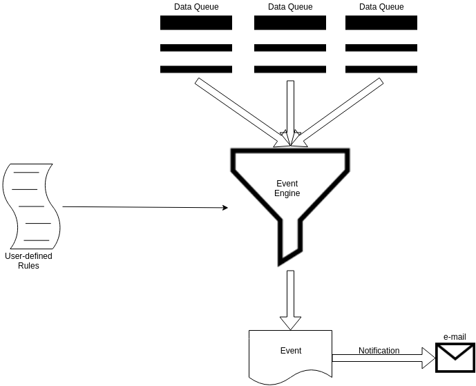

The Event Engine, in the current first release, is decoupled from the
mail dataflow by mean of one or more Kafka queues:

-   Messages in the application data model are dequeued by an Event
    Producer from a user defined Kafka queue

    -   Many Event Producer can consume from the same Kafka queue.

-   Generated Event objects, are enqueued in a (different) user defined
    Kafka queue.

    -   Many events flow can converge in the same Kafka queue.

-   Event objects, which are compliant to a specific data model, can be
    consumed by an Event Consumer, which send them as e-mails to the
    user

## Event: ##

An Event is an object that contains information relating to a
criticality or an unexpected situation, generated from a series of rules
defined by the user. Event objects are characterized by:

-   Event Id: Unique identifier of the Event, generated via an UUID

-   Timestamp: UTC instant of the generation of the Event, with
    millisecond resolution

-   Event Type: String representing the type of Event

-   Severity: String representing the Degree of severity of the Event

-   Source Id: Optional identifier of the original data that generated
    the Event

-   Source: Identifier of the streaming data source from which the Event
    was generated

-   Payload: json transcription of the entire data that generated the
    Event

-   Event Rule Name: Name of the rule responsible for the generated
    event object

Among these fields, eventId, timestamp, payload, source and
eventRuleName are managed internally, while eventType, severity and
sourceId can be customized by the user.

## Mail: ##

A Mail object is a pre-packaged item ready to be sent as a notification
of a occurrent Event. Mail objects are characterized by:

Mail To: Main recipient of the e-mail

Mail CC: Optional carbon copy recipient of the e-mail

Mail BCC: Optional hidden carbon copy recipient of the -e-mail

Mail Subject: Subject of the email

Mail Content: Content of the mail

All fields can be customized by the user.

The content of the email, in text/html format, is generated by the
Apache Velocity templating engine, using user provided template files,
compiled at runtime with the information available from Event object.

As the current implementation, each Event object may generate up to one
Mail.

## Configuration: ##

The Event Engine is provided with two Pipegraphs, the user can access
and configure them editing the ***it.agilelab.wasp.eventengine***
section of the configuration file.

Every configuration section mentioned from now on has to be considered
as child of the ***it.agilelab.wasp.eventengine*** block.

## Event Pipegraph: ##

The Event Pipegraph is the Pipegraph which is in charge of generate
Event objects. Event Pipegraph configuration is accessible inside the
block ***eventPipegraph***, which exposes the following keys:

-   ***isSystem***: flag which defines whether the Event Pipegraph
    should be included in the system pipegraphs (and therefore be
    automatically executed at startup when ***systempipegraphs.start***
    is enabled)

-   ***eventStrategy***: array of configuration objects in charge of
    creating each one an Event Producer.

Each element of the ***eventStrategy*** array is in turn composed by the
following keys:

-   ***name***: Name of the input streaming data source

-   ***reader***: configuration block that defines how to access input
    data from a Kafka queue

-   ***writer***: configuration block that defines where to write the
    output Event objects in a Kafka queue

-   ***trigger***: list of rules for generating Event objects

The configuration block is defined as follows:

```hocon
eventPipegraph: {

    IsSystem: true

    eventStrategy: [

      {

        name: “*the name of the event strategy*"

        reader: {...}

        writer: {...}

        trigger: {...}

     },

      {

        name: “*the name of the event strategy*"

        reader: {...}

        writer: {...}

        trigger: {...}

     },

     {...},

     {...}

  ]

}
```

In turn, child objects are defined as follows:

```hocon
reader: {

          modelName: "*The identifier in MongoDB of the input model*"

          datastoreModelName: "*name of the kafka topic*"

          modelType: "Kafka"

          options: [

            {

              key: "rate-limit"

              value: "200"

            }

        ]

}


writer: {

          modelName: "*The identifier in MongoDB of the output model*"

          datastoreModelName: "*name of the kafka topic*"

          modelType: "Kafka"

          options: [ (*MapLike sequence of Key→Value option)*

            {

              key: "replica"

              value: "3"

            },

            {

              key: "partitions"

              value: "3"

            },

       ]

   }


trigger: {

          eventRules: [

            {...},

            {...}

          ]

        }
```

Where each element of the eventRules array is defined as follows
```hocon
{

     name: "*name of the specific rule*"

     streamingSource = "*name of the streaming data source*",

     statement = "*SQL WHERE clause to infer whether or not an Event is
occurred*",

     typeExpression = "*SQL WHERE clause to decorate the Event with the
eventType field*",

     severityExpression = "*SQL WHERE clause to decorate the Event with
the severity field*",

     sourceIdExpression = "*SQL WHERE clause to decorate the Event with
the sourceId field*",

}
```

For each user-defined ***eventStrategy*** object, a minimum of one event
rule has to be defined in the ***eventRules*** array. There is however
no maximum limit imposed by the application on the number of rules for
each ***eventRules*** array. Hence, the user can add, remove or freely
modify event rules and restart Wasp to put them into operation.

 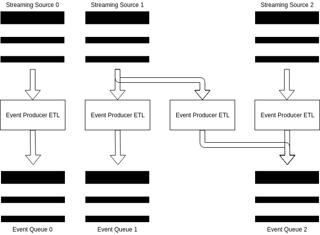

In the example, the Pipegraph Event has been configured to generate 4
Event Producers (therefore equivalent to four elements in the
***eventStrategy*** array). Each ETL is defined by entering an entry
point (reader) and an exit point (writer). Multiple ETLs can read from
the same input queue and / or write to the same output queue.


## Mailing Pipegraph: ##

The Mailing Pipegraph is the Pipegraph which is in charge of consume
Event objects. Mailing Pipegraph configuration is accessible inside the
block ***mailingPipegraph***, which exposes the following keys:

-   ***isSystem***: flag which defines whether the Event Pipegraph
    should be included in the system pipegraphs (and therefore be
    automatically executed at startup when ***systempipegraphs.start***
    is enabled)

-   ***writer***: configuration block that defines how to connect to an
    SMTP server and send e-mails

-   ***mailingStrategy***: array of configuration objects in charge of
    creating each one an Event Producer.

Each element of the ***mailingStrategy*** array is in turn composed by
the following keys:

-   ***name***: Name of the input streaming Event source

-   ***reader***: configuration block that defines how to access Event
    data from a Kafka queue

-   ***trigger***: list of rules for consuming Event objects

The configuration block is defined as follows:

```hocon
mailingPipegraph: {

    isSystem: false

    writer: {...}

    mailingStrategy: [

      {

name: “*the name of the mailing strategy*”

              reader: {...}

              trigger: {...}

      },

      {...}

   ]

  }
```

The ***writer*** block is defined as follows:

```hocon
writer: {

      modelName: "*Name of the mail writer*"

      datastoreModelName: "*Name of the topic from which fetch Event*"

      modelType: "Mail"

      options: [

        {

          key: "mail.smtp.host"

          value: "*SMTP server url or ip address*"

        }

        {

          key: "mail.smtp.port"

          value: "*SMTP port*"

        },

        {

          key: "mail-from"

          value: "*SMTS server’s accredited mail to be used as sender
address*"

        },

        {

          key: "mail.smtp.auth"

          value: "*Flag indicating if an authentication step on the SMPT
server is required*"

        },

        {

          key: "mail.smtp.ssl.enable"

          value: "*Flag indicating if the conncection over SSL is
enabled*"

        },

        {

          key: "username"

          value: "*Username to connect to the SMTP server*"

        },

        {

          key: "password"

          value: "Password *to connect to the SMTP server*"

        },

      ]

    }
```

The user is left with the task of compiling the ***options*** array,
entering all the information needed to connect to the chosen SMTP
server.

Each element of the ***mailingStrategy*** array has the following
children:

```hocon
reader: {

          modelName: "*Name of the event input model*"

          datastoreModelName: "*Name of the Kafka topic to fetch Event
objects from*"

          modelType: "Kafka"

          options: [

            {

              key: "rate-limit"

              value: "200"

            }

          ]

        }


trigger: {

          mailRules: [

                       {... },

          {...}

          ]

        }
```


In which each element of the ***mailRules*** array is defined as
follows:

```hocon
{

              name: "Name of the mailing rules"

              statement: "*SQL WHERE clause to decide whether or not a
Mail should be generated from the Event*"

              subjectExpression: "*SQL WHERE clause to decorate the Mail
with the subject*"

              templatePath: "*Path to a Velocity template file available
on the Spark Driver*"

              recipient: {

                mailTo: “*Comma separated main recipients of the Mail*"

                mailCc: “*Comma separated optional CC recipient of the
Mail*"

                mailBcc: "*Comma separated optional BCC recipient of the
Mail*"

              }

}
```
For each
user-defined ***mailingStrategy*** object, a minimum of one mailing rule
has to be defined in the ***mailingRules*** array. There is however no
maximum limit imposed by the application on the number of rules for each
***mailingRules*** array. Hence, the user can add, remove or freely
modify mailing rules and restart Wasp to put them into operation.

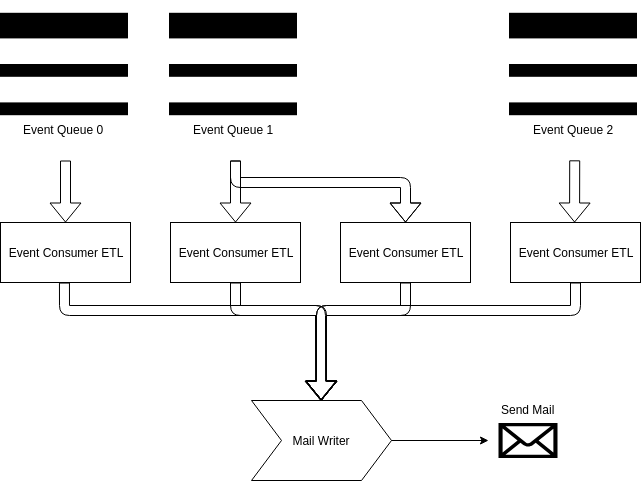

In the example, the Mailing Pipegraph has been configured to generate 4
Event Consumer (therefore equivalent to four elements in the
***mailingStrategy*** array). Each ETL is defined by entering an entry
point (***reader***), while the same exit point (***writer***) is used
for all ETLs. Multiple ETLs can read from the same input queue.

The example pipeline, complete with Event Pipegraph and Mailing
Pipegraph, is as follows:

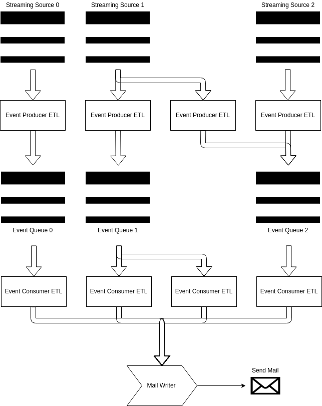

## Velocity Template: ##

Apache Velocity (`https://velocity.apache.org/`) is a Template Engine for
generating web pages, documents, SQL queries, etc.

In the context of the Event Engine, Velocity is used for mail
composition. The Mailing Pipegraph will generate the contents of the
mail starting from the template provided in the Velocity template file
(.vm) and the contents of the Event object.

The contents of the fields of the Event object can be referenced in the
Velocity template via the notation `${field}`

Below the fields currently supported and how they have to be referenced:

```velocity
eventId = ${eventId}

eventType = ${eventType}

severity = ${severity}

payload = ${payload}

timestamp = ${timestamp}

source = ${source}

sourceId = ${sourceId}

ruleName = ${ruleName}
```

Closes #195
Closes #197

## Wasp 2.26.0

### Resolve "Support dryrun mode in GDPR job"
		
[Merge request 186](https://gitlab.com/AgileFactory/Agile.Wasp2/-/merge_requests/186)
		
		Created at: 2020-04-15T09:34:07.677Z
		
		Updated at: 2020-09-17T15:40:19.472Z
		
		Branch: feature/272-support-dryrun-mode-in-gdpr-job
		
		Author: [Robert Nad](https://gitlab.com/whoaim)
		
		Assignee: [Antonio Murgia](https://gitlab.com/antonio.murgia)
		
Closes #272

### feature: Update API documentation
		
[Merge request 190](https://gitlab.com/AgileFactory/Agile.Wasp2/-/merge_requests/190)
		
		Created at: 2020-04-21T14:20:16.155Z
		
		Updated at: 2020-09-17T15:40:20.679Z
		
		Branch: feature/305-update-api-documentation
		
		Author: [Andrea Fonti](https://gitlab.com/andrea.fonti)
		
#### New features and improvements

- Created a new openapi module
- Created machinery to generate models via type classes
- Documented existing routes in code
- Created `documentation/wasp-openapi.yaml` by running `it.agilelab.bigdata.wasp.master.web.openapi.GenerateOpenApi`

#### Breaking changes

None.

#### Migration

None

#### Bug fixes

Fixed Mongo encoder for BatchJob that prevented updating batch jobs
Fixed Spray encoder for BatchJob let's that reported type values that were not acceptable as input

#### Related issue

Closes #305

### feature: Censor is not working properly on shared runners
		
[Merge request 191](https://gitlab.com/AgileFactory/Agile.Wasp2/-/merge_requests/191)
		
		Created at: 2020-04-27T17:18:19.873Z
		
		Updated at: 2020-09-17T15:40:20.957Z
		
		Branch: feature/306-censor-is-not-working-properly-on-shared-runners
		
		Author: [Antonio Murgia](https://gitlab.com/antonio.murgia)
		
		Assignee: [Andrea Fonti](https://gitlab.com/andrea.fonti)
		
#### New features and improvements

Censor step now works on gitlab shared runners because version `0.1.0` of docker image does not have any entrypoint.

#### Breaking changes

None.

#### Migration

None.

#### Bug fixes

None.

#### Related issue

Closes #306

### feature: Implement REST APIs for Logs
		
[Merge request 192](https://gitlab.com/AgileFactory/Agile.Wasp2/-/merge_requests/192)
		
		Created at: 2020-04-28T12:20:54.683Z
		
		Updated at: 2020-09-17T15:40:21.878Z
		
		Branch: feature/298-implement-rest-apis-for-logs
		
		Author: [Andrea Fonti](https://gitlab.com/andrea.fonti)
		
#### New features and improvements

A new rest API is available to search logs (see [wasp-openapi](documentation/wasp-openapi.yaml))

date-times are iso-8601 instant (thus always UTC) i.e. `2020-04-29T09:09:57.699Z`

search is the text that will be searched in all the logged fields (message, thread, log_source, stacktrace, cause, etc)

To use the feature

- Start the logger producer actor
- Start the logger pipegraph
- Wait for logs to be indexed
- Query the logs api

examples are provided using waspctl and fish shell, should be adapted for bash usage

```fish
./waspctl-darwin-amd64 --server localhost:2891 startpipegraph LoggerPipegraph

./waspctl-darwin-amd64 --server localhost:2891 startproducer  LoggerProducer

./waspctl-darwin-amd64 --server localhost:2891 logs  'Telemetry'  (instant -10d) (instant) 0 1
{
  "Result": "OK",
  "data": {
    "found": 1,
    "entries": [
     {
      "log_level": "Info",
      "log_source": "it.agilelab.bigdata.wasp.consumers.spark.streaming.actor.telemetry.TelemetryActorKafkaProducer$",
      "message": "Telemetry configuration\nKafkaEntryConfig(batch.size,1048576)\nKafkaEntryConfig(acks,0)",
      "thread": "WASP-akka.actor.default-dispatcher-3",
      "timestamp": "2020-04-29T09:09:57.699Z"
    }
    ]
  }
}
```

#### Breaking changes

None

#### Migration

None

#### Bug fixes

None

#### Related issue

Closes #298

### feature: Generate a waspctl client from open api specification
		
[Merge request 193](https://gitlab.com/AgileFactory/Agile.Wasp2/-/merge_requests/193)
		
		Created at: 2020-04-29T09:58:41.772Z
		
		Updated at: 2020-09-17T15:40:24.372Z
		
		Branch: feature/307-generate-a-waspctl-client-from-open-api-specification
		
		Author: [Andrea Fonti](https://gitlab.com/andrea.fonti)
		
#### New features and improvements

A waspctl client is now autogenerated from openapi specification see [README.md](waspctl/README.md) on how to regenerate the API bindings or build it locally with docker.

if you are interested in the executables those are generated in the deploy phase of the ci pipeline in the waspctl job, grab the executable relevant to your architecture and os (osx, windows, Linux) from the job artifacts

#### Breaking changes

None

#### Migration

None

#### Bug fixes

None

#### Related issue

Closes #307

### feature: Add found count to logging api to ease pagination
		
[Merge request 194](https://gitlab.com/AgileFactory/Agile.Wasp2/-/merge_requests/194)
		
		Created at: 2020-04-29T13:33:47.593Z
		
		Updated at: 2020-09-17T15:40:21.320Z
		
		Branch: feature/308-add-found-count-to-logging-api-to-ease-pagination
		
		Author: [Andrea Fonti](https://gitlab.com/andrea.fonti)
		
#### New features and improvements

- Added count field to log api response representing the total number of found log lines
- openapi can be regenerated via sbt command generate-open-api
- go binaries are now fully statically linked

#### Breaking changes

None

#### Migration

None

#### Bug fixes

None

#### Related issue

Closes #308

### feature: Implement REST APIs for Events
		
[Merge request 195](https://gitlab.com/AgileFactory/Agile.Wasp2/-/merge_requests/195)
		
		Created at: 2020-04-30T10:19:59.342Z
		
		Updated at: 2020-09-17T15:40:23.496Z
		
		Branch: feature/299-implement-rest-apis-for-events
		
		Author: [Andrea Fonti](https://gitlab.com/andrea.fonti)
		
#### New features and improvements

A new rest API is available to search events (see [wasp-openapi](documentation/wasp-openapi.yaml))

date-times are iso-8601 instant (thus always UTC) i.e. `2020-04-29T09:09:57.699Z`

search is the text that will be searched in all the event fields (eventId, eventRuleName, eventType, payload, severity, source, sourceId,timestamp)

To use the feature

- Start the fakedata producer actor
- Start the event pipegraph
- Wait for events to be indexed
- Query the events api

examples are provided using waspctl and fish shell, should be adapted for bash usage

```fish
./waspctl-darwin-amd64 --server localhost:2891 startpipegraph EventPipegraph

./waspctl-darwin-amd64 --server localhost:2891 startproducer FakeDataProducer

./waspctl-darwin-amd64 --server localhost:2891 events  'sensor_45'  (instant -400S) (instant) 0 1

{
  "Result": "OK",
  "data": {
    "found": 1,
    "entries": [
       {
        "eventId": "01c0e3e8-919e-4171-b528-cb606e41896b",
        "eventRuleName": "HighTemperature",
        "eventType": "TempControl",
        "payload": "{\"kafkaMetadata\":{\"key\":\"NDUyNzgyNjQx\",\"headers\":[],\"topic\":\"fake-data.topic\",\"partition\":1,\"offset\":2169,\"timestamp\":\"2020-05-04T18:18:56.639Z\",\"timestampType\":0},\"name\":\"sensor_45\",\"temperature\":107.495094,\"someLong\":1588616336638,\"someStuff\":\"even\",\"someNumber\":92}",
        "severity": "CRITICAL",
        "source": "streamingSource1",
        "sourceId": "sensor_45",
        "timestamp": "2020-05-04T18:18:57.450Z"
      }
    ]
  }
}

```

#### Breaking changes

None

#### Migration

None

#### Bug fixes

None

#### Related issue

Closes #299

### feature: Implement REST APIs for Telemetry
		
[Merge request 196](https://gitlab.com/AgileFactory/Agile.Wasp2/-/merge_requests/196)
		
		Created at: 2020-05-05T08:11:50.906Z
		
		Updated at: 2020-09-17T15:40:21.593Z
		
		Branch: feature/297-implement-rest-apis-for-telemetry
		
		Author: [Andrea Fonti](https://gitlab.com/andrea.fonti)
		
#### New features and improvements

A new rest API is available to search and obtain telemetry data (see [wasp-openapi](/AgileFactory/Agile.Wasp2/-/blob/develop/documentation/wasp-openapi.yaml))

date-times are iso-8601 instant (thus always UTC) i.e. `2020-04-29T09:09:57.699Z`

To use the feature

* Start the `TestJSONProducerWithMetadata` producer actor
* Start the `TelemetryPipegraph` pipegraph
* Start the `TestConsoleWriterWithMetadataStructuredJSONPipegraph` pipegraph
* Wait for telemetry to be indexed
* Query the telemetry api

examples are provided using waspctl and fish shell, should be adapted for bash usage

```
./waspctl-darwin-amd64 startpipegraph TestConsoleWriterWithMetadataStructuredJSONPipegraph
./waspctl-darwin-amd64 startpipegraph TelemetryPipegraph
./waspctl-darwin-amd64 startproducer TestJSONProducerWithMetadata

./waspctl-darwin-amd64 list-telemetry-sources "" 100
./waspctl-darwin-amd64 list-telemetry-metrics "" "pipegraph_TelemetryPipegraph_structuredstreaming_write_on_index_writer_Write_telemetry_data_to_Solr" 100 --verbose

./waspctl-darwin-amd64 get-telemetry-series walCommit-durationMs pipegraph_TelemetryPipegraph_structuredstreaming_write_on_index_writer_Write_telemetry_data_to_Solr 100 "2020-05-08T08:49:07.001Z" "2020-05-08T09:49:07.001Z"
```

#### Breaking changes

None

#### Migration

None

#### Bug fixes

None

#### Related issue

Closes #297

### feature: Create a docker image to run wasp without compiling it first
		
[Merge request 198](https://gitlab.com/AgileFactory/Agile.Wasp2/-/merge_requests/198)
		
		Created at: 2020-05-06T09:33:37.444Z
		
		Updated at: 2020-09-17T15:40:24.215Z
		
		Branch: feature/310-create-a-docker-image-to-run-wasp-without-compiling-it-first
		
		Author: [Andrea Fonti](https://gitlab.com/andrea.fonti)
		
#### New features and improvements

##### Created a try-wasp docker container

###### Rebuild the image

in order to build the new container image

```
docker login registry.gitlab.com
```

```
cd whitelabel/docker/runnable-cdh5/
bash build-image.sh $TAG
```

if you want to push the image to the registry use the command printed by the script

###### Use the image

```
docker run -it -p 8088:8088 -p 2891:2891 -p 8042:8042 -p 5005:5005 -p 5006:5006 -p 5007:5007 -p 5008:5008 -p8983:8983 -p4040:4040 -p4041:4041 registry.gitlab.com/agilefactory/agile.wasp2/try-wasp:$TAG
```

change this environment variables to change memory allocated to wasp components by passing them as options to the docker run command

```
MASTER_MEMORY 512m
PRODUCERS_MEMORY 512m
SPARK_STREAMING_MEMORY 512m
SPARK_BATCH_MEMORY 512m
```


#### Breaking changes

None

#### Migration

None

#### Bug fixes

None

#### Related issue

Closes #310

### hotfix: Topics endpoint returns some entities not compliant with TopicModel
		
[Merge request 200](https://gitlab.com/AgileFactory/Agile.Wasp2/-/merge_requests/200)
		
		Created at: 2020-05-08T12:03:03.472Z
		
		Updated at: 2020-09-17T15:40:19.197Z
		
		Branch: hotfix/313-topics-endpoint-returns-some-entities-not-compliant-with-topicmodel
		
		Author: [Andrea Fonti](https://gitlab.com/andrea.fonti)
		
#### New features and improvements

None

#### Breaking changes

None

#### Migration

None

#### Bug fixes

Added alternatives to topics response, the elements can either be `TopicModel` or `MultiTopicModel`

#### Related issue

Closes #313

### hotfix: The POST mlmodels API does not work
		
[Merge request 201](https://gitlab.com/AgileFactory/Agile.Wasp2/-/merge_requests/201)
		
		Created at: 2020-05-08T12:12:23.306Z
		
		Updated at: 2020-09-17T15:40:22.260Z
		
		Branch: hotfix/312-the-post-mlmodels-api-does-not-work
		
		Author: [Andrea Fonti](https://gitlab.com/andrea.fonti)
		
#### New features and improvements

- Refactored mlmodelbl
- More descriptive errors when something fails
- Updated documentation to clarify what should be provided as modelFieldId

#### Breaking changes

None

#### Migration

None

#### Bug fixes

- Fixed bug preventing inter of models with same name but different versions or timestamps

#### Related issue

Closes #312

### feature: Change behaviour of search REST APIs
		
[Merge request 203](https://gitlab.com/AgileFactory/Agile.Wasp2/-/merge_requests/203)
		
		Created at: 2020-05-11T14:32:10.529Z
		
		Updated at: 2020-09-17T15:40:18.747Z
		
		Branch: feature/318-change-behaviour-of-search-rest-apis
		
		Author: [Andrea Fonti](https://gitlab.com/andrea.fonti)
		
#### New features and improvements

Logs and event search now perform correctly a full text search

the `all` field used by searches is now tokenized by `solr.StandardTokenizerFactory` and filtered via `solr.StopFilterFactory` and `solr.LowerCaseFilterFactory`

#### Breaking changes

None

#### Migration

None

#### Bug fixes

None

#### Related issue

Closes #318

### feature: Implement REST APIs for KeyValues
		
[Merge request 204](https://gitlab.com/AgileFactory/Agile.Wasp2/-/merge_requests/204)
		
		Created at: 2020-05-12T08:07:48.972Z
		
		Updated at: 2020-09-17T15:40:23.221Z
		
		Branch: feature/316-implement-rest-apis-for-keyvalues
		
		Author: [Andrea Fonti](https://gitlab.com/andrea.fonti)
		
#### New features and improvements

Implemented read endpoint for key values

#### Breaking changes

None

#### Migration

None

#### Bug fixes

Removed build time from build info, it was forcing set to recompile and repackage at every start of containerised wasp

#### Related issue

Closes #316

### hotfix: wrong openapi definition for telemetry
		
[Merge request 205](https://gitlab.com/AgileFactory/Agile.Wasp2/-/merge_requests/205)
		
		Created at: 2020-05-12T09:59:40.530Z
		
		Updated at: 2020-09-17T15:40:22.869Z
		
		Branch: hotfix/320-wrong-openapi-definition-for-telemetry
		
		Author: [Andrea Fonti](https://gitlab.com/andrea.fonti)
		
#### New features and improvements

None

#### Breaking changes

None

#### Migration

None

#### Bug fixes

Fixed `metrics` e `sources` endpoint definition

#### Related issue

Closes #320

### feature: Implement REST APIs for RawData
		
[Merge request 206](https://gitlab.com/AgileFactory/Agile.Wasp2/-/merge_requests/206)
		
		Created at: 2020-05-13T09:21:35.674Z
		
		Updated at: 2020-09-17T15:40:20.385Z
		
		Branch: feature/317-implement-rest-apis-for-rawdata
		
		Author: [Andrea Fonti](https://gitlab.com/andrea.fonti)
		
#### New features and improvements

implemented api to list `RawModel` see [WaspOpenApi](documentation/wasp-openapi.yaml)

#### Breaking changes

None

#### Migration

None

#### Bug fixes

None

#### Related issue

Closes #317

### feature: Implement REST APIs for counts summary
		
[Merge request 207](https://gitlab.com/AgileFactory/Agile.Wasp2/-/merge_requests/207)
		
		Created at: 2020-05-14T10:11:30.032Z
		
		Updated at: 2020-09-17T15:40:23.816Z
		
		Branch: feature/319-implement-rest-apis-for-counts-summary
		
		Author: [Andrea Fonti](https://gitlab.com/andrea.fonti)
		
#### New features and improvements

Implemented stats api see [wasp-openapi.yaml](documentation/wasp-openapi.yaml)

```
./waspctl-darwin-amd64  start-producer FakeDataProducer
./waspctl-darwin-amd64  start-pipegraph EventPipegraph
./waspctl-darwin-amd64  start-pipegraph TelemetryPipegraph
./waspctl-darwin-amd64  start-pipegraph LoggerPipegraph
./waspctl-darwin-amd64  start-producer LoggerProducer
./waspctl-darwin-amd64  stats "2020-05-15T10:47:09.492Z" "2020-05-15T11:00:09.492Z"
```

get telemetry series now supports aggregates

```
waspctl-darwin-amd64 get-telemetry-series  "java.lang.ps-scavenge.collection-time" "jvm" 100 "2020-05-18T12:00:52.236Z" "2020-05-18T15:10:52.236Z" sum
```

aggregates can be:

* `sum`
* `max`
* `min`
* `avg`

NOTE:

aggregate value for buckets without data will be `null`

```json
[{
    "timestamp": "2020-05-18T13:58:40.236Z",
    "value": null
},
{
    "timestamp": "2020-05-18T14:00:34.236Z",
    "value": 6286
},
{
    "timestamp": "2020-05-18T14:02:28.236Z",
    "value": null
}]
```

#### Breaking changes

None

#### Migration

None

#### Bug fixes

Fixed metric name returned truncated by list-telemetry-metric operation

#### Related issue

Closes #319

### feature: RawModel should not limit writes to be directed to HDFS
		
[Merge request 208](https://gitlab.com/AgileFactory/Agile.Wasp2/-/merge_requests/208)
		
		Created at: 2020-05-14T15:07:24.344Z
		
		Updated at: 2020-09-17T15:40:18.370Z
		
		Branch: feature/321-rawmodel-should-limit-writes-to-be-directed-to-hdfs
		
		Author: [Antonio Murgia](https://gitlab.com/antonio.murgia)
		
		Assignee: [Andrea Fonti](https://gitlab.com/andrea.fonti)
		
#### New features and improvements

RawModels can be written to any uri.

#### Breaking changes

None.

#### Migration

None.

#### Bug fixes

None.

#### Related issue

Closes #321

### feature: Update wasp to Cloudera CDH6 dependencies
		
[Merge request 209](https://gitlab.com/AgileFactory/Agile.Wasp2/-/merge_requests/209)
		
		Created at: 2020-05-14T16:13:08.425Z
		
		Updated at: 2020-09-17T15:40:22.568Z
		
		Branch: feature/322-update-wasp-to-cloudera-cdh6-dependencies
		
		Author: [Andrea Fonti](https://gitlab.com/andrea.fonti)
		
#### New features and improvements

- Upgraded wasp to cdh6 dependencies

https://docs.cloudera.com/documentation/enterprise/6/release-notes/topics/rg_cdh_63_packaging.html#cdh_630_packaging

#### Breaking changes

- Wasp now depends on cdh6

#### Migration

- During upgrade all the dependencies should be validated, an integration test or complete system test is advisable

#### Bug fixes

None

#### Thanks

Thanks to @emakhov @LorenzoGraziano @antonio.murgia 

#### Related issue

Closes #322

### feature: Install nifi and nifi registry inside whitelabel docker image
		
[Merge request 212](https://gitlab.com/AgileFactory/Agile.Wasp2/-/merge_requests/212)
		
		Created at: 2020-05-29T14:14:06.024Z
		
		Updated at: 2020-09-17T15:40:18.914Z
		
		Branch: feature/331-install-nifi-and-nifi-registry-inside-whitelabel-docker-image
		
		Author: [Mattia Folcarelli](https://gitlab.com/mattia.folcarelli)
		
#### New features and improvements

Add **nifi** and **nifi-registry** setup in the /whitelabel/docker/cdh6 docker file with standard configs.

**How to try it:**  
Build:  
`docker build . -t  registry.gitlab.com/agilefactory/agile.wasp2/cdh-docker:6.3.2`

Run:  
`docker run -it --rm -p 8088:8088 -p 2891:2891 -p 8042:8042 -p 5005:5005 -p 5006:5006 -p 5007:5007 -p 50088983:8983 -p4040:4040 -p4041:4041 -p8080:8080 -p18080:18080 registry.gitlab.com/agilefactory/agile.wasp2/cdh-docker:6.3.2`

The run command will start nifi and nifi-registry services at:  
`http://localhost:8080/nifi`  
`http://localhost:18080/nifi-registry`  


*Thanks to @antonio.murgia for the support!*

#### Related issue

Closes #331

### feature: Implement a nifi rest client compatible with Akka version used by wasp
		
[Merge request 213](https://gitlab.com/AgileFactory/Agile.Wasp2/-/merge_requests/213)
		
		Created at: 2020-06-03T08:48:28.447Z
		
		Updated at: 2020-09-17T15:40:41.292Z
		
		Branch: feature/329-implement-a-nifi-rest-client-compatible-with-akka-version-used-by-wasp
		
		Author: [Mattia Folcarelli](https://gitlab.com/mattia.folcarelli)
		
		Assignee: [Andrea Fonti](https://gitlab.com/andrea.fonti)
		
#### New features and improvements

Add a nifi rest client module with its dependencies.
The main class SmokeTest could be used to check if the nifi rest client it's working:
- In nifi ([http://localhost:8080/nifi](http://localhost:8080/nifi)) add a new registry
- Go to [http://localhost:18080/nifi-registry](http://localhost:18080/nifi-registry) and create a new Buckets  
- Run the SmokeTest class, it should print something like this:
> VersionControlInformationEntity(Some(VersionControlInformationDTO(Some(7feea00b-0172-1000-36d3-2a80bf9c4f74),Some(7fedc3d2-0172-1000-9dc0-258950cbb9a8),Some(TestRegistry),Some(dee15208-a514-42e0-81fa-f964e1893ed5),Some(pippo),Some(d2bb0c9c-8401-45e0-91d1-bf70d633113b),Some(demo),None,Some(1),Some(UP_TO_DATE),Some(Flow version is current))),Some(RevisionDTO(Some(b340b214-b16c-4df5-9435-6df64f67b66c),Some(2),Some(anonymous))),None)


#### Related issue

Closes #329

### feature: Compile scala code at runtime and execute it as a spark streaming job
		
[Merge request 214](https://gitlab.com/AgileFactory/Agile.Wasp2/-/merge_requests/214)
		
		Created at: 2020-06-04T16:00:08.551Z
		
		Updated at: 2020-09-17T15:40:40.209Z
		
		Branch: feature/333-compile-scala-code-at-runtime-and-execute-it-as-a-spark-streaming-job
		
		Author: [Andrea Pinto](https://gitlab.com/pintuz)
		
#### New features and improvements

- Created strategy that compiles code at runtime 

```scala
val strategy = new FreeCodeStrategy(
      """
        |import it.agilelab.bigdata.wasp.consumers.spark.strategies.TestObj._
        |val df = dataFrames.getFirstDataFrame.select("name","someNumber","someLong")
        |val udfEven = spark.udf.register("udfEven",even )
        |df.withColumn("someNumber",df("someNumber")*df("someNumber"))
        |  .withColumn("extra",lit("TEST"))
        |  .withColumn("extra_bis",lit(value_1))
        |  .withColumn("even",udfEven(df("someLong")))
        |""".stripMargin)
```

This strategy will bind these names:

* `spark`  - Spark session
* `configuration` - The strategy configuration as declared in the strategy model
* `dataFrames` - The input data frames to the strategy

#### Breaking changes

None

#### Migration

None

#### Bug fixes

None
#### Related issue

Closes #333

### feature: Move SchemaConverters to master module
		
[Merge request 216](https://gitlab.com/AgileFactory/Agile.Wasp2/-/merge_requests/216)
		
		Created at: 2020-06-08T08:33:07.058Z
		
		Updated at: 2020-09-17T15:40:41.562Z
		
		Branch: feature/336-move-schemaconverters-to-master-module
		
		Author: [Antonio Murgia](https://gitlab.com/antonio.murgia)
		
		Assignee: [Andrea Fonti](https://gitlab.com/andrea.fonti)
		
#### New features and improvements

Move `SchemaConverters` to master module and rename it to `AvroSchemaConverters`.

#### Breaking changes

Not strictly breaking, we are deprecating
`it.agilelab.bigdata.wasp.consumers.spark.utils.SchemaConverters` is favor of `it.agilelab.bigdata.wasp.core.utils.AvroSchemaConverters`.


#### Migration

Replace usage of `it.agilelab.bigdata.wasp.consumers.spark.utils.SchemaConverters` with `it.agilelab.bigdata.wasp.core.utils.AvroSchemaConverters`.

#### Bug fixes

None.

#### Related issue

Closes #336

### feature: Define nifi stateless APIs
		
[Merge request 217](https://gitlab.com/AgileFactory/Agile.Wasp2/-/merge_requests/217)
		
		Created at: 2020-06-08T08:49:56.967Z
		
		Updated at: 2020-09-17T15:40:43.636Z
		
		Branch: feature/335-define-nifi-stateless-apis
		
		Author: [Mattia Folcarelli](https://gitlab.com/mattia.folcarelli)
		
#### New features and improvements

Add Rest api definition for:
- post to get an editor (a nifi stateless instance)
- get commit an edited process group (returns the inserted code)
- post a pipegraph DTO model to generate a new Pipegraph

The trait PipegraphDTOConverter will be used as reference for future controllers and eventually removed

Add editor and DTO Models

#### Related issue

Closes #335

### feature: Create an api to compile free code strategy and report errors to the user
		
[Merge request 218](https://gitlab.com/AgileFactory/Agile.Wasp2/-/merge_requests/218)
		
		Created at: 2020-06-09T10:22:37.077Z
		
		Updated at: 2020-09-17T15:40:42.394Z
		
		Branch: feature/337-create-an-api-to-compile-free-code-strategy-and-report-errors-to-the-user
		
		Author: [Andrea Pinto](https://gitlab.com/pintuz)
		
#### New features and improvements

Add some APIs to manage a "free code strategy":
- a get-list to retrieve all strategies stored on the MongoDB
- a get to retrieve a specific strategy stored on the MongoDB, filtering by name
- a post to save the code on MongoDB. In this step the code is validated.
 
To validate the code, there is a utility class that checks the free code and, eventually, returns the list of problems.

#### Related issue

Closes #337

### feature: Implement an api to create a new process group on nifi to be edited
		
[Merge request 219](https://gitlab.com/AgileFactory/Agile.Wasp2/-/merge_requests/219)
		
		Created at: 2020-06-10T13:57:59.606Z
		
		Updated at: 2020-09-17T15:40:40.751Z
		
		Branch: feature/327-implement-an-api-to-create-a-new-process-group-on-nifi-to-be-edited
		
		Author: [Mattia Folcarelli](https://gitlab.com/mattia.folcarelli)
		
		Assignee: [Andrea Fonti](https://gitlab.com/andrea.fonti)
		
#### New features and improvements

Implement a Controller in master of this api:

```
POST /editor/nifi/{processGroupName}
```

It creates a new process group on a nifi instance and return to the client the url of the nifi ui to edit it

#### Related issue

Closes #327

### feature: Integrate nifi stateless engine as a strategy
		
[Merge request 221](https://gitlab.com/AgileFactory/Agile.Wasp2/-/merge_requests/221)
		
		Created at: 2020-06-11T16:07:33.686Z
		
		Updated at: 2020-09-17T15:40:42.111Z
		
		Branch: feature/330-integrate-nifi-stateless-engine-as-a-strategy
		
		Author: [Andrea Fonti](https://gitlab.com/andrea.fonti)
		
#### New features and improvements

Nifi stateless is now available as an execution engine for pipegraphs

##### Sequence overview

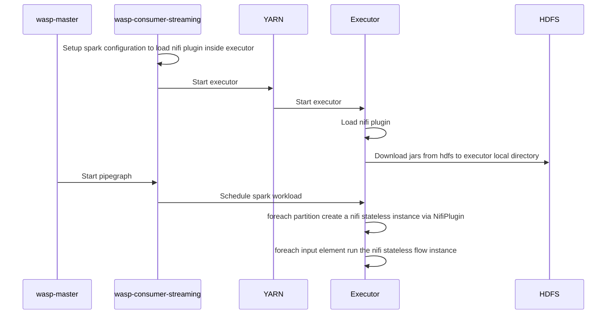

##### Nifi strategy execution
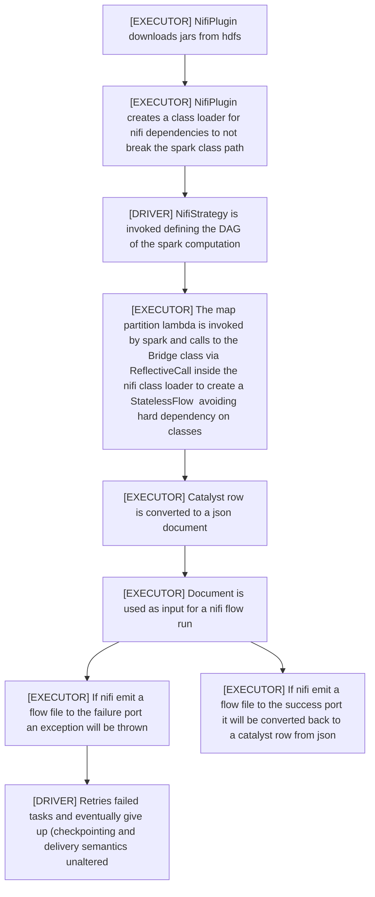

##### Configuration of a wasp deployment

To enable the feature these steps should be performed

1. Copy nifi stateless jars from the nifi-stateless docker image

```docker
#### this example is useful to prepare a docker container but can be adapted to a non dockerized deployment
FROM apache/nifi-stateless:1.11.4 AS nifi

FROM ubuntu:16.04

COPY --from=nifi /opt/nifi/nifi-current/lib/*.jar /nifi-libs/system/
COPY --from=nifi /opt/nifi/nifi-current/lib/bootstrap/*.jar /nifi-libs/bootstrap/
COPY --from=nifi /opt/nifi/nifi-current/work/stateless-nars /nifi-libs/extensions
```

2. Download nifi-stateless and its dependencies using coursier 

```bash
mkdir -p /nifi-libs/stateless && \
     curl -fLo cs https://git.io/coursier-cli-linux && \
     chmod +x cs && \
     bash -c "./cs fetch org.apache.nifi:nifi-stateless:1.11.4 org.apache.nifi:nifi-nar-utils:1.11.4 | xargs -I{} cp {} /nifi-libs/stateless" && \
     ls /nifi-libs/stateless
```

3. Upload nifi jars and extensions to hdfs

```bash
 hdfs dfs -copyFromLocal /nifi-libs/stateless/* /user/root/nifi/stateless \
    && hdfs dfs -copyFromLocal /nifi-libs/bootstrap/* /user/root/nifi/bootstrap \
    && hdfs dfs -copyFromLocal /nifi-libs/system/* /user/root/nifi/system \
    && hdfs dfs -copyFromLocal /nifi-libs/extensions /user/root/nifi/ \
```

4. Add nifi plugin jar to the spark lib directories (it should be available at executors startup so no remote class loading from driver will take place at this stage)

```bash
hdfs dfs -copyFromLocal /code/consumers-spark/lib/it.agilelab.wasp-spark-nifi-plugin-*.jar /user/root/spark2/lib
```

5. Copy bridge jar to the stateless directory on hdfs

```bash
hdfs dfs -copyFromLocal /code/consumers-spark/lib/it.agilelab.wasp-spark-nifi-plugin-bridge-*.jar /user/root/nifi/stateless
```

6. Configure wasp to enable nifi-plugin by updating the config file

```
wasp.spark-streaming {
    nifi-stateless {
      bootstrap = "hdfs://"${HOSTNAME}":9000/user/root/nifi/bootstrap"
      system = "hdfs://"${HOSTNAME}":9000/user/root/nifi/system"
      stateless = "hdfs://"${HOSTNAME}":9000/user/root/nifi/stateless"
      extensions = "hdfs://"${HOSTNAME}":9000/user/root/nifi/extensions"
    }
}
```

##### Quick demo

To perform a quick test or demo run

```
whitelabel/docker/cdh6/start-wasp.sh
```

use waspctl to start the provided example pipegraph

```
➜ ./waspctl-darwin-amd64 start-pipegraph TestConsoleWriterNifiStructuredJSONPipegraph
➜ ./waspctl-darwin-amd64 start-producer TestJSONProducer
```

you should see an output similar to this one

```
[streaming] INFO  2020-06-17 14:26:56,723 o.a.k.c.c.i.Fetcher: [Consumer clientId=consumer-1, groupId=spark-kafka-source-f4af9144-e852-49e3-871e-e961b26f015d-371672520-driver-0] Resetting offset for partition test_json.topic-2 to offset 4.
-------------------------------------------
Batch: 9
-------------------------------------------
+--------------------+------+------+--------------------+
|       kafkaMetadata|    id|number|              nested|
+--------------------+------+------+--------------------+
|[9, [], test_json...|ciccio|     9|[field1_9, 9, fie...|
```

#### Breaking changes

None

#### Migration

None

#### Bug fixes

None

#### Related issue

Closes #330

### Resolve "Create an api to complete the free code strategy"
		
[Merge request 224](https://gitlab.com/AgileFactory/Agile.Wasp2/-/merge_requests/224)
		
		Created at: 2020-06-18T07:09:33.061Z
		
		Updated at: 2020-09-17T15:40:39.894Z
		
		Branch: feature/341-create-an-api-to-complete-the-free-code-strategy
		
		Author: [Andrea Pinto](https://gitlab.com/pintuz)
		
#### New features and improvements

Add a api to list the the possible words (methods or variable names) to complete the free code of a strategy

##### Examples

Request completion

```
➜ echo '{ "name": "name", "code": "val ciccio=12; c"}' | ./waspctl/output/waspctl-darwin-amd64 complete-freecode "15"
{
  "Result": "OK",
  "data": [
    {
      "info": "Int",
      "toComplete": "ciccio"
    },
    {
      "info": "org.apache.spark.sql.SparkSession",
      "toComplete": "spark"
    },
    {
      "info": "com.typesafe.config.Config",
      "toComplete": "configuration"
    },
    {
      "info": "Map[it.agilelab.bigdata.wasp.consumers.spark.strategies.ReaderKey,org.apache.spark.sql.DataFrame]",
      "toComplete": "dataFrames"
    },
    {
      "info": "()Compilation.type",
      "toComplete": "\u003cinit\u003e"
    },
    {
      "info": "(self: Compilation.type)any2stringadd[Compilation.type]",
      "toComplete": "\u003cinit\u003e"
    },
    {
      "info": "[T0](x$1: T0)T0",
      "toComplete": "synchronized"
    },
    {
      "info": "()Int",
      "toComplete": "##"
    },
    {
      "info": "(x$1: Any)Boolean",
      "toComplete": "!="
    },
    {
      "info": "(x$1: Any)Boolean",
      "toComplete": "=="
    },
    {
      "info": "(x$1: AnyRef)Boolean",
      "toComplete": "ne"
    },
    {
      "info": "(x$1: AnyRef)Boolean",
      "toComplete": "eq"
    },
    {
      "info": "()Unit",
      "toComplete": "finalize"
    },
    {
      "info": "()Unit",
      "toComplete": "wait"
    },
    {
      "info": "(x$1: Long, x$2: Int)Unit",
      "toComplete": "wait"
    },
    {
      "info": "(x$1: Long)Unit",
      "toComplete": "wait"
    },
    {
      "info": "()Unit",
      "toComplete": "notifyAll"
    },
    {
      "info": "()Unit",
      "toComplete": "notify"
    },
    {
      "info": "()String",
      "toComplete": "toString"
    },
    {
      "info": "()Object",
      "toComplete": "clone"
    },
    {
      "info": "(x$1: Any)Boolean",
      "toComplete": "equals"
    },
    {
      "info": "()Int",
      "toComplete": "hashCode"
    },
    {
      "info": "()Class[_]",
      "toComplete": "getClass"
    },
    {
      "info": "[T0]=\u003e T0",
      "toComplete": "asInstanceOf"
    },
    {
      "info": "[T0]=\u003e Boolean",
      "toComplete": "isInstanceOf"
    },
    {
      "info": "(other: String)String",
      "toComplete": "+"
    },
    {
      "info": "(fmtstr: String)String",
      "toComplete": "formatted"
    },
    {
      "info": "(cond: Compilation.type =\u003e Boolean, msg: =\u003e Any)Compilation.type",
      "toComplete": "ensuring"
    },
    {
      "info": "(cond: Compilation.type =\u003e Boolean)Compilation.type",
      "toComplete": "ensuring"
    },
    {
      "info": "(cond: Boolean, msg: =\u003e Any)Compilation.type",
      "toComplete": "ensuring"
    },
    {
      "info": "(cond: Boolean)Compilation.type",
      "toComplete": "ensuring"
    },
    {
      "info": "[B](y: B)(Compilation.type, B)",
      "toComplete": "→"
    },
    {
      "info": "[B](y: B)(Compilation.type, B)",
      "toComplete": "-\u003e"
    }
  ]
}
```

Request compilation with errors

```
echo '{ "name": "name", "code": "val ciccio=12; c"}' | ./waspctl/output/waspctl-darwin-amd64 insert-freecode
{
  "ErrorMsg": "FreeCodeStrategy with one or more problems",
  "Result": "KO",
  "data": [
    {
      "content": "val ciccio=12; c",
      "errorType": "error",
      "fileName": "\u003cvirtual\u003e",
      "indicator": "               ^",
      "msg": "not found: value c",
      "where": "1"
    }
  ]
}
```

Request compilation with invalid signature (not a strategy)

```
echo '{ "name": "name", "code": "val ciccio=12"}' | ./waspctl/output/waspctl-darwin-amd64 insert-freecode
{
  "ErrorMsg": "FreeCodeStrategy with one or more problems",
  "Result": "KO",
  "data": [
    {
      "content": "}) : ((Map[ReaderKey, DataFrame], Config) =\u003e DataFrame) ",
      "errorType": "error",
      "fileName": "\u003cvirtual\u003e",
      "indicator": "^",
      "msg": "type mismatch;\n found   : Unit\n required: org.apache.spark.sql.DataFrame\n    (which expands to)  org.apache.spark.sql.Dataset[org.apache.spark.sql.Row]",
      "where": "2"
    }
  ]
}
```

Request compilation with valid strategy

```
echo '{ "name": "name", "code": "dataFrames.head._2"}' | ./waspctl/output/waspctl-darwin-amd64 insert-freecode
{
  "Result": "OK",
  "data": "OK"
}
```

Retrieve free code strategy 

```
./waspctl/output/waspctl-darwin-amd64 get-freecode name
{
  "Result": "OK",
  "data": {
    "code": "dataFrames.head._2",
    "name": "name"
  }
}
```

List all free code strategies

```
./waspctl/output/waspctl-darwin-amd64 list-freecode
{
  "Result": "OK",
  "data": [
    {
      "code": "dataFrames.head._2",
      "name": "name"
    }
  ]
}
```

#### Related issue

Closes #341

### feature: Fix  runnable cdh6 docker file
		
[Merge request 225](https://gitlab.com/AgileFactory/Agile.Wasp2/-/merge_requests/225)
		
		Created at: 2020-06-18T08:35:53.932Z
		
		Updated at: 2020-09-17T15:40:41.946Z
		
		Branch: feature/342-fix-runnable-cdh6-docker-file
		
		Author: [Mattia Folcarelli](https://gitlab.com/mattia.folcarelli)
		
		Assignee: [Andrea Fonti](https://gitlab.com/andrea.fonti)
		
#### New features and improvements

#### Bug fixes

fix docker files
fix docker-entrypoint.sh
rebuild openapi

#### Related issue

Closes #342

### feature: Implement an api to commit changes made to a process group in nifi
		
[Merge request 226](https://gitlab.com/AgileFactory/Agile.Wasp2/-/merge_requests/226)
		
		Created at: 2020-06-18T09:04:28.876Z
		
		Updated at: 2020-09-17T15:40:46.145Z
		
		Branch: feature/328-implement-an-api-to-commit-changes-made-to-a-process-group-in-nifi
		
		Author: [Mattia Folcarelli](https://gitlab.com/mattia.folcarelli)
		
		Assignee: [Andrea Fonti](https://gitlab.com/andrea.fonti)
		
#### New features and improvements

Add new endpoint to commit process groups and retrieve their json representation

##### Examples

```
➜ ./waspctl-darwin-amd64 new-processgroup my-very-special-process-group
{
  "Result": "OK",
  "data": {
    "name": "my-very-special-process-group",
    "processGroupId": "e0e0c8c0-0172-1000-1586-062baf7b02a6",
    "url": "http://d0737c4267f1:2891/proxy/nifi/?processGroupId=e0e0c8c0-0172-1000-1586-062baf7b02a6"
  }
}

./waspctl-darwin-amd64 commit-processgroup e0e0c8c0-0172-1000-1586-062baf7b02a6
{
  "Result": "OK",
  "data": {
    "contents": {
      "comments": "",
      "componentType": "PROCESS_GROUP",
      "connections": [],
      "controllerServices": [],
      "funnels": [],
      "identifier": "d66911b4-8282-30ab-9101-bfb308af065d",
      "inputPorts": [
        {
          "allowRemoteAccess": false,
          "componentType": "INPUT_PORT",
          "concurrentlySchedulableTaskCount": 1,
          "groupIdentifier": "d66911b4-8282-30ab-9101-bfb308af065d",
          "identifier": "b4c39bab-b6c8-3608-9452-204923d72558",
          "name": "wasp-input",
          "position": {
            "x": 700,
            "y": 0
          },
          "type": "INPUT_PORT"
        }
      ],
      "labels": [],
      "name": "my-very-special-process-group",
      "outputPorts": [
        {
          "allowRemoteAccess": false,
          "componentType": "OUTPUT_PORT",
          "concurrentlySchedulableTaskCount": 1,
          "groupIdentifier": "d66911b4-8282-30ab-9101-bfb308af065d",
          "identifier": "ff84621d-4ded-3180-9d1b-98b38d108220",
          "name": "wasp-output",
          "position": {
            "x": 1000,
            "y": 0
          },
          "type": "OUTPUT_PORT"
        },
        {
          "allowRemoteAccess": false,
          "componentType": "OUTPUT_PORT",
          "concurrentlySchedulableTaskCount": 1,
          "groupIdentifier": "d66911b4-8282-30ab-9101-bfb308af065d",
          "identifier": "d9fbfe22-8f55-37a0-8f59-460686dd0959",
          "name": "wasp-error",
          "position": {
            "x": 1000,
            "y": 100
          },
          "type": "OUTPUT_PORT"
        }
      ],
      "position": {
        "x": 0,
        "y": 0
      },
      "processGroups": [],
      "processors": [],
      "remoteProcessGroups": [],
      "variables": {}
    },
    "id": "e0e0c8c0-0172-1000-1586-062baf7b02a6"
  }
}
```
#### Related issue

Closes #328

### feature: Proxy nifi to work around iframe embeddability
		
[Merge request 227](https://gitlab.com/AgileFactory/Agile.Wasp2/-/merge_requests/227)
		
		Created at: 2020-06-18T14:07:51.439Z
		
		Updated at: 2020-09-17T15:40:46.439Z
		
		Branch: feature/343-proxy-nifi-to-work-around-iframe-embeddability
		
		Author: [Andrea Fonti](https://gitlab.com/andrea.fonti)
		
#### New features and improvements

Wasp now proxies nifi at this endpoint and strips header that prevent iframe embedding

`http://$WASP_HOST:$WASP_PORT/proxy/nifi`

nifi url configuration is

```
wasp.nifi {
    base-url = "http://localhost:8080" #Nifi url
    api-path = "nifi-api"              #Nifi api path
    ui-path = "nifi"                   #Nifi ui path
}
```

nifi should be configured to allow proxy connections via these two properties in `nifi.properties`

```
nifi.web.proxy.context.path=/proxy
nifi.web.proxy.host=$WASP_HOST:$WASP_PORT
```

The create editor endpoint will return an url pointing to the proxy

```
curl -X POST localhost:2891/editor/nifi/process-group-name
```

```
http://$WASP_HOST:$WASP_PORT/proxy/nifi/?processGroupId=$PROCESS_GROUP_UUID
```

To try this feature use

```
docker run --rm -it -p2891:2891 registry.gitlab.com/agilefactory/agile.wasp2/try-wasp:2.26.0-SNAPSHOT-feature-343-proxy-nifi-to-work-around-iframe-embeddability
```

#### Breaking changes

None

#### Migration

None

#### Bug fixes

None

#### Related issue

Closes #343

### hotfix: Wrong X-ProxyPort header sent to nifi
		
[Merge request 228](https://gitlab.com/AgileFactory/Agile.Wasp2/-/merge_requests/228)
		
		Created at: 2020-06-19T13:22:28.782Z
		
		Updated at: 2020-09-17T15:40:40.604Z
		
		Branch: hotfix/344-wrong-x-proxyport-header-sent-to-nifi
		
		Author: [Andrea Fonti](https://gitlab.com/andrea.fonti)
		
#### New features and improvements

None

#### Breaking changes

None

#### Migration

None

#### Bug fixes

Fixed X-ProxyPort header, now it reflects the port of the proxy (wasp master) instead of the nifi port

#### Related issue

Closes #344

### feature: Create an api to validate the free code strategy
		
[Merge request 229](https://gitlab.com/AgileFactory/Agile.Wasp2/-/merge_requests/229)
		
		Created at: 2020-06-22T15:56:36.129Z
		
		Updated at: 2020-09-17T15:40:39.625Z
		
		Branch: feature/345-create-an-api-to-validate-the-free-code-strategy
		
		Author: [Andrea Pinto](https://gitlab.com/pintuz)
		
#### New features and improvements

Add a api to validate the free code without saving on MongoDB.

#### Bug fixes

On complete api remove a unnecessary input param

#### Related issue

Closes #345

### feature: Create wasp nifi input and output
		
[Merge request 230](https://gitlab.com/AgileFactory/Agile.Wasp2/-/merge_requests/230)
		
		Created at: 2020-06-23T08:53:33.418Z
		
		Updated at: 2020-09-17T15:40:42.807Z
		
		Branch: feature/346-create-wasp-nifi-input-and-output
		
		Author: [Andrea Fonti](https://gitlab.com/andrea.fonti)
		
#### New features and improvements

Ports are created when a new process group is created

* `wasp-input`: Input json row from wasp
* `wasp-output`: Output json row from nifi to wasp
* `wasp-error`:  Error output, if any flow file is routed to this output the spark streaming query will fail 

#### Breaking changes

None

#### Migration

None

#### Bug fixes

None

#### Related issue

Closes #346

### feature: Create an api to list all strategies
		
[Merge request 231](https://gitlab.com/AgileFactory/Agile.Wasp2/-/merge_requests/231)
		
		Created at: 2020-06-23T11:35:46.825Z
		
		Updated at: 2020-09-17T15:40:43.080Z
		
		Branch: feature/347-create-an-api-to-list-all-strategies
		
		Author: [Andrea Pinto](https://gitlab.com/pintuz)
		
#### New features and improvements

Implement a api to list all strategies (excluding the FreeCodeStrategy and NifiStrategy)

##### Example

```
./waspctl/output/waspctl-darwin-amd64 list-strategies
{
  "Result": "OK",
  "data": [
    "it.agilelab.bigdata.wasp.whitelabel.consumers.spark.strategies.test.TestSetShufflePartitionsTo20Strategy",
    "it.agilelab.bigdata.wasp.consumers.spark.strategies.EventIndexingStrategy",
    "it.agilelab.bigdata.wasp.consumers.spark.strategies.gdpr.GdprStrategy",
    "it.agilelab.bigdata.wasp.whitelabel.consumers.spark.strategies.test.TestAvroEncoderStrategy",
    "it.agilelab.bigdata.wasp.whitelabel.consumers.spark.strategies.test.TestIdentityStrategyPostHook",
    "it.agilelab.bigdata.wasp.whitelabel.consumers.spark.strategies.test.TestJdbcMySqlStrategy",
    "it.agilelab.bigdata.wasp.whitelabel.consumers.spark.strategies.test.TestKafkaHeaders",
    "it.agilelab.bigdata.wasp.whitelabel.consumers.spark.strategies.test.TestErrorStrategy",
    "it.agilelab.bigdata.wasp.whitelabel.consumers.spark.strategies.test.TestIdentityStrategy",
    "it.agilelab.bigdata.wasp.consumers.spark.eventengine.EventStrategy",
    "it.agilelab.bigdata.wasp.whitelabel.consumers.spark.strategies.test.TestCheckpointJSONStrategyV1",
    "it.agilelab.bigdata.wasp.whitelabel.consumers.spark.strategies.test.TestCheckpointAVROStrategyV2",
    "it.agilelab.bigdata.wasp.whitelabel.consumers.spark.strategies.test.TestCheckpointJSONStrategyV3",
    "it.agilelab.bigdata.wasp.whitelabel.consumers.spark.strategies.test.TestKafkaBinary",
    "it.agilelab.bigdata.wasp.whitelabel.consumers.spark.strategies.test.TestCheckpointAVROStrategyV1",
    "it.agilelab.bigdata.wasp.whitelabel.consumers.spark.strategies.test.TestToKafkaPlainStrategy",
    "it.agilelab.bigdata.wasp.whitelabel.consumers.spark.strategies.test.TestKafkaMetadata",
    "it.agilelab.bigdata.wasp.consumers.spark.eventengine.MailStrategy",
    "it.agilelab.bigdata.wasp.whitelabel.consumers.spark.strategies.test.TestCheckpointJSONStrategyV4",
    "it.agilelab.bigdata.wasp.whitelabel.consumers.spark.strategies.test.TestCheckpointAVROStrategyV4",
    "it.agilelab.bigdata.wasp.consumers.spark.strategies.DropKafkaMetadata",
    "it.agilelab.bigdata.wasp.whitelabel.consumers.spark.strategies.test.TestSetShufflePartitionsTo10Strategy",
    "it.agilelab.bigdata.wasp.whitelabel.consumers.spark.strategies.test.TestCheckpointStrategy",
    "it.agilelab.bigdata.wasp.whitelabel.consumers.spark.strategies.test.TestEchoStrategy",
    "it.agilelab.bigdata.wasp.whitelabel.consumers.spark.strategies.test.TestHBaseWithSchemaAvroManagerv2",
    "it.agilelab.bigdata.wasp.whitelabel.consumers.spark.strategies.test.TestCheckpointAVROStrategyV3",
    "it.agilelab.bigdata.wasp.whitelabel.consumers.spark.strategies.test.TestKafkaMultitopicWrite",
    "it.agilelab.bigdata.wasp.whitelabel.consumers.spark.strategies.test.TestKafkaReaderWithDifferentVersionOfAvro",
    "it.agilelab.bigdata.wasp.consumers.spark.strategies.TelemetryIndexingStrategy",
    "it.agilelab.bigdata.wasp.whitelabel.consumers.spark.strategies.test.TestCheckpointJSONStrategyV2",
    "it.agilelab.bigdata.wasp.whitelabel.consumers.spark.strategies.test.TestKafkaPlaintext"
  ]
}
```

#### Related issue

Closes #347

### Resolve "Connection between FreeCodeStrategy and pipegraph"
		
[Merge request 232](https://gitlab.com/AgileFactory/Agile.Wasp2/-/merge_requests/232)
		
		Created at: 2020-06-24T14:24:34.427Z
		
		Updated at: 2020-09-17T15:40:44.006Z
		
		Branch: feature/350-connection-between-freecodestrategy-and-pipegraph
		
		Author: [Andrea Pinto](https://gitlab.com/pintuz)
		
#### New features and improvements

Free code strategies can now be executed by spark consumers streaming

To use the feature use the `insert-freecode` api and configure the pipegraph to have a `StrategyModel` with `FreeCodeStrategy` as strategy and 

```json
{
  "name": "free-code-name"
}
```

as configuration

#### Breaking changes

None

#### Migration

None

#### Bug fixes

None

#### Related issue

Closes #350

### feature: Add BL ProcessGroup on mongo
		
[Merge request 234](https://gitlab.com/AgileFactory/Agile.Wasp2/-/merge_requests/234)
		
		Created at: 2020-06-25T09:01:28.023Z
		
		Updated at: 2020-09-17T15:40:41.008Z
		
		Branch: feature/351-add-bl-processgroup-on-mongo
		
		Author: [Mattia Folcarelli](https://gitlab.com/mattia.folcarelli)
		
		Assignee: [Andrea Fonti](https://gitlab.com/andrea.fonti)
		
#### New features and improvements

Add bl to store and fetch processGroups in mongo

#### Related issue

Closes #351

### feature: Enable execution of process groups fetched from mongodb instance
		
[Merge request 235](https://gitlab.com/AgileFactory/Agile.Wasp2/-/merge_requests/235)
		
		Created at: 2020-06-29T08:52:50.091Z
		
		Updated at: 2020-09-17T15:40:53.226Z
		
		Branch: feature/352-enable-execution-of-process-groups-fetched-from-mongodb-instance
		
		Author: [Mattia Folcarelli](https://gitlab.com/mattia.folcarelli)
		
#### New features and improvements

Add the execution step for a nify strategy using the bl to fetch the processGroup flowFile from an id stored in the DB.  
Add an error port check in the nifi editor service

#### Breaking changes

`case class ProcessGroupModel(name: String, content: BsonDocument) extends Model`  
became  
`case class ProcessGroupModel(name: String, content: BsonDocument, errorPort: String) extends Model`   
to ensure the errorPort presence

#### Related issue

Closes #352

### Resolve "Block Code Compiler"
		
[Merge request 236](https://gitlab.com/AgileFactory/Agile.Wasp2/-/merge_requests/236)
		
		Created at: 2020-06-30T08:03:44.881Z
		
		Updated at: 2020-09-17T15:40:43.347Z
		
		Branch: feature/349-block-code-compiler
		
		Author: [Andrea Pinto](https://gitlab.com/pintuz)
		
#### New features and improvements

Scope completion now works even in nested blocks

#### Breaking changes

None

#### Migration

None

#### Bug fixes

None

#### Related issue

Closes #349

### Resolve "Manage more free code compilers"
		
[Merge request 238](https://gitlab.com/AgileFactory/Agile.Wasp2/-/merge_requests/238)
		
		Created at: 2020-07-01T14:25:40.441Z
		
		Updated at: 2020-09-17T15:40:52.821Z
		
		Branch: feature/348-manage-more-free-code-compilers
		
		Author: [Andrea Pinto](https://gitlab.com/pintuz)
		
#### New features and improvements

There are more compilers to validate and complete the free code: there is a number of compilers always active. 
If it is necessary a other compilers (the others are locked), it will create a new but at the end will be destroyed.


#### Related issue

Closes #348

### feature: Fix SolrAdminActor addMapping response check
		
[Merge request 239](https://gitlab.com/AgileFactory/Agile.Wasp2/-/merge_requests/239)
		
		Created at: 2020-07-01T14:49:17.787Z
		
		Updated at: 2020-09-17T15:40:44.259Z
		
		Branch: feature/353-fix-solradminactor-addmapping-response-check
		
		Author: [Vincenzo Castro](https://gitlab.com/VincenzoCastro)
		
#### New features and improvements

Updated the SolrAdminActor#AddMapping response status checking condition to ensure it is != 200 && != 0 before considering the response as failed.

#### Breaking changes

None

#### Migration

None

#### Bug fixes

None

#### Related issue

Closes #353

### feature: Update SparkSolr version to 3.8.1
		
[Merge request 240](https://gitlab.com/AgileFactory/Agile.Wasp2/-/merge_requests/240)
		
		Created at: 2020-07-01T14:57:30.789Z
		
		Updated at: 2020-09-17T15:40:44.527Z
		
		Branch: feature/354-update-sparksolr-version-to-3-8-1
		
		Author: [Vincenzo Castro](https://gitlab.com/VincenzoCastro)
		
#### New features and improvements

Updated SparkSolr version from 3.8.0 to 3.8.1.

#### Breaking changes

None.

#### Migration

None.

#### Bug fixes

The impossibility to find the ConnectTimeoutException and NoHttpResponseException classes during runtime by using SparkSolr 3.8.0 and cdh6 are now solved.

#### Related issue

Closes #354

### feature: Update Scala version to 2.11.12
		
[Merge request 241](https://gitlab.com/AgileFactory/Agile.Wasp2/-/merge_requests/241)
		
		Created at: 2020-07-01T14:58:08.725Z
		
		Updated at: 2020-09-17T15:40:55.518Z
		
		Branch: feature/355-update-scala-version-to-2-11-12
		
		Author: [Vincenzo Castro](https://gitlab.com/VincenzoCastro)
		
#### New features and improvements

Scala version updated from 2.11.11 to 2.11.12.

#### Breaking changes

None.

#### Migration

None.

#### Bug fixes

Errors such as encoder not found (of built-in classes) which occurred while testing wasp with cdh6 causing the inability to start some pipegraphs is now fixed.

#### Related issue

Closes #355

### feature: Develop images of wasp components based on Redhat Universal Base Images
		
[Merge request 243](https://gitlab.com/AgileFactory/Agile.Wasp2/-/merge_requests/243)
		
		Created at: 2020-07-03T09:02:10.608Z
		
		Updated at: 2020-09-17T15:40:53.366Z
		
		Branch: feature/359-develop-images-of-wasp-components-based-on-redhat-universal-base-images
		
		Author: [Andrea Fonti](https://gitlab.com/andrea.fonti)
		
#### New features and improvements

List any new features and improvements made here.

#### Breaking changes

List any breaking changes here, along with a brief reason why they were made (eg to add a new feature).

#### Migration

If any breaking changes were made, list how to handle them here.

#### Bug fixes

List any bug fixes made here.

#### Related issue

Closes #359

### Resolve "Make WaspDB private and migrate all usages to bl interface usage"
		
[Merge request 244](https://gitlab.com/AgileFactory/Agile.Wasp2/-/merge_requests/244)
		
		Created at: 2020-07-03T09:29:29.763Z
		
		Updated at: 2020-09-17T15:40:55.775Z
		
		Branch: feature/357-make-waspdb-private-and-migrate-all-usages-to-bl-interface-usage
		
		Author: [Andrea Pinto](https://gitlab.com/pintuz)
		
#### New features and improvements

Mongo db dependency has been isolated in a separate module, implementation of different db backends will be discovered at runtime from the classpath

#### Breaking changes

WaspDB Should non be used by wasp extenders is now considered a private api

#### Migration

Do not depend directly on WaspDB, use the ConfigBL object to access the relevant BL

#### Bug fixes

None

#### Related issue

Closes #357

### feature: Cleanup open shift images
		
[Merge request 245](https://gitlab.com/AgileFactory/Agile.Wasp2/-/merge_requests/245)
		
		Created at: 2020-07-06T12:16:30.055Z
		
		Updated at: 2020-09-17T15:40:54.601Z
		
		Branch: feature/360-cleanup-open-shift-images
		
		Author: [Andrea Fonti](https://gitlab.com/andrea.fonti)
		
#### New features and improvements

* Cleaned up openshift directory
* Added license notice
* Added metadata to images

#### Breaking changes

None

#### Migration

None

#### Bug fixes

None

#### Related issue

Closes #360

### Resolve "Isolate mongodb dependency in another module"
		
[Merge request 246](https://gitlab.com/AgileFactory/Agile.Wasp2/-/merge_requests/246)
		
		Created at: 2020-07-08T14:16:31.978Z
		
		Updated at: 2020-09-17T15:40:54.448Z
		
		Branch: feature/358-isolate-mongodb-dependency-in-another-module
		
		Author: [Andrea Pinto](https://gitlab.com/pintuz)
		
#### New features and improvements

Repositories implementation are now separated in modules and discovered via `ServiceLoader` from class path.

#### Breaking changes

Model classes where moved to `it.agilelab.bigdata.wasp.models` imports should be updated

#### Migration

Update your imports (classes where only moved)

#### Bug fixes

None

#### Related issue

Closes #358

### Resolve "Create the module Repository Postgres"
		
[Merge request 247](https://gitlab.com/AgileFactory/Agile.Wasp2/-/merge_requests/247)
		
		Created at: 2020-07-09T10:37:09.722Z
		
		Updated at: 2020-09-17T15:40:55.367Z
		
		Branch: feature/361-create-the-module-repository-postgres
		
		Author: [Andrea Pinto](https://gitlab.com/pintuz)
		
#### New features and improvements

1. created the new module wasp-repository-postgres
2. Created a `PostgresRepositoriesFactory` implementation in `repository/postgres` with relevant `ServiceLoader` hooks
3. implemented the firsts BL (FreeCodeBL and BatchJobBL)


#### Related issue

Closes #361

### feature: Implement RawBL for  postgres
		
[Merge request 248](https://gitlab.com/AgileFactory/Agile.Wasp2/-/merge_requests/248)
		
		Created at: 2020-07-13T13:27:53.265Z
		
		Updated at: 2020-09-17T15:40:54.757Z
		
		Branch: feature/363-implement-rawbl-for-postgres
		
		Author: [Mattia Folcarelli](https://gitlab.com/mattia.folcarelli)
		
		Assignee: [Andrea Fonti](https://gitlab.com/andrea.fonti)
		
#### New features and improvements

Implement RawBLImpl and the model table for postgres.
The raw's options field it's converted in json in the db.

#### Related issue

Closes #363

### Resolve "Implement BatchJobInstanceBLImpl for postgres"
		
[Merge request 249](https://gitlab.com/AgileFactory/Agile.Wasp2/-/merge_requests/249)
		
		Created at: 2020-07-13T14:23:00.707Z
		
		Updated at: 2020-09-17T15:40:56.062Z
		
		Branch: feature/364-implement-batchjobinstanceblimpl-for-postgres
		
		Author: [Andrea Pinto](https://gitlab.com/pintuz)
		
Closes #364

### Resolve "Implement PipegraphInstanceBlImpl and PipegraphBLImpl for postgres"
		
[Merge request 250](https://gitlab.com/AgileFactory/Agile.Wasp2/-/merge_requests/250)
		
		Created at: 2020-07-13T15:07:28.561Z
		
		Updated at: 2020-09-17T15:41:03.658Z
		
		Branch: feature/365-implement-pipegraphinstanceblimpl-and-pipegraphblimpl-for-postgres
		
		Author: [Andrea Pinto](https://gitlab.com/pintuz)
		
Closes #365

### feature: Implement SqlSourceBl for postgres
		
[Merge request 251](https://gitlab.com/AgileFactory/Agile.Wasp2/-/merge_requests/251)
		
		Created at: 2020-07-14T08:47:11.226Z
		
		Updated at: 2020-09-17T15:40:54.007Z
		
		Branch: feature/368-implement-sqlsourcebl-for-postgres
		
		Author: [Mattia Folcarelli](https://gitlab.com/mattia.folcarelli)
		
#### New features and improvements

Implement SqlSourceBLImpl and its model table for postgreSQL.

#### Related issue

Closes #368

### Resolve "Implement IndexBL for postgres"
		
[Merge request 252](https://gitlab.com/AgileFactory/Agile.Wasp2/-/merge_requests/252)
		
		Created at: 2020-07-14T09:01:15.128Z
		
		Updated at: 2020-09-17T15:40:53.688Z
		
		Branch: feature/369-implement-indexbl-for-postgres
		
		Author: [Andrea Pinto](https://gitlab.com/pintuz)
		
Closes #369

### feature: Fix and implement api for pipegraph editing via web ui
		
[Merge request 255](https://gitlab.com/AgileFactory/Agile.Wasp2/-/merge_requests/255)
		
		Created at: 2020-07-14T14:02:46.268Z
		
		Updated at: 2020-09-17T15:40:56.210Z
		
		Branch: feature/339-fix-and-implement-api-for-pipegraph-editing-via-web-ui
		
		Author: [Egor Makhov](https://gitlab.com/emakhov)
		
#### New features and improvements

Implement an endpoint to add a new pipegraph thru UI. Adds additional DTOs to represent pipegraph parts and errors. 

#### Breaking changes

Implements `/editor/pipegraph` endpoint, described in `wasp-openapi.yaml`. By posting a pipegraph in a described JSON format, you are able to validate and add it to the wasp database. In the case of errors, the backend will return you a list of errors.

#### Migration

None

#### Bug fixes

None

#### Related issue

Closes #339

### Resolve "Implement ProducerBL for postgres"
		
[Merge request 256](https://gitlab.com/AgileFactory/Agile.Wasp2/-/merge_requests/256)
		
		Created at: 2020-07-14T14:52:21.459Z
		
		Updated at: 2020-09-17T15:40:53.846Z
		
		Branch: feature/370-implement-producerbl-for-postgres
		
		Author: [Andrea Pinto](https://gitlab.com/pintuz)
		
#### New features and improvements

Implemented a BL to store ProducerModels inside postgresql

#### Breaking changes

None

#### Migration

None

#### Bug fixes

None

#### Related issue

Closes #370

### Resolve "Implement WebsocketBL for postgres"
		
[Merge request 257](https://gitlab.com/AgileFactory/Agile.Wasp2/-/merge_requests/257)
		
		Created at: 2020-07-15T08:20:26.999Z
		
		Updated at: 2020-09-17T15:41:03.198Z
		
		Branch: feature/373-implement-websocketbl-for-postgres
		
		Author: [Andrea Pinto](https://gitlab.com/pintuz)
		
Closes #373

### Resolve "Implement TopicBL for postgres"
		
[Merge request 258](https://gitlab.com/AgileFactory/Agile.Wasp2/-/merge_requests/258)
		
		Created at: 2020-07-15T12:43:07.407Z
		
		Updated at: 2020-09-17T15:40:54.296Z
		
		Branch: feature/371-implement-topicbl-for-postgres
		
		Author: [Andrea Pinto](https://gitlab.com/pintuz)
		
Closes #371

### Resolve "Implement MlModelBL for postgres"
		
[Merge request 259](https://gitlab.com/AgileFactory/Agile.Wasp2/-/merge_requests/259)
		
		Created at: 2020-07-15T15:46:10.226Z
		
		Updated at: 2020-09-17T15:41:03.824Z
		
		Branch: feature/372-implement-mlmodelbl-for-postgres
		
		Author: [Andrea Pinto](https://gitlab.com/pintuz)
		
Closes #372

### Resolve "Implement BatchSchedulersBL for postgres"
		
[Merge request 260](https://gitlab.com/AgileFactory/Agile.Wasp2/-/merge_requests/260)
		
		Created at: 2020-07-15T16:00:48.405Z
		
		Updated at: 2020-09-17T15:40:55.221Z
		
		Branch: feature/374-implement-batchschedulersbl-for-postgres
		
		Author: [Andrea Pinto](https://gitlab.com/pintuz)
		
Closes #374

### Resolve "Implement an api to let the ui edit a pipegraph created by it"
		
[Merge request 261](https://gitlab.com/AgileFactory/Agile.Wasp2/-/merge_requests/261)
		
		Created at: 2020-07-16T12:50:52.579Z
		
		Updated at: 2020-09-17T15:41:04.795Z
		
		Branch: feature/375-implement-an-api-to-let-the-ui-edit-a-pipegraph-created-by-it
		
		Author: [Egor Makhov](https://gitlab.com/emakhov)
		
		Assignee: [Andrea Fonti](https://gitlab.com/andrea.fonti)
		
#### New features and improvements

Adds new endpoints to interact with FE Pipegraph editor:

* GET /editor/pipegraph/{pipegraphName} - return a specific UI pipegraph
* GET /editor​/pipegraph - return a list of all UI pipegraphs
* POST /editor​/pipegraph - creates a new UI pipegraph
* PUT /editor/pipegraph - updates an existing UI pipegraph

More information about endpoints and JSON formats can be found in [wasp-openapi.yaml](/documentation/wasp-openapi.yaml)

#### Breaking changes

Adds new pipegraph editor api and corresponding DTO layer for models.

#### Related issue

Closes #375

### feature: Implement DocumentBL for postgres
		
[Merge request 262](https://gitlab.com/AgileFactory/Agile.Wasp2/-/merge_requests/262)
		
		Created at: 2020-07-16T13:07:28.045Z
		
		Updated at: 2020-09-17T15:41:03.342Z
		
		Branch: feature/377-implement-documentbl-for-postgres
		
		Author: [Mattia Folcarelli](https://gitlab.com/mattia.folcarelli)
		
		Assignee: [Andrea Fonti](https://gitlab.com/andrea.fonti)
		
#### New features and improvements

Implement DocumentBLImpl and its model table for postgreSQL.

#### Related issue

Closes #377

### feature: Implement KeyValueBL for postgres
		
[Merge request 263](https://gitlab.com/AgileFactory/Agile.Wasp2/-/merge_requests/263)
		
		Created at: 2020-07-16T13:08:06.123Z
		
		Updated at: 2020-09-17T15:40:55.924Z
		
		Branch: feature/376-implement-keyvaluebl-for-postgres
		
		Author: [Mattia Folcarelli](https://gitlab.com/mattia.folcarelli)
		
		Assignee: [Andrea Fonti](https://gitlab.com/andrea.fonti)
		
#### New features and improvements

Implement KeyValueBLImpl and its model table for postgreSQL.

#### Related issue

Closes #376

### feature: Understand how PipegraphGuardian/SparkConsumersStreamingMasterGuardian/EtlActors interact and propose a new hierarchy to support multiple drivers use case
		
[Merge request 264](https://gitlab.com/AgileFactory/Agile.Wasp2/-/merge_requests/264)
		
		Created at: 2020-07-16T15:29:30.911Z
		
		Updated at: 2020-09-17T15:41:04.376Z
		
		Branch: feature/334-understand-how-pipegraphguardian-sparkconsumersstreamingmasterguardian-etlactors-interact-and-propose-a-new-hierarchy-to-support-multiple-drivers-use-case
		
		Author: [Andrea Fonti](https://gitlab.com/andrea.fonti)
		
#### New features and improvements

`SparkConsumerStreamingMasterGuardian` can now schedule pipegraphs on multiple nodes


`SparkConsumerStreamingMasterGuardian` will listen for cluster membership events and update its schedule accordingly

if a node hosting `SparkConsumerStreamingMasterGuardian` is lost `SparkConsumerStreamingMasterGuardian` will migrate to another node and recover all running pipegraphs by reconnecting to nodes that are still alive and restarting pipegraphs that were on the lost node

if a node *not* hosting `SparkConsumerStreamingMasterGuardian` is lost `SparkConsumerStreamingMasterGuardian` will restart the pipegraphs that were running on the lost node on another one


A new `CollaboratorActor` will mediate requests from `SparkConsumerStreamingMasterGuardian` by spawning `PipegraphGuardian` as its child, the collaborator is running on all the nodes at the path `/user/collaborator` and is discovered by `SparkConsumerStreamingMasterGuardian` via actor selections

SEE it.agilelab.bigdata.wasp.consumers.spark.streaming.actor.master.MultiMasterSpec for current available test cases


##### Pipegraph start

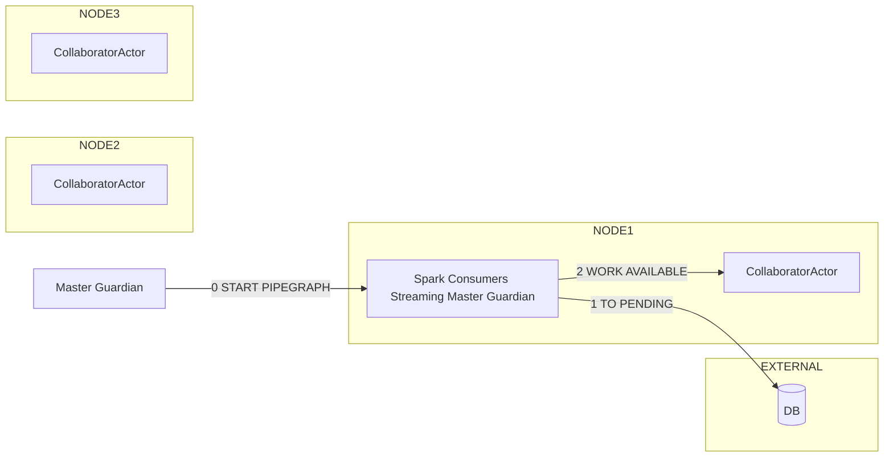

##### Collaborator actor spawns a pipegraph actor

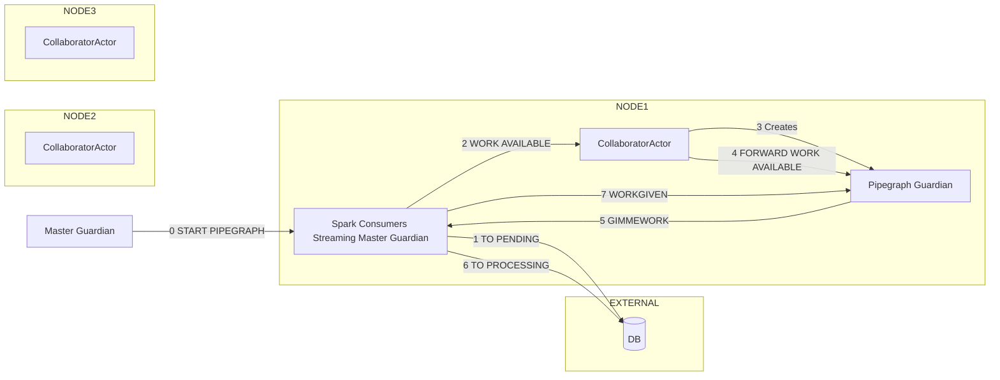

##### Start of a second pipegraph on another node

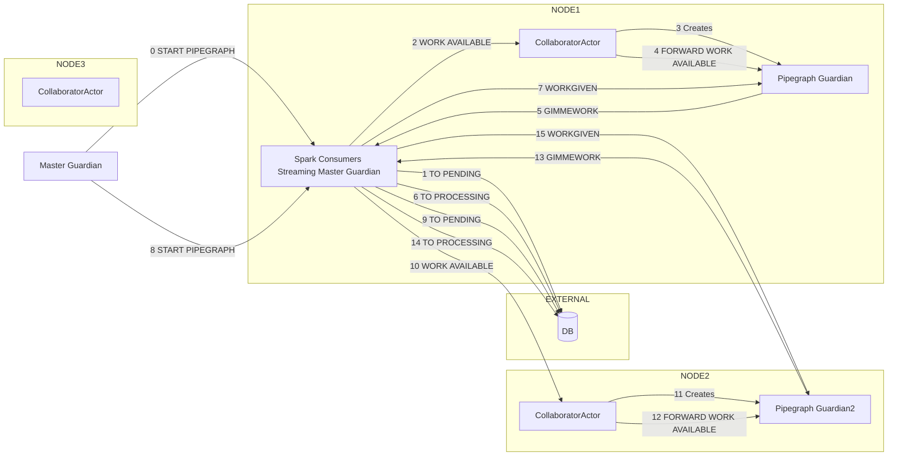

##### Node 1 lost, master guardian migrates

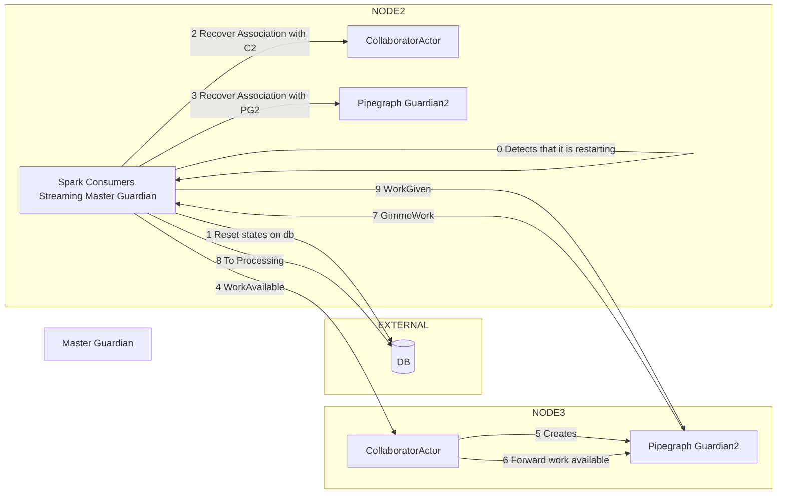

##### Node 3 lost, no guardian migrates but pipegraphs need restart

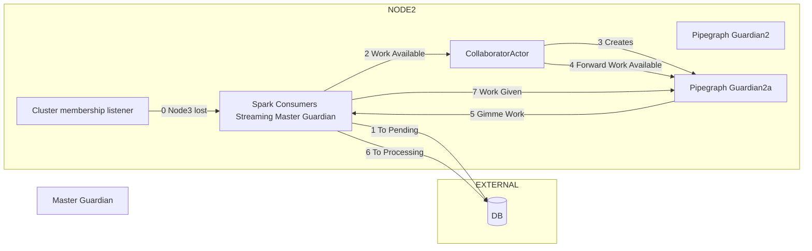

#### Breaking changes

Deployment that had multiple Spark consumers streaming nodes where Active/Standby, now they are Active/Active (the previously standby node will be used now to schedule pipegraphs) this will be addressed in a future merge request that will introduce scheduling policies

Deployments with a single spark consumers streaming node are unaffected

#### Migration

None

#### Bug fixes

None

#### Related issue

Closes #334

### feature: Implement ProcessGroupBL for postgres
		
[Merge request 265](https://gitlab.com/AgileFactory/Agile.Wasp2/-/merge_requests/265)
		
		Created at: 2020-07-17T09:50:59.980Z
		
		Updated at: 2020-09-17T15:40:55.058Z
		
		Branch: feature/379-implement-processgroupbl-for-postgres
		
		Author: [Mattia Folcarelli](https://gitlab.com/mattia.folcarelli)
		
		Assignee: [Andrea Fonti](https://gitlab.com/andrea.fonti)
		
#### New features and improvements

Implement ProcessGroupBLImpl and its model table for postgreSQL.

#### Related issue

Closes #379

### Resolve "Implement ConfigManagerBL and DBConfigBL for postgres"
		
[Merge request 266](https://gitlab.com/AgileFactory/Agile.Wasp2/-/merge_requests/266)
		
		Created at: 2020-07-17T10:24:47.116Z
		
		Updated at: 2020-09-17T15:40:54.142Z
		
		Branch: feature/380-implement-configmanagerbl-and-dbconfigbl-for-postgres
		
		Author: [Andrea Pinto](https://gitlab.com/pintuz)
		
Closes #380

### Resolve "Refactor GenerateOpenApi"
		
[Merge request 267](https://gitlab.com/AgileFactory/Agile.Wasp2/-/merge_requests/267)
		
		Created at: 2020-07-21T07:57:52.831Z
		
		Updated at: 2020-09-17T15:40:53.521Z
		
		Branch: feature/381-refactor-generateopenapi
		
		Author: [Andrea Pinto](https://gitlab.com/pintuz)
		
#### New features and improvements

Create a trait that extends all the OpenApiDefinition's. The wasp GenerateOpenOpi will extend only the new trait. New custom GenerateOpenApi's for other project will extend the new wasp trait and other trait for custom api's


#### Related issue

Closes #381

### hotfix: Choose a random name for the flow version
		
[Merge request 268](https://gitlab.com/AgileFactory/Agile.Wasp2/-/merge_requests/268)
		
		Created at: 2020-07-22T08:17:30.562Z
		
		Updated at: 2020-09-17T15:41:03.027Z
		
		Branch: hotfix/383-choose-a-random-name-for-the-flow-version
		
		Author: [Mattia Folcarelli](https://gitlab.com/mattia.folcarelli)
		
		Assignee: [Andrea Fonti](https://gitlab.com/andrea.fonti)
		
#### New features and improvements

Nifi accept to save updates to an already saved flow
Nifi accept to generate new processgroups with same name (the process group id changes)

#### Breaking changes

Now the nifi editor commit api fetch only the flow content from the processgroup without actually committing in the repository

#### Related issue

Closes #383

### feature: Rename the postgres package
		
[Merge request 269](https://gitlab.com/AgileFactory/Agile.Wasp2/-/merge_requests/269)
		
		Created at: 2020-07-23T16:12:44.811Z
		
		Updated at: 2020-09-17T15:41:03.991Z
		
		Branch: feature/382-rename-the-postgres-package
		
		Author: [Andrea Fonti](https://gitlab.com/andrea.fonti)
		
#### New features and improvements

None

#### Breaking changes

None

#### Migration

None

#### Bug fixes

Renamed wrong package name (no released artifacts have the changed package so no breaking change was made)

#### Related issue

Closes #382

### Resolve "Fix META-INF.services of postgres"
		
[Merge request 270](https://gitlab.com/AgileFactory/Agile.Wasp2/-/merge_requests/270)
		
		Created at: 2020-07-24T12:38:24.993Z
		
		Updated at: 2020-09-17T15:41:02.405Z
		
		Branch: feature/384-fix-meta-inf-services-of-postgres
		
		Author: [Andrea Pinto](https://gitlab.com/pintuz)
		
#### New features and improvements

The file it.agilelab.bigdata.wasp.repository.core.db.RepositoriesFactory for postgres module was wrong: now it contains it.agilelab.bigdata.wasp.repository.postgres.PostgresRepositoryFactory


#### Related issue

Closes #384

### Resolve "Check if all the tableDefinitions are defined on WaspPostgresDB"
		
[Merge request 271](https://gitlab.com/AgileFactory/Agile.Wasp2/-/merge_requests/271)
		
		Created at: 2020-07-27T12:21:01.067Z
		
		Updated at: 2020-09-17T15:41:02.736Z
		
		Branch: feature/385-check-if-all-the-tabledefinitions-are-defined-on-wasppostgresdb
		
		Author: [Andrea Pinto](https://gitlab.com/pintuz)
		
#### New features and improvements

- Add some tables definition on On WaspPostgresDB.tableDefinitions.
- Complete PostgresFactoryBL

#### Related issue

Closes #385

### feature: Create pluggable scheduling policies
		
[Merge request 272](https://gitlab.com/AgileFactory/Agile.Wasp2/-/merge_requests/272)
		
		Created at: 2020-07-27T15:54:14.750Z
		
		Updated at: 2020-09-17T15:41:05.249Z
		
		Branch: feature/387-create-pluggable-scheduling-policies
		
		Author: [Andrea Fonti](https://gitlab.com/andrea.fonti)
		
#### New features and improvements

Wasp now supports pluggable scheduling strategies, three strategies are available

`it.agilelab.bigdata.wasp.consumers.spark.streaming.actor.master.FifoSchedulingStrategyFactory`

`it.agilelab.bigdata.wasp.consumers.spark.streaming.actor.master.LowestUUIDNodeSchedulingStrategyFactory`

`it.agilelab.bigdata.wasp.consumers.spark.streaming.actor.master.NodeLabelsSchedulingStrategyFactory`

To configure your scheduling strategy add this section to `wasp.spark-streaming`

```hocon
scheduling-strategy {
      class-name = "Factory class name"
      additional-parameter = "parameter value"
}
```

##### FifoSchedulingStrategyFactory

Deployment type: ACTIVE/ACTIVE

This strategy will select nodes in fifo order, if we have 3 nodes they will be selected in a round robin fashion

###### Additional configurations

None

###### Example

```hocon
wasp.spark-streaming.scheduling-strategy {
      class-name = "it.agilelab.bigdata.wasp.consumers.spark.streaming.actor.master.FifoSchedulingStrategyFactory"
}
```

##### LowestUUIDNodeSchedulingStrategyFactory

Deployment type: ACTIVE/PASSIVE

This strategy will select always the node with lowest uuid

###### Additional configurations

None

###### Example

```hocon
wasp.spark-streaming.scheduling-strategy {
      class-name = "it.agilelab.bigdata.wasp.consumers.spark.streaming.actor.master.LowestUUIDNodeSchedulingStrategyFactory"
}
```

##### NodeLabelsSchedulingStrategyFactory

Deployment type: ACTIVE/ACTIVE

This strategy will select nodes that have all the labels specified in the PipegraphModel as cluster roles.

if you have a pipegraph with labels `Set("freecode", "fast-node")` this strategy will only schedule it on a node that has `freecode` and `fast-node` roles in addition to `consumers-streaming` role, if multiple nodes satisfy this constraint this strategy will use one of the other strategy as tie breaker

###### Additional configurations

`tie-breaker` another section with the same structure as the `scheduling-strategy` section, used to configure the tie breaker strategy

###### Example

```hocon
wasp.spark-streaming.scheduling-strategy {
      class-name = "it.agilelab.bigdata.wasp.consumers.spark.streaming.actor.master.it.agilelab.bigdata.wasp.consumers.spark.streaming.actor.master.NodeLabelsSchedulingStrategyFactory"
      tie-breaker{
          class-name = "it.agilelab.bigdata.wasp.consumers.spark.streaming.actor.master.LowestUUIDNodeSchedulingStrategyFactory" 
      }
}
```
#### Breaking changes

Old deployment of wasp where ACTIVE/PASSIVE, now the default is FIFO STRATEGY

#### Migration

To switch back to ACTIVE/PASSIVE from the ACTIVE/ACTIVE default use the `LowestUUIDNodeSchedulingStrategyFactory` strategy

#### Bug fixes

None

#### Related issue

Closes #387

### feature: Forward proxy path header to nifi if client supplies it
		
[Merge request 273](https://gitlab.com/AgileFactory/Agile.Wasp2/-/merge_requests/273)
		
		Created at: 2020-07-30T09:21:29.250Z
		
		Updated at: 2020-09-17T15:41:02.863Z
		
		Branch: feature/388-forward-proxy-path-header-to-nifi-if-client-supplies-it
		
		Author: [Mattia Folcarelli](https://gitlab.com/mattia.folcarelli)
		
		Assignee: [Andrea Fonti](https://gitlab.com/andrea.fonti)
		
#### New features and improvements

The nifi proxy controller will maintain the headers of the received request for the following headers properties:
* `X-ProxyScheme`
* `X-ProxyPort`
* `X-ProxyHost`
* `X-ProxyContextPath`

The docker entrypoint file `whitelabel/docker/runnable-cdh6/docker-entrypoint.sh` will substitute values in nifi configuration according to the environment variables: `NIFI_PROXY_PATH` `NIFI_PROXY_HOST`

```bash
sed 's|nifi.web.proxy.context.path=|nifi.web.proxy.context.path=/proxy|g' -i nifi/conf/nifi.properties
sed 's|nifi.web.proxy.host=|nifi.web.proxy.host=localhost:2891|g' -i nifi/conf/nifi.properties
```

keep current values as default if no env var is provided

to run the docker:

```bash

WASP_DESIRED_HOSTNAME=wasp
NIFI_PROXY_PATH_VALUE=/api/core/proxy
NIFI_PROXY_HOST_VALUE=localhost:4200 #for angular dev server
NIFI_PROXY_HOST_VALUE=nginx_host:nginx_port #for nginx proxy

docker network create wasp

docker run --name $WASP_DESIRED_HOSTNAME \
           --hostname $WASP_DESIRED_HOSTNAME \
           --network wasp \
           -it
           -p 8088:8088
           -p 2891:2891
           -p 8042:8042
           -p 5005:5005
           -p 5006:5006
           -p 5007:5007
           -p 5008:5008
           -p8983:8983
           -p4040:4040
           -p4041:4041
           -p8080:8080
           -p18080:18080
           -e NIFI_PROXY_PATH=$NIFI_PROXY_PATH_VALUE
           -e NIFI_PROXY_HOST=$NIFI_PROXY_HOST_VALUE
           -it $IMAGE_NAME
``` 

##### Run with the angular dev server

set the proxy.conf.js
```javascript
const PROXY_CONFIG = {
  [...],
  '/api/core/**': {
    target: 'http://localhost:2891',
    secure: false,
    pathRewrite: {
      '^/api/core': ''
    }
  },
  [...]
};
```
##### Run with nginx

Properly configure nginx and provide a WASP_HOSTNAME environment variable pointing to the wasp server hostname, if inside docker use the name of the wasp container and remember to put the nginx container in the same network

```nginx
location /api/core {
    proxy_pass http://$WASP_HOSTNAME:2891;
    rewrite ^/api/core/(.\*)$ /$1 break;
    proxy_http_version 1.1;
    proxy_set_header Upgrade $http_upgrade;
    proxy_set_header Connection 'upgrade';
    proxy_set_header Host $host;
    proxy_set_header X-ProxyContextPath '/api/core/proxy/';
    proxy_set_header X-ProxyPort 'PORT_NGINX_IS_LISTENING_ON';
    proxy_set_header X-ProxyHost 'HOST_NGINX_IS_RUNNING_ON';
    proxy_cache_bypass \$http_upgrade;
}
```

#### Related issue

Closes #388

### feature: Add IndexModel options  in order to manage Solr multi-writer
		
[Merge request 274](https://gitlab.com/AgileFactory/Agile.Wasp2/-/merge_requests/274)
		
		Created at: 2020-07-30T10:24:34.920Z
		
		Updated at: 2020-09-17T15:41:04.177Z
		
		Branch: feature/389-add-indexmodel-options-in-order-to-manage-solr-multi-writer
		
		Author: [Davide Colombatto](https://gitlab.com/davidecolombatto)
		
		Assignee: [Andrea Fonti](https://gitlab.com/andrea.fonti)
		
#### New features and improvements

Add "options" (Map: string -> string, default empty) to the IndexModel.

It is useful to create a Solr multi-writer. 

#### Related issue

Closes #389

### Resolve "Implement insertIfNotExists for PipegraphBL"
		
[Merge request 276](https://gitlab.com/AgileFactory/Agile.Wasp2/-/merge_requests/276)
		
		Created at: 2020-08-04T14:07:26.925Z
		
		Updated at: 2020-09-17T15:41:05.085Z
		
		Branch: feature/392-implement-insertifnotexists-for-pipegraphbl-2
		
		Author: [Andrea Pinto](https://gitlab.com/pintuz)
		
		Assignee: [Andrea Fonti](https://gitlab.com/andrea.fonti)
		
#### New features and improvements

* define and implement the method insertIfNotExists on PipegraphBL
* use insertIfNotExists instead of insert on MasterNodeLauncherTrait

#### Related issue

Closes #392

### hotfix: Fix whiteLabelMaster dependency
		
[Merge request 277](https://gitlab.com/AgileFactory/Agile.Wasp2/-/merge_requests/277)
		
		Created at: 2020-08-05T08:49:23.411Z
		
		Updated at: 2020-09-17T15:41:04.544Z
		
		Branch: hotfix/393-fix-whitelabelmaster-dependency
		
		Author: [Mattia Folcarelli](https://gitlab.com/mattia.folcarelli)
		
#### Bug fixes

update whiteLabelMaster dependency, adds .dependsOn(whiteLabelConsumersSpark)


```
lazy val whiteLabelMaster = Project("wasp-whitelabel-master", file("whitelabel/master"))
.settings(Settings.commonSettings: \_\*)
.dependsOn(whiteLabelModels)
.dependsOn(repository_mongo)
.dependsOn(master)
.dependsOn(whiteLabelConsumersSpark)
.settings(libraryDependencies ++= Dependencies.plugin_hbase_spark)
.settings(libraryDependencies += Dependencies.log4j1)
.settings(libraryDependencies ++= Dependencies.log4j :+ Dependencies.darwinHBaseConnector)
.enablePlugins(JavaAppPackaging)
```

a docker image has been created to test the change: 

`registry.gitlab.com/agilefactory/agile.wasp2/try-wasp:2.26.0-SNAPSHOT-hotfix-393-fix-whitelabelmaster-dependency`

#### Related issue

Closes #393

### Resolve "Fix method  to retrieve active pipegraphs"
		
[Merge request 280](https://gitlab.com/AgileFactory/Agile.Wasp2/-/merge_requests/280)
		
		Created at: 2020-08-27T14:50:56.280Z
		
		Updated at: 2020-09-17T15:41:04.939Z
		
		Branch: feature/397-fix-method-to-retrieve-active-pipegraphs
		
		Author: [Andrea Pinto](https://gitlab.com/pintuz)
		
		Assignee: [Andrea Fonti](https://gitlab.com/andrea.fonti)
		
#### New features and improvements

Use `getByName(instance.instanceOf)` instead of `getByName(instance.name)` on PipegraphBLImp.getActivePipegraphs()


#### Related issue

Closes #397

### feature: Fix WaspCtl 'list-pipegraph-instance'
		
[Merge request 282](https://gitlab.com/AgileFactory/Agile.Wasp2/-/merge_requests/282)
		
		Created at: 2020-09-02T09:17:58.385Z
		
		Updated at: 2020-09-17T15:41:02.222Z
		
		Branch: feature/402-fix-waspctl-list-pipegraph-instance
		
		Author: [Andrea Fonti](https://gitlab.com/andrea.fonti)
		
#### New features and improvements

None

#### Breaking changes

None

#### Migration

None

#### Bug fixes

fixed `list-pipegraph-instance` open api definition to be a GET instead of a POST

```
➜ ./waspctl-darwin-amd64 list-pipegraph-instance LoggerPipegraph
{
  "Result": "OK",
  "data": [
    {
      "currentStatusTimestamp": 1599040818321,
      "executedByNode": "akka.tcp://WASP@64a764d4d923:2896/-1549071257",
      "instanceOf": "LoggerPipegraph",
      "name": "LoggerPipegraph-ace97651-9b3a-4fdc-b613-0df65b59b76b",
      "peerActor": "akka.tcp://WASP@64a764d4d923:2896/user/collaborator/LoggerPipegraph-6905f6fd-53b8-4847-ac90-8017fc51241b",
      "startTimestamp": 1599040818222,
      "status": "PROCESSING"
    }
  ]
}
➜ ./waspctl-darwin-amd64 get-pipegraph-instance LoggerPipegraph LoggerPipegraph-ace97651-9b3a-4fdc-b613-0df65b59b76b
{
  "Result": "OK",
  "data": {
    "currentStatusTimestamp": 1599040818321,
    "executedByNode": "akka.tcp://WASP@64a764d4d923:2896/-1549071257",
    "instanceOf": "LoggerPipegraph",
    "name": "LoggerPipegraph-ace97651-9b3a-4fdc-b613-0df65b59b76b",
    "peerActor": "akka.tcp://WASP@64a764d4d923:2896/user/collaborator/LoggerPipegraph-6905f6fd-53b8-4847-ac90-8017fc51241b",
    "startTimestamp": 1599040818222,
    "status": "PROCESSING"
  }
}
```

#### Related issue

Closes #402

### Resolve "Improve whitelabel"
		
[Merge request 283](https://gitlab.com/AgileFactory/Agile.Wasp2/-/merge_requests/283)
		
		Created at: 2020-09-03T07:17:31.073Z
		
		Updated at: 2020-09-17T15:41:05.856Z
		
		Branch: feature/404-improve-whitelabel
		
		Author: [Agile Lab](https://gitlab.com/agile-lab)
		
#### New features and improvements

Introduction of an IoT demo pipegraph.
IoT Industrial Plant pipegraph is modelling a manufacturing use case, simulating domain KPI like OEE, OLE, etc.

A random Producer is generating data on a kafka topic and then we have a simple pipegraph persisting such events on Solr. 
In addition there is also an event rule definition to generate events when OEE kpi is lower than 80.

#### Breaking changes


#### Migration


#### Bug fixes

removing typesafe resolver because it is not available anymore

#### Related issue

Closes #404

### feature: Update to latest Darwin version
		
[Merge request 284](https://gitlab.com/AgileFactory/Agile.Wasp2/-/merge_requests/284)
		
		Created at: 2020-09-07T09:11:47.415Z
		
		Updated at: 2020-09-17T15:41:05.523Z
		
		Branch: feature/405-update-to-latest-darwin-version
		
		Author: [Antonio Murgia](https://gitlab.com/antonio.murgia)
		
		Assignee: [Andrea Fonti](https://gitlab.com/andrea.fonti)
		
#### New features and improvements

Darwin dependency has been updated to 1.0.13.

#### Breaking changes

None.

#### Migration

It is suggested but not mandatory to set a value for the Darwin endianness configuration (i.e. `wasp.avroSchemaManager.darwin.endianness`) to either `BIG_ENDIAN` or `LITTLE_ENDIAN`.

#### Bug fixes

None.

#### Related issue

Closes #405

### feature: Fix additional-jars-path to allow relative paths
		
[Merge request 289](https://gitlab.com/AgileFactory/Agile.Wasp2/-/merge_requests/289)
		
		Created at: 2020-09-16T16:43:17.772Z
		
		Updated at: 2020-09-17T15:41:05.692Z
		
		Branch: feature/408-fix-additional-jars-path-to-allow-relative-paths
		
		Author: [Andrea Fonti](https://gitlab.com/andrea.fonti)
		
#### New features and improvements

Additionals jars and jars list behaviour changed when we upgraded to CDH6 dependencies

Previously an additional jars directory relative to the working dir was allowed, when upgrading to cdh6 we added the file:/ prefix thinking that it would simply make spark happy but this prevented relative paths (Uris should be absolute)

Now the behaviour should be the same one used by spark itself 

#### Breaking changes

One less

#### Migration

One less

#### Bug fixes

Technically not a bug

#### Related issue

Closes #408

