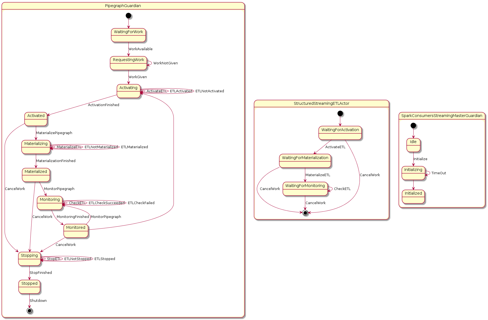

# WASP ChangeLog

## WASP 2.0.5
25/01/2018

- Miglioramento complessivo error/exception-handling dai seguenti punti di vista:
	- log in console dei vari componenti
	- propagazione e gestione errori - ora riportati fino alla REST-response
	
	N.B. il timeout passato alla `WaspSystem.??()` (se non esplicitato viene usato general-timeout-millis di *.conf) è ora inteso come "tempo complessivo per gestire la REST" e non più come "tempo per svolgere la specifica operazione interna (es. avvio pipegraph)": a partire da general-timeout, lo slot di tempo assegnato ai livelli inferiori di annidamento è via via ridotto di 5sec

- Gestione down(post-unreachable) / reJoin(post-reachable) dei membri XyzMasterGuardian del cluster Akka - gestito tramite ClusterListenerActor (e `actor-downing-timeout-millis` di *.conf)
	
	N.B. almeno un seed-node deve rimane in vita per poter fare reJoin!!!

- Gestione launcher tramite CommanLine invece che lista argomenti


## WASP 2.1.0
06/02/2018

**Fix**
- A seguito di failure di StartPipegraph, SparkConsumersMasterGuardian e RtConsumersMasterGuardian non rimangono più in stato `starting` ma ritornano in `unitialized`, evitando quindi lo stash() di RestartConsumers durante StartPipegraph successivi

- Corretto uso di log4j direttamente da WASP framework

**Update**
- Miglioramento complessivo error/exception-handling durante StopProducer e StopPipegraph

- Log di stackTrace al posto del solo message da parte dell'attore che gestisce l'eccezione (continua ad esser propagato il solo message)

- Allineata cartella docker (yml e sh) per futuro uso WhiteLabel

- Solr unique key: IndexModel accetta parametro opzionale `idField` per indicare quale campo usare come id al posto di autogenerare UUID random

- Elastic Spark upgrade to 6.1 for Structured Streaming

	yml di riferimento rimane `docker/elastickibana-docker-compose.yml`

- Gestione parametri commandLine e relativo allineamento `docker/start-wasp.sh`
	
	Parametri disponibili: -h (help), -v (versione), -d (MongoDB dropping)
		
		-h, -v	ricevuto da tutti
		-d	ricevuto solo da master

- Aggiornamento di `reference.conf`: WASP usa ora i default presi da `reference.conf`; `docker/docker-environment.conf` funge per ora come `template-whitelabel` dove sono presenti le KEY da sovrascrivere obbligatorie e invece commentate tutte le altre KEY possibili
	
	N.B. per mantenere scalabile la soluzione, i VALUE di default presenti in `reference.conf` non sono anche riportati in `docker/docker-environment.conf`


## WASP 2.1.1
07/02/2018

**Fix**
- GitLab CI to compile and publish on internal (nexus) and public (criticalcase)


## WASP 2.1.2
12/02/2018

**Fix**
- GitLab CI rimossa da master
- Scommentate le KEY `driver-hostname` della `template-whitelabel` `docker/docker-environment.conf` di `spark-streaming` e `spark-batch`

**Update**
- HBASE Writer - gestione celle create dinamicamente in stile Cassandra


## WASP 2.1.3
16/02/2018

**Update**
- MongoDB fullwriteConsistency


## WASP 2.2.0
16/02/2018

**Fix**
- Corretta la KEY `driver-hostname` della `template-whitelabel` `docker/docker-environment.conf` di `spark-batch`
- MongoDB, Elastic, Solr considerano ora il timeout di configuration espresso in millis

**Update**
- WaspRELEASE_NOTES + WhiteLabelREADME

- Trait `Strategy` estende `Serializable`

- Revisione connectionTimeout verso MongoDB, Solr, Elastic

- Impostazione WhiteLabel (per usarla: `whitelabel/docker/start-whitelabel-wasp.sh`)

- Riportata in WaspSystem la creazione della collection MongoDB `configurations` (in modo venga eseguita da tutti i container nello stesso modo)

- Revisione della gestione `dropDB` tramite commandlineOption `-d` di `start_wasp.sh`: Master fa solo drop ed esce (senza reinizializzare)

- Modulo consolePlugin separato da modulo consumers-spark

- Migrazione totale cross-reference da byId a byName delle collection MongoDB


## WASP 2.3.0
26/02/2018

**Fix**
- Corrette dipendenze ElasticSearch

**Update**
- Consistenza/atomicità su waspDB.insertIfNotExist: permette che non avvengano scritture contemporanee/duplicate

- Supporto Solr per nested document

- Whitelabel manual/auto-test per Console, Solr, HDFS, ElasticSearch

- LoggerPipegraph su Solr tramite StructuredStreaming

- Aggiunto service `banana` (Data visualization plugin per Solr) su porta 32770 con template di default per `logger_index_shard1_replica1`: `whitelabel/docker/solrcloud-docker-compose.yml` -> `whitelabel/docker/solrcloudbanana-docker-compose.yml`

- Revisione uso additionalJars

- Batch separato da streaming (container apposito) ma in stesso modulo consumers-spark


## WASP 2.4.0
02/03/2018

**Fix**
- Solr JsonSchema: rollback a gestione "estrapola/invia a Solr solo il contenuto del campo `properties`" (gestione ad-hoc rispetto ElasticSearch)

**Update**
- Aggiornamento di `reference.conf` e `whitelabel/docker/docker-environment.conf`
	- `spark-streaming` e `spark-batch`: riordinate le KEY, aggiunta KEY `driver-conf` che incapsula le configurazioni relative al driver (nuovo `submit-deploy-mode` con default "client"), aggiunta KEY `retained-jobs` (default 100)
	- `solrcloud`: rimossa KEY `cluster_name`
	- `elastic`: rimossa KEY `cluster-name`

- Solr: uso di `zookeeperConnections` al posto di `apiEndPoint`

- Revisione gestione batchJobs: avvio parallelo di istanze di batchJobs diversi (vedi nuova collection MongoDB batchjobinstances)


## WASP 2.5.0
09/03/2018

### Update
- Modificato `chroot_path` di zookeeper per Kafka: da `""` a `"/kafka"` (allineamento con Solr per cui è `"/solr"`)

- Aggiunto JDBCReader plugin

- Aggiunto uso di kryoSerializator tramite `kryo-serializer` in`reference.conf` e `whitelabel/docker/docker-environment.conf` (default: `enabled = true, registrators = "", strict = false`)

- Rimozione `broadcast()` nei seguenti punti:
    - `strategy` in `LegacyStreamingETLActor` / `StructuredStreamingETLActor`
    - `topic.getDataType` in `KafkaReader`

- Aggiunto IndexModelBuilder per gestire Solr/Elastic in modo distinto

### Resolve "Release note generator tool"

[Merge request 22](https://gitlab.com/AgileFactory/Agile.Wasp2/merge_requests/22)

Updated at: 2018-03-09T15:03:26.784Z

Branch: feature/85-release-note-generator-tool

Author: [Andrea Fonti](https://gitlab.com/andrea.fonti)

Closes #85 

```
cd tools/release-note-generator
python setup.py install
wasp-release-note-generator --token 'YOUR GITLAB AUTHENTICATION TOKEN' --sprint 'Sprint 2.5' > file.md

```

### Resolve "[plugin] jdbReader improvement"

[Merge request 20](https://gitlab.com/AgileFactory/Agile.Wasp2/merge_requests/20)

Updated at: 2018-03-09T14:40:28.653Z

Branch: feature/83-plugin-jdbreader-improvement

Author: [Davide Colombatto](https://gitlab.com/davidecolombatto)

Closes #83

### Resolve "[kryo-config] Set new configs for Spark streaming/batch"

[Merge request 17](https://gitlab.com/AgileFactory/Agile.Wasp2/merge_requests/17)

Updated at: 2018-03-09T11:14:44.422Z

Branch: feature/73-kryo-config-set-new-configs-for-spark-streaming-batch

Author: [Davide Colombatto](https://gitlab.com/davidecolombatto)

Closes #73

The config `kryo-serializer.strict` within `wasp.spark-streaming` / `wasp.spark-batch` are mapped to spark `spark.kryo.registrationRequired` in `Agile.Wasp2/consumers-spark/src/main/scala/it/agilelab/bigdata/wasp/consumers/spark/utils/SparkUtils.scala`)

**Note**: This config have to be "false" in order to correctly work without N class registrations (see https://spark.apache.org/docs/2.2.1/configuration.html#compression-and-serialization and https://github.com/EsotericSoftware/kryo#registration)

### Resolve "[gitlab-ci] organize branching model and deployment model"

[Merge request 18](https://gitlab.com/AgileFactory/Agile.Wasp2/merge_requests/18)

Updated at: 2018-03-08T16:23:37.998Z

Branch: feature/66-gitlab-ci-organize-branching-model-and-deployment-model

Author: [Andrea Fonti](https://gitlab.com/andrea.fonti)

Closes #66 

Branching model now follows the rules described in [BranchingModelSupport](project/BranchingModelSupport.scala)

BaseVersion(2.5.0)

* if branch name is develop -> 2.5.0-SNAPSHOT
* if branch name is release/v2.5 -> 2.5.0-SNAPSHOT
* if branch name is feature/issue-issue-text -> 2.5.0-issue-issue-text-SNAPSHOT
* if branch name is hotfix/hotfix -> 2.5.0-hotfix-SNAPSHOT
* if tag name is v2.5.0 -> 2.5.0
* if branch name is not release/v2.5 -> exception
* if tag name is not v2.5.0 -> exception


To use the branching model

```scala
import BranchingModelSupport._

val baseVersion = BaseVersion(2,5,0)

//retrieves branch name from gitlab ci environment or from current repository as fallback
version in ThisBuild := versionForContainingRepositoryOrGitlabCi(baseVersion)

//retrieves branch name from current repository
version in ThisBuild := versionForContainingRepository(baseVersion)

//retrieves branch name from constant
version in ThisBuild := versionForConstant("develop")(baseVersion)

```


## WASP 2.6.0
16/03/2018

### Added Kerberos integration to WASP2 and other stuff

[Merge request 23](https://gitlab.com/AgileFactory/Agile.Wasp2/merge_requests/23)

Created at: 2018-03-12T09:49:27.083Z

Updated at: 2018-03-16T13:20:53.709Z

Branch: feature/20-kerberos

Author: [Mattia](https://gitlab.com/MattiaB)

Assignee: [Davide Colombatto](https://gitlab.com/davidecolombatto)

Closes #20, #63, #71, #54, #89

- Created a new docker image for wasp2; also changed the start-wasp script to integrate with the security
- Fixed the wasp kafka producer to write in the kerberos enviroment
- Some fix to write with Hbase and Solr in the kerberos env
- Added some documentation to run wasp2 in YARN-mode with kerberos
- Added general options for spark
- Added more test for Hbase (keyValue datastore) and KafkaWriter

### Resolve "[rest] improvements"

[Merge request 32](https://gitlab.com/AgileFactory/Agile.Wasp2/merge_requests/32)

Created at: 2018-03-14T17:44:03.445Z

Updated at: 2018-03-15T08:49:13.440Z

Branch: feature/97-rest-improvements

Author: [Davide Colombatto](https://gitlab.com/davidecolombatto)

Closes #97 

- `/help` returns `wasp` as a JSON arrayOfObjects instead of a JSON objectOfObjects
- Added `pretty=true` optional URI param in order to receive JSON beautified

### Resolve "[improvement] master dropDB-mode issue"

[Merge request 33](https://gitlab.com/AgileFactory/Agile.Wasp2/merge_requests/33)

Created at: 2018-03-15T10:38:47.104Z

Updated at: 2018-03-16T13:20:57.566Z

Branch: feature/100-improvement-master-dropdb-mode-issue

Author: [Davide Colombatto](https://gitlab.com/davidecolombatto)

Closes #100

In  WaspLauncher.initializeWasp(): pre-checked if the current node is a `master` and done an ad-hoc mngm


## WASP 2.7.0
26/03/2018

### Resolve "[rest] batchjob-start REST json parameter"

[Merge request 38](https://gitlab.com/AgileFactory/Agile.Wasp2/merge_requests/38)

Created at: 2018-03-16T18:31:17.440Z

Updated at: 2018-03-21T09:34:24.638Z

Branch: feature/104-rest-allow-batchjob-rest-post-parameters

Author: [Davide Colombatto](https://gitlab.com/davidecolombatto)

Closes #104, #86 

**Usage example**

cURL

```bash
curl -X POST \
  http://localhost:2891/batchjobs/TestBatchJobFromHdfsFlatToConsole/start \
  -H 'Content-Type: application/json' \
  -d '{
        "stringKey": "aaa",
        "intKey2": 5
      }'
```

Rest API => POST http://localhost:2891/batchjobs/_batchJobName_/start

Header => Content-Type: application/json

Body => _jsonContent_

**Note**

For the resulting batchJob instance start, the json keys (in the REST json parameter) will be merged with the batchJobETL strategy configuration (Typesafe Config) keys of the related batchJob => the merged configuration is injected in the Strategy `configuration` (Typesafe Config)

*N.B. json keys (in the REST json parameter) override any duplicate keys of the specific batchJob*


### Resolve "[whitelabel] testcases"

[Merge request 39](https://gitlab.com/AgileFactory/Agile.Wasp2/merge_requests/39)

Created at: 2018-03-19T15:21:37.224Z

Updated at: 2018-03-21T13:44:40.817Z

Branch: feature/106-whitelabel-verify-hbase-testcase

Author: [Davide Colombatto](https://gitlab.com/davidecolombatto)

Closes #106 

Fix HBase
* `docker-service-configuration/hdfs` => `docker-service-configuration/hadoop` including also `hbase-site.xml`
* `whitelabel/docker/start-wasp.sh`:

```
DOCKER_OPTS="$DOCKER_OPTS -v $SCRIPT_DIR/docker-service-configuration/hdfs:/etc/hadoop/conf/:ro ..."
```

=>

```
DOCKER_OPTS="$DOCKER_OPTS -v $SCRIPT_DIR/docker-service-configuration/hadoop:/etc/hadoop/conf/:ro ..."
```


### Resolve "[config] revise core-site.xml and hbase.site.xml in containers"

[Merge request 40](https://gitlab.com/AgileFactory/Agile.Wasp2/merge_requests/40)

Created at: 2018-03-21T13:36:28.900Z

Updated at: 2018-03-21T14:01:03.491Z

Branch: feature/108-config-revise-core-site-xml-and-hbase-site-xml-in-container-and

Author: [Davide Colombatto](https://gitlab.com/davidecolombatto)

Closes #108
* `core-site.xml` in solr, hdfs, hbase containers:

```
hdfs://hdfs-namenode:9000
```
=>
```
hdfs://namenode:9000
```

* `whitelabel/docker/start-wasp.sh`:

```
DOCKER_OPTS="$DOCKER_OPTS -v $SCRIPT_DIR/docker-service-configuration/hdfs:/etc/hadoop/conf/:ro  -v $SCRIPT_DIR/docker-service-configuration/hbase:/etc/hbase/conf/:ro"
```

=>

```
DOCKER_OPTS="$DOCKER_OPTS -v $SCRIPT_DIR/docker-service-configuration/hadoop:/etc/hadoop/conf/:ro"
```

*  hbase in `reference.conf`:

```
    core-site-xml-path = "/etc/hbase/conf/core-site.xml"
    hbase-site-xml-path = "/etc/hbase/conf/hbase-site.xml" 
```

 =>

```
    core-site-xml-path = "/etc/hadoop/conf/core-site.xml"
    hbase-site-xml-path = "/etc/hadoop/conf/hbase-site.xml"
```

### GL-111: Producer actor now support extract partition key value

[Merge request 44](https://gitlab.com/AgileFactory/Agile.Wasp2/merge_requests/44)

Created at: 2018-03-23T17:29:37.763Z

Updated at: 2018-03-26T10:29:38.088Z

Branch: feature/GL-111-producerPartitionKey

Author: [Vito](https://gitlab.com/vito.ressa)

Closes #111 


## WASP 2.8.0
30/03/2018

### Resolve "Error/exception handling - Pipegraph start may leave components running while returning a failure"

[Merge request 29](https://gitlab.com/AgileFactory/Agile.Wasp2/merge_requests/29)

Created at: 2018-03-12T16:41:58.997Z

Updated at: 2018-03-30T14:03:08.080Z

Branch: feature/13-error-exception-handling-pipegraph-start-may-leave-components-running-while-returning-a-failure

Author: [Andrea Fonti](https://gitlab.com/andrea.fonti)

#### Start Pipegraph
When a REST start pipegraph request is received a new pipegraphinstance is created and asynchronously runned by the assigned pipegraph guardian

```bash
http -v POST :2891/pipegraphs/TestConsoleWriterWithMetadataStructuredJSONPipegraph/start

POST /pipegraphs/TestConsoleWriterWithMetadataStructuredJSONPipegraph/stop HTTP/1.1
Accept: */*
Accept-Encoding: gzip, deflate
Connection: keep-alive
Content-Length: 0
Host: localhost:2891
User-Agent: HTTPie/0.9.9


HTTP/1.1 200 OK
Content-Length: 97
Content-Type: application/json
Date: Fri, 30 Mar 2018 09:32:05 GMT
Server: akka-http/10.0.9

{
    "Result": "OK", 
    "data": "Pipegraph 'TestConsoleWriterWithMetadataStructuredJSONPipegraph' accepted (queued or processing)"
}
```

#### Check pipegraph instance status

* To check if a pipegraph started check the status of the instance via a REST the request /pipegraph/$name/instances

```
http -v GET :2891/pipegraphs/TestConsoleWriterWithMetadataStructuredJSONPipegraph/instances            531ms  ven 30 mar 2018 15:04:29 CEST
GET /pipegraphs/TestConsoleWriterWithMetadataStructuredJSONPipegraph/instances HTTP/1.1
Accept: */*
Accept-Encoding: gzip, deflate
Connection: keep-alive
Host: localhost:2891
User-Agent: HTTPie/0.9.9


HTTP/1.1 200 OK
Content-Length: 285
Content-Type: application/json
Date: Fri, 30 Mar 2018 13:04:37 GMT
Server: akka-http/10.0.9

{
    "Result": "OK", 
    "data": [
        {
            "currentStatusTimestamp": 1522404178417, 
            "instanceOf": "TestConsoleWriterWithMetadataStructuredJSONPipegraph", 
            "name": "TestConsoleWriterWithMetadataStructuredJSONPipegraph-c5db85bb-08d0-4d5a-ab7f-2f52019ddc1d", 
            "startTimestamp": 1522404178360, 
            "status": "PROCESSING"
        }
    ]
}

```

#### Stop Pipegraph

* To Stop a pipegraph use the REST api, the stop will be performed asynchronously, check the status via instances api

```
http -v POST :2891/pipegraphs/TestConsoleWriterWithMetadataStructuredJSONPipegraph/stop                274ms  ven 30 mar 2018 15:04:37 CEST
POST /pipegraphs/TestConsoleWriterWithMetadataStructuredJSONPipegraph/stop HTTP/1.1
Accept: */*
Accept-Encoding: gzip, deflate
Connection: keep-alive
Content-Length: 0
Host: localhost:2891
User-Agent: HTTPie/0.9.9


HTTP/1.1 200 OK
Content-Length: 97
Content-Type: application/json
Date: Fri, 30 Mar 2018 13:05:58 GMT
Server: akka-http/10.0.9

{
    "Result": "OK", 
    "data": "Pipegraph 'TestConsoleWriterWithMetadataStructuredJSONPipegraph' stopped"
}

http -v GET :2891/pipegraphs/TestConsoleWriterWithMetadataStructuredJSONPipegraph/instances            304ms  ven 30 mar 2018 15:05:58 CEST
GET /pipegraphs/TestConsoleWriterWithMetadataStructuredJSONPipegraph/instances HTTP/1.1
Accept: */*
Accept-Encoding: gzip, deflate
Connection: keep-alive
Host: localhost:2891
User-Agent: HTTPie/0.9.9


HTTP/1.1 200 OK
Content-Length: 282
Content-Type: application/json
Date: Fri, 30 Mar 2018 13:06:53 GMT
Server: akka-http/10.0.9

{
    "Result": "OK", 
    "data": [
        {
            "currentStatusTimestamp": 1522415158518, 
            "instanceOf": "TestConsoleWriterWithMetadataStructuredJSONPipegraph", 
            "name": "TestConsoleWriterWithMetadataStructuredJSONPipegraph-c5db85bb-08d0-4d5a-ab7f-2f52019ddc1d", 
            "startTimestamp": 1522404178360, 
            "status": "STOPPED"
        }
    ]
}

```

#### Phases

When a pipegraph is started a new `PipegraphGuardian` is spawned by the `SparkConsumersStreamingMasterGuardian`
the `PipegraphGuardian` instantiate an `StructuredStreamingETLActor` for each Etl component

The `PipegraphGuardian` manages the `StructuredStreamingETLActors` in steps

##### Activation
The strategy is applied, if a failure happens in strategy application it is assumed as transient and thus Activation is retried until successful or a Stop is received (maybe a rest request from within the code executed in wasp jvm before strategy application) 
##### Materialization
The output plugin is applied, if a failure happens in output plugin it is assumed as transient and thus Materialization is retried until successful or a Stop is received (maybe the output data store did not accept the creation of the tables/indices)
##### Monitoring
The streaming query is monitored for failure and progress, if the query signal that a failure and that it has stopped then the activation of that query is retried (the other etls are left running)
##### Stop
The streaming query are stopped gracefully one by one
 

#### Availability guarantees

If spark-consumers jvm is lost (the spark driver is also lost) spark checkpointing and kafka should handle the buffering of incoming data and the consistency of the streaming. 
When the  spark-consumers jvm restarts it should check mongo for pipegraphs in pending or processing status and restart them recovering the queries that were running when the unexpected shutdown occurred

`NOTE: To prevent reactivation of running pipegraphs when intentionally rebooting spark-consumers explicitly stop all pipegraphs`





### Resolve "Verify checkpointing with new strategy load"

[Merge request 43](https://gitlab.com/AgileFactory/Agile.Wasp2/merge_requests/43)

Created at: 2018-03-22T11:36:44.193Z

Updated at: 2018-03-29T16:39:14.656Z

Branch: feature/4-verify-checkpointing-with-new-strategy-load

Author: [Davide Colombatto](https://gitlab.com/davidecolombatto)

Closes #4, #118 

*  Default (`reference.conf`) CheckpointDir root is `/checkpoint` on HDFS
*  New testcases to test and show "best-practise" for checkpoint using stateful transformations in Spark StructuredStreaming ETL (e.g. `flatMapGroupsWithState`); in `whitelabel/models/test/TestPipegraphs.scala`
   1.  `TestCheckpointConsoleWriterStructuredJSONPipegraph`
   2.  `TestCheckpointConsoleWriterStructuredAVROPipegraph`
* Documentation
   1. `documentation/spark-structured-streaming-checkpointing.md`: general info about checkpoint internal implementation
   2. `whitelabel/README.md`: added section "Checkpoint and Stateful transformation in Spark StructuredStreaming ETL"

### Resolve "[cherrypick] hotfix kafka-writer-config"

[Merge request 48](https://gitlab.com/AgileFactory/Agile.Wasp2/merge_requests/48)

Created at: 2018-03-30T10:25:42.227Z

Updated at: 2018-03-30T12:29:07.699Z

Branch: feature/119-cherrypick-hotfix-kafka-writer-config

Author: [Davide Colombatto](https://gitlab.com/davidecolombatto)

Closes #119 

*  Fixed some Kafka configurations not being used properly.
*  Fixed reference.conf in wasp core to reflect those changes.

