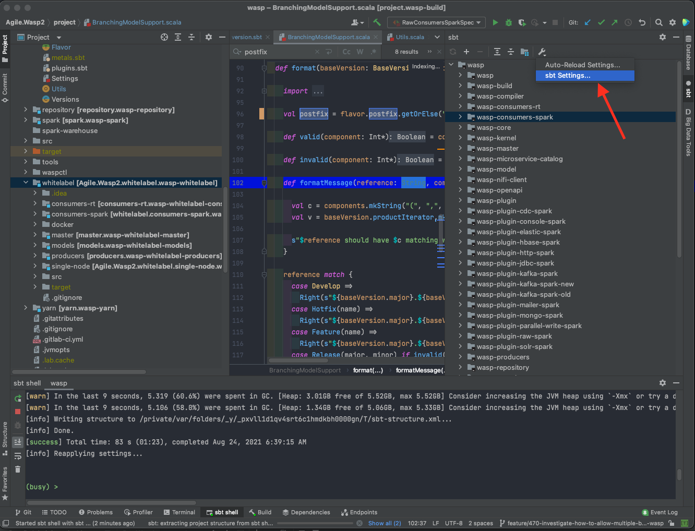
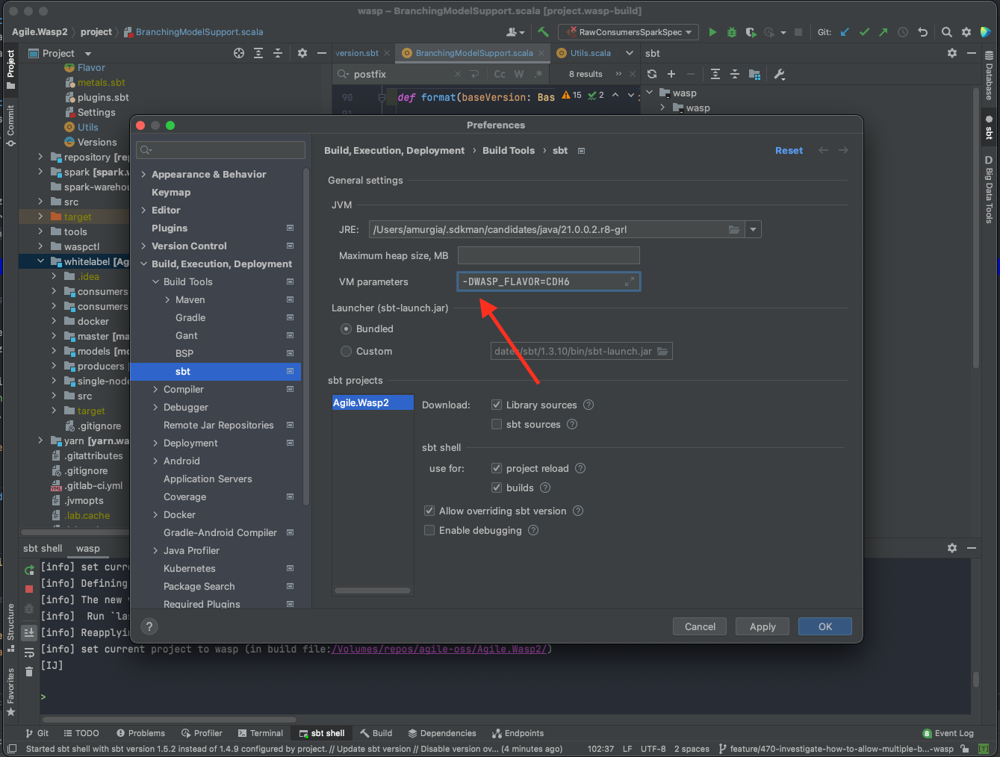

#### Building WASP

Wasp can be built under different flavours.

You can find all the supported flavours under `project/Flavor.scala`, it's a sealed hierarchy of case objects.
The flavour is defined at sbt startup through the environment variable `WASP_FLAVOR` or the JVM system property `WASP_FLAVOR` (environment variable takes precedence over system property), this means that in order to build Wasp in two different flavours, you will need to run two different instances of SBT. This choice was made to limit the number of keys present in the SBT build (which is already around 51k).

Flavors should change the artifact version (or the artifactId) so that they can all be published without conflicts. For that reason, the "postfix" of the flavor is appended to the version of the artifact (before the SNAPSHOT qualifier, if present).

---

In order to run an SBT instance selecting a flavour which is not the default, from a shell (it has been tested with `bash`, `fish`, `zsh` and `sh`) type:

```
WASP_FLAVOR=CDH6 sbt
```

In order to make IntelliJ Idea load the project in a particular flavour, after the initial import (which will happen in the default flavour),

Click on the tool icon of the SBT panel of Intellij, then on `sbt Setting...`:



Then on the VM Parameters text box enter: `-DWASP_FLAVOR=<the flavour of your choice>`



After that, proceed to apply the changes and then reload the sbt shell and re-import the project:


You will notice in the logs of the sbt shell a log similar to this:

```
*****************************
* Building for flavor: CDH6 *
*****************************
```

That should feature the flavour you selected.